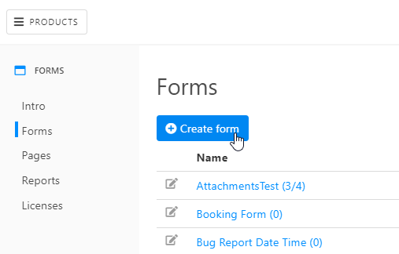
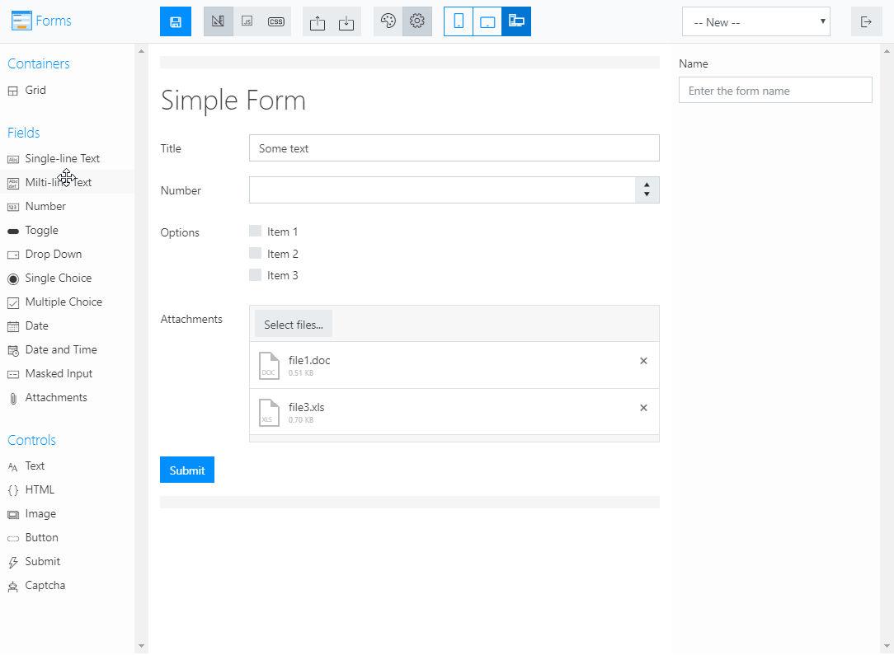
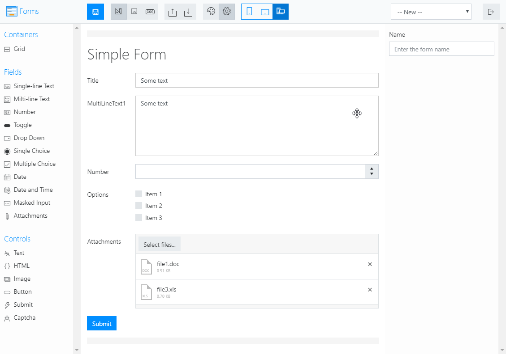
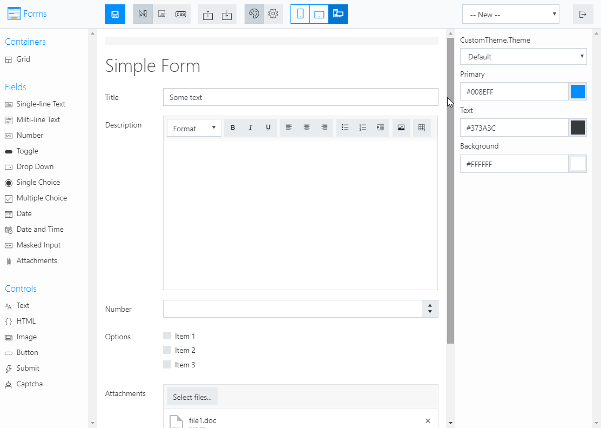
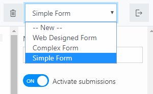

.. title:: Designing online forms with Plumsail Forms

.. meta::
   :description: How to create public web forms - learn the basics: add fields, controls and containers, save the form

Designing web forms with Plumsail Forms
==================================================

.. _start-web-designer:

Launch web designer
--------------------------------------------------
Go to |Plumsail Account|, and navigate to Forms page. Click **Create form**:

|pic-create-form|

Design the form
--------------------------------------------------
When you open the designer, you can start designing the form. Drag and drop Fields, Controls and Containers onto the form: 

|pic-design-drag-drop|

Then you can adjust individual settings for each field, control or container by selecting it and modifying its configuration:

|pic-design-properties|

In **web designer**, multiple fields/controls can be selected at once to adjust their shared properties:

|pic-design-multiple-fields|

Designer section of our documentation much more about each :doc:`Field </designer/fields>`, 
:doc:`Control </designer/controls>` and :doc:`Container </designer/containers>`, and their properties that you can modify.
Finally, there is also a section on :doc:`Ribbon buttons </designer/ribbon-actions>` that explains how you can work with mobile layouts, apply custom JavaScript and CSS to the form.

|pic-web-ribbon|

Once you've designed the form, click **Save**. You'll be able to give a name to your form and it will be saved to your Plumsail Account. 
You are always be able to open, edit or delete your saved forms in the upper right corner of the designer:

|pic-saved-forms|

When you are satisfied with how your form looks on all the layouts and screen sizes (you can just resize browser's window to see how the form scales),
you can finally share the form. 

To find out how to share saved forms, please, go to our :doc:`Sharing forms </sharing>` article.