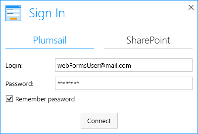
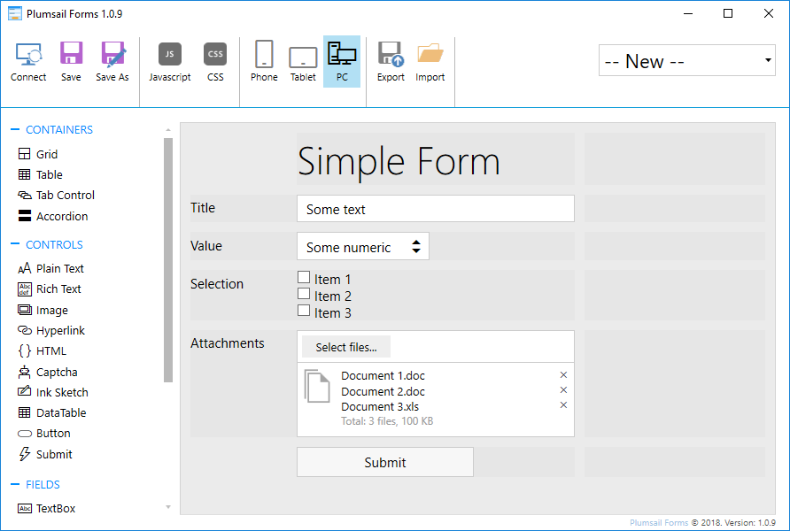
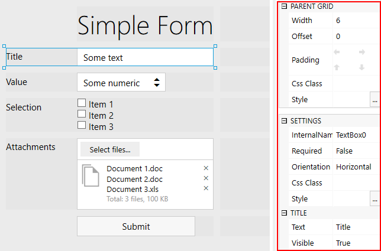
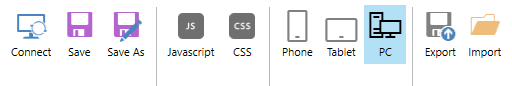
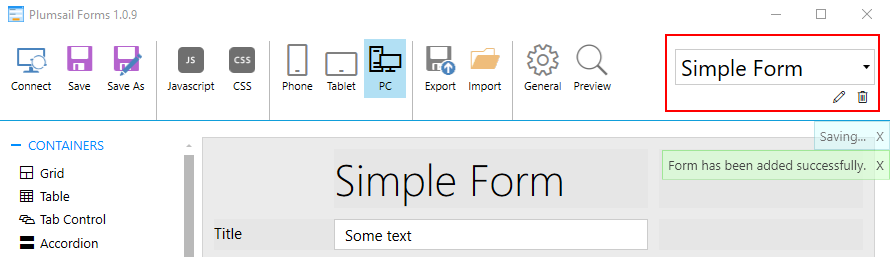
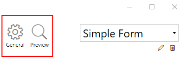
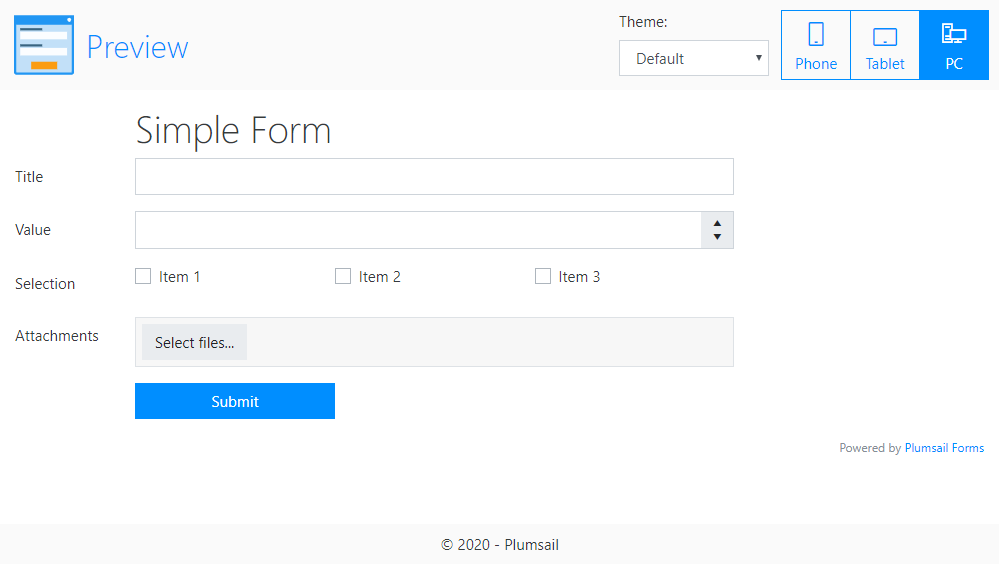

.. title:: Designing online forms with Plumsail Forms

.. meta::
   :description: How to create public web forms - learn the basics: web editor vs desktop editor, add fields, controls and containers, save the form

Designing online forms with Plumsail Forms
==================================================

Public Web Forms currently offer 2 ways to design forms - using :ref:`start-web-designer` or using :ref:`start-desktop-designer`.

Both designers share most of their functionality, but:

- Web Designer works without installation and gives better understanding of how the form would look like in the browser;
- Desktop Designer has more advanced controls and containers, which will be implemented in Web Designer with time.

.. contents::
 :local:
 :depth: 1

.. _start-web-designer:

Web Designer
**************************************************

Launch web designer
--------------------------------------------------
Go to |Plumsail Account|, and navigate to Forms page. Click **Create form**:

|pic-create-form|

.. |pic-create-form| image:: ./images/start/design-web-create-form.png
   :alt: Create form in web designer

Design the form
--------------------------------------------------
When you open the designer, you can start designing the form. Drag and drop Fields, Controls and Containers onto the form: 

|pic-design-drag-drop|

.. |pic-design-drag-drop| image:: ./images/start/design-drag-drop.gif
   :alt: Drag and drop

Then you can adjust individual settings for each field, control or container by selecting it and modifying its configuration:

|pic-design-properties|

.. |pic-design-properties| image:: ./images/start/design-properties.gif
   :alt: Field's properties

In **web designer**, multiple fields/controls can be selected at once to adjust their shared properties:

|pic-design-multiple-fields|

.. |pic-design-multiple-fields| image:: ./images/start/design-multiple-fields.gif
   :alt: Select multiple fields

Designer section of our documentation much more about each :doc:`Field </designer/fields>`, 
:doc:`Control </designer/controls>` and :doc:`Container </designer/containers>`, and their properties that you can modify.
Finally, there is also a section on :doc:`Ribbon buttons </designer/ribbon-actions>` that explains how you can work with mobile layouts, apply custom JavaScript and CSS to the form.

|pic-web-ribbon|

.. |pic-web-ribbon| image:: ./images/start/designer-web-ribbon.png
   :alt: Web Designer's Ribbon

Once you've designed the form, click **Save**. You'll be able to give a name to your form and it will be saved to your Plumsail Account. 
You are always be able to open, edit or delete your saved forms in the upper right corner of the designer:

|pic-saved-forms|

.. |pic-saved-forms| image:: ./images/start/designer-web-saved-forms.png
   :alt: Saved Public Forms in the web designer

When you are satisfied with how your form looks on all the layouts and screen sizes (you can just resize browser's window to see how the form scales),
you can finally share the form. 

To find out how to share saved forms, please, go to our :doc:`Sharing forms </sharing>` article.

.. _start-desktop-designer:

Desktop Designer
**************************************************

Install desktop designer
--------------------------------------------------
Go to |Plumsail Account|, download and install |the designer application| to your PC.

.. |Plumsail Account| raw:: html

   <a href="https://account.plumsail.com/" target="_blank">Plumsail Account</a>

.. |the designer application| raw:: html

   <a href="https://account.plumsail.com/forms/intro" target="_blank">the designer application</a>

The app launches with the following window:

|pic1|

In order to design Public Web Forms, select the Plumsail tab and enter Login and Password of your Plumsail Account. 

Design the form
--------------------------------------------------
When you open the designer, you can start designing the form. Fields, Controls and Containers can be simply dragged and dropped onto the form. 

|pic2|

Then you can adjust individual settings for each field, control or container by selecting it and modifying its configuration:

|pic3|

Designer section of our documentation much more about each :doc:`Field </designer/fields>`, 
:doc:`Control </designer/controls>` and :doc:`Container </designer/containers>`, and their properties that you can modify.
Finally, there is also a section on :doc:`Ribbon buttons </designer/ribbon-actions>` that explains how you can work with mobile layouts, apply custom JavaScript and CSS to the form.

|pic4|

Once you've designed the form, click **Save**. You'll be able to give a name to your form and it will be saved to your Plumsail Account. 
You are always be able to open, edit or delete your saved forms in the upper right corner of the designer:

|pic5|

After saving, you'll see two additional buttons on the Ribbon - *General* and *Preview*:

|pic16|

Preview allows you to see how your form will look in the browser. It will look different from its presentation in the designer, 
so make sure that you like the final result before publishing:

|pic17|

When you are satisfied with how your form looks on all the layouts and screen sizes (you can just resize browser's window to see how the form scales),
you can finally share the form. 

To find out how to share saved forms, please, go to our :doc:`Sharing forms </sharing>` article.