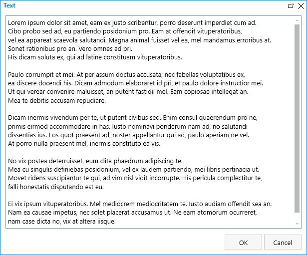
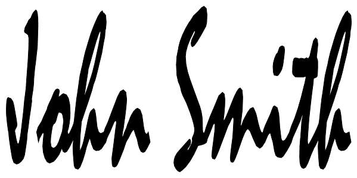
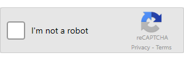

Controls
==================================================

.. contents:: Contents:
 :local:
 :depth: 1
    
General Info
-------------------------------------------------------------
Controls are elements designed to give you more control over your forms. They allow you to customize the look of the form and add interactivity to it. 
Controls aren't fields as they do not store information, though some controls rely on user input.

Plain Text
-------------------------------------------------------------
Plain Text control is used to add text to your form, for information that you want to convey to the user. 
Even though it's a plain text control, you can still format the text and apply styles to it.

Plain Text properties
~~~~~~~~~~~~~~~~~~~~~~~~~~~~~~~~~~~~~~~~~~~~~~~~~~
Every Plain Text control has the following settings:

General

.. list-table::
    :widths: 10 40

    *   - Name
        - Setting utilized by many elements. Name is similar to ID, it's a unique identifier for the element.
    *   - Type
        - Here you can select the type of the text you are entering - either Text or Header 1, Header 2, or Header 3.
    *   - Text
        - Allows you to type in or copy in the exact text you want to display on the form.
    *   - Color
        - Allows you to set text's color.
    *   - Class 
        - Give CSS Class to the element, in order to apply JavaScript or CSS Style to it. Can give multiple classes separated by spaces to one element.
    *   - Style
        - Allows you to give specific element certain style. No need to use selectors, simply add CSS rules to this setting.

Rich Text
-------------------------------------------------------------
Rich Text control is also used to add text to your form, just like Plain Text control. 
Unlike Plain Text control, Rich Text control comes with an editor which allows you to style your text without relying on CSS.

Rich Text properties
~~~~~~~~~~~~~~~~~~~~~~~~~~~~~~~~~~~~~~~~~~~~~~~~~~
Every Plain Text control has the following settings:

General

.. list-table::
    :widths: 10 40
        
    *   - Name
        - Setting utilized by many elements. Name is similar to ID, it's a unique identifier for the element.
    *   - Text
        - Allows you to type in or copy in the exact text you want to display on the form. When editing, opens up an editor screen in Designer.
    *   - Class
        - Allows you to give CSS Class to the element, in order to apply JavaScript or CSS Style to it. Can give multiple classes separated by spaces to one element.
    *   - Style
        - Allows you to give specific element certain style. No need to use selectors, simply add CSS rules to this setting.

Image
-------------------------------------------------------------
Image control allows you to add images to your forms. Image can either be used as decoration or as a link.

.. image:: ../images/designer/controls/Image.png
   :alt: Image

Image properties
~~~~~~~~~~~~~~~~~~~~~~~~~~~~~~~~~~~~~~~~~~~~~~~~~~
Every Image control has the following settings:

General

.. list-table::
    :widths: 10 40
        
    *   - Name
        - Setting utilized by many elements. Name is similar to ID, it's a unique identifier for the element.
    *   - Image URL
        - Allows you to specify the URL of an image here.
    *   - Width
        - Allows you to set the Width of the image.
    *   - Height
        - Allows you to set the Height of the image.
    *   - Alt
        - Allows you to specify an alternate text for an image here.
    *   - Class
        - Allows you to give CSS Class to the element, in order to apply JavaScript or CSS Style to it. Can give multiple classes separated by spaces to one element.
    *   - Style
        - Allows you to give specific element certain style. No need to use selectors, simply add CSS rules to this setting.

Hyperlink

.. list-table::
    :widths: 10 40

    *   - URL
        - Specify the URL of the page clicking the image sends user to. Leave blank if not needed.
    *   - Target
        - Specify where to open the linked document. _blank will open in a new tab.
    *   - Click
        - Add JavaScript to execute when image is clicked. If no link is used, add event.preventDefault(); prior to your JS.

Hyperlink
-------------------------------------------------------------
Hyperlink control allows you to add hyperlinks to your forms. Can be used to redirect users to different page or execute JavaScript on click.

.. image:: ../images/designer/controls/Hyperlink.png
   :alt: Hyperlink

Hyperlink properties
~~~~~~~~~~~~~~~~~~~~~~~~~~~~~~~~~~~~~~~~~~~~~~~~~~
Every Hyperlink control has the following settings:

General

.. list-table::
    :widths: 10 40
        
    *   - Name
        - Setting utilized by many elements. Name is similar to ID, it's a unique identifier for the element.
    *   - Text
        - Allows you to type in or copy in the exact text the link will display on the form.
    *   - URL
        - Specify the URL of the page clicking the link sends user to. Leave blank if not needed.
    *   - Target
        - Specify where to open the linked document. _blank will open in a new tab.
    *   - Click
        - Allows you to add JavaScript to execute when link is clicked. If no link is used, add event.preventDefault(); prior to your JS.
    *   - Class
        - Allows you to give CSS Class to the element, in order to apply JavaScript or CSS Style to it. Can give multiple classes separated by spaces to one element.
    *   - Style
        - Allows you to give specific element certain style. No need to use selectors, simply add CSS rules to this setting.

HTML
-------------------------------------------------------------
HTML control allows you to add absolutely any HTML code to your forms. Can be used for variety of reasons, including loading of JavaScript files, creating hidden fields, etc.

.. image:: ../images/designer/controls/HTML.png
   :alt: HTML

HTML properties
~~~~~~~~~~~~~~~~~~~~~~~~~~~~~~~~~~~~~~~~~~~~~~~~~~
Every HTML control has the following settings:

General

.. list-table::
    :widths: 10 40

    *   - Content
        - Allows you to specify HTML contents here.

Ink Sketch
-------------------------------------------------------------
Ink Sketch control behaves more similarly to a field. It allows users to draw or leave their input by holding down mouse key and dragging the mouse across the control.
Can be used for signatures, drawings, |marking details over a background image|, etc.

The data is stored in the session state, once the browser is closed, it is purged. The data is also sent on Form submission using Microsoft Flow, like other fields' data.

.. _designer-inksketch:

Ink Sketch properties
~~~~~~~~~~~~~~~~~~~~~~~~~~~~~~~~~~~~~~~~~~~~~~~~~~
Every Ink Sketch control has the following settings:

General

.. list-table::
    :widths: 10 40
        
    *   - Name
        - Setting utilized by many elements. Name is similar to ID, it's a unique identifier for the element.
    *   - Height
        - Allows you to set the Height of the control.
    *   - Width
        - Allows you to set the Width of the control.
    *   - Ink Color
        - Allows you to set the color of drawing done by the user.
    *   - Class
        - Allows you to give CSS Class to the element, in order to apply JavaScript or CSS Style to it. Can give multiple classes separated by spaces to one element.
    *   - Style
        - Allows you to give specific element certain style. No need to use selectors, simply add CSS rules to this setting.

Button
-------------------------------------------------------------
Button control allows you to add buttons to your forms. Can be used to execute JavaScript on click.

Bootstrap classes can be used to give different buttons unique look. You can |location_link|.

.. |location_link| raw:: html

   <a href="https://www.w3schools.com/bootstrap/bootstrap_ref_css_buttons.asp" target="_blank">read more here</a>

Button properties
~~~~~~~~~~~~~~~~~~~~~~~~~~~~~~~~~~~~~~~~~~~~~~~~~~
Every Button control has the following settings:

General

.. list-table::
    :widths: 10 40
        
    *   - Name
        - Setting utilized by many elements. Name is similar to ID, it's a unique identifier for the element.
    *   - OnClick
        - Add JavaScript to execute when button is clicked.
    *   - Text
        - Allows you to type in or copy in the exact text the button will display on the form.
    *   - Width
        - Allows you to set the Width of the button.
    *   - Class
        - Allows you to give CSS Class to the element, in order to apply JavaScript or CSS Style to it. Can give multiple classes separated by spaces to one element.
    *   - Style
        - Allows you to give specific element certain style. No need to use selectors, simply add CSS rules to this setting.

Submit
-------------------------------------------------------------
Submit control allows you to add submit button to your forms. 
It's actually just a button control which already includes JavaScript necessary to save and submit the Form on click, 
but you can also add your custom code or customize the Submit control just like any other button.

.. _designer-captcha:

Captcha
-------------------------------------------------------------
Captcha allows you to protect your forms from being submitted by bots and thus putting extra pressure on your Flows and polluting your data.
A must have if you want to publish your form on a public website. 

Our captcha is based on Google's ReCAPTCHA, so you will need to get a SiteKey from |SiteKey| before you can use it.

Captcha properties
~~~~~~~~~~~~~~~~~~~~~~~~~~~~~~~~~~~~~~~~~~~~~~~~~~
Every Captcha control has the following settings:

General

.. list-table::
    :widths: 10 40
        
    *   - Name
        - Setting utilized by many elements. Name is similar to ID, it's a unique identifier for the element.
    *   - Site Key
        - Your public key for the ReCAPTCHA. Get it |SiteKey|. 

Appearance

.. list-table::
    :widths: 10 40

    *   - Size
        - Allows you to select between Normal and Compact size for the Captcha.
    *   - Theme
        - Allows you to select between Light and Dark theme to better suit your form.

.. |SiteKey| raw:: html

   <a href="https://developers.google.com/recaptcha/intro" target="_blank">here</a>

.. _designer-datatable:

DataTable
-------------------------------------------------------------
DataTable is a control which allows you to add dynamic table to your forms. This control is based on |kendoGrid|.

You can set up how many columns the table has and their type, and the users will be able to add entries to this table.

Most configuration for DataTable can be done by editing individual column settings. To add a new column, simply click on the plus symbol:

|

DataTable can be easily submitted to MS Flow and you can use its data as you see fit including creation of HTML tables or SharePoint items.

DataTable properties
~~~~~~~~~~~~~~~~~~~~~~~~~~~~~~~~~~~~~~~~~~~~~~~~~~
Every DataTable control has the following settings:

General

.. list-table::
    :widths: 10 40
        
    *   - Name
        - Setting utilized by many elements. Name is similar to ID, it's a unique identifier for the element.
    *   - New Line
        - Allows to select where the new line will be added - at the Top or at the Bottom of the table.
    *   - Delete
        - Allows to select where the delete button will appear - in the first or in the last column.

DataTable Column properties
~~~~~~~~~~~~~~~~~~~~~~~~~~~~~~~~~~~~~~~~~~~~~~~~~~
Every DataTable Column has the following settings:

General

.. list-table::
    :widths: 10 40

    *   - Title
        - Allows to set the title of the column.
    *   - Type
        - Allows to select the type of the data for the column - can be either String, Number, Boolean, Date or Dropdown.
    *   - Required
        - Allows to set the column as mandatory for the record to be added.
    *   - Name
        - Setting utilized by many elements. Name is similar to ID, it's a unique identifier for the element.
    *   - Width
        - Allows you to set the Width of the column.

.. |kendoGrid| raw:: html

    <a href="https://docs.telerik.com/kendo-ui/api/javascript/ui/grid" target="_blank">kendoGrid</a>

.. |marking details over a background image| raw:: html

    <a href="https://plumsail.com/docs/forms-web/how-to/notes-on-an-image.html" target="_blank">marking details over a background image</a>

.. _designer-likert:

Likert scale
-------------------------------------------------------------
Likert scale is a control which allows you to gather detailed feedback from the user.

You can set up as many questions as you want in the Likert scale, as well as choose the available answer options.

Likert scale can be easily submitted to MS Flow or stored in a hidden field in a SharePoint List.

.. _designer-datatable-properties:

Likert scale properties
~~~~~~~~~~~~~~~~~~~~~~~~~~~~~~~~~~~~~~~~~~~~~~~~~~
Every Likert scale control has the following settings:

General

.. list-table::
    :widths: 10 40
        
    *   - Name
        - Setting utilized by many elements. Name is similar to ID, it's a unique identifier for the element.
    *   - Questions
        - Enter how many questions the Likert scale will have - each question starts form a new line.
    *   - Answers
        - Select labels for available answers. Each one adds an additional answer to the control.
    *   - Type
        - Select type of answers user can input into the scale. The types include: Radio, Checkbox, String, Number, Dropdown.
    *   - Items
        - Select available choices in the dropdown answers. Only available if Type is set to Dropdown.