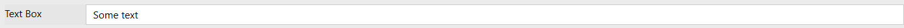
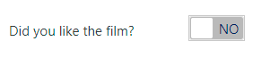
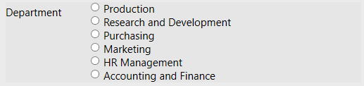
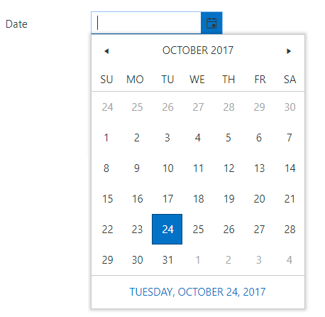
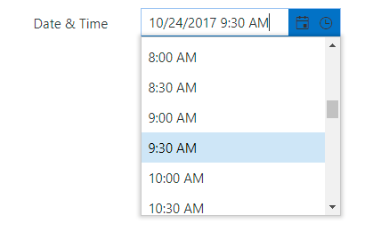
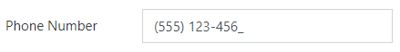
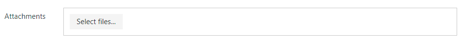

.. title:: Fields in Plumsail Forms (public forms)

.. meta::
   :description: Information about fields, e.g. Text, Number, Drop Down, Toggle, Checkboxes, Radios, Date and Attachments, and their properties that you can configure on a form

Fields in Plumsail Forms (public forms)
==================================================

Fields are primary input elements on the Form. 
Fields are being filled by the user and store their data in user's session storage and once the form is submitted, their contents are either saved to Plumsail Account, or handled by Power Automate (MS Flow) or Zapier.

.. contents:: Contents:
 :local:
 :depth: 1

Basic properties
-------------------------------------------------------------
Most fields have following settings:

General

.. list-table::
    :widths: 10 40

    *   - Name
        - Setting utilized by many elements. Name is similar to ID, it's a unique identifier for the element.
    *   - Required
        - Select if the field is required to submit the form or not.
    *   - Orientation
        - Select if the title is displayed on the left from field or on top of it, to the left. Might automatically switch if not enough space.
    *   - Class
        - Give CSS Class to the element, in order to apply JavaScript or CSS Style to it. Can give multiple classes separated by spaces to one element.
    *   - Style
        - Allows you to give specific element certain style. No need to use selectors, simply add CSS rules to this setting.

Title

.. list-table::
    :widths: 10 40

    *   - Text
        - Select the displayed title for the field.
    *   - Visible
        - Select if the title is visible or not.
    *   - Width
        - Select the width of the title.
    *   - Font Size
        - Select font size of the title.
    *   - Font Style
        - Select if the title is in italics or not.
    *   - Font Weight
        - Select if the title is bold or not.
    *   - Font Color
        - Select font color of the title. Can be either selected or manually entered.
    *   - Wrap
        - Select if the title will wrap if it has not enough space or not.

Control

.. list-table::
    :widths: 10 40

    *   - Width
        - Allows you to set the width of the input field manually. Only takes number in pixels, no additional symbols required.
    *   - Hint
        - Allows you to set placeholder value for the text input. Can be used as an example for the users.
    *   - Font Size
        - Select font size for the input.
    *   - Font Style
        - Select if the input is in italics or not.
    *   - Font Weight
        - Select if the input is bold or not.
    *   - Font Color
        - Select font color for the input. Can be either selected or manually entered.

Single-line Text
-------------------------------------------------------------
Single-line Text is the basic text input field. It doesn't support multiple lines of text and doesn't include an editor, but it's well-suited for short and simple inputs.

Single-line Text unique properties
~~~~~~~~~~~~~~~~~~~~~~~~~~~~~~~~~~~~~~~~~~~~~~~~~~
Single-line Text field has the following unique settings:

Pattern

.. list-table::
    :widths: 10 40

    *   - Type
        - Select the Type of the Single-line Text, this will automatically apply a pattern to it. Several types are available, such as Email, Phone, Numeric, etc. This will determine what type of text can be input, and will give field a validator to make sure that the input is correct. You can alter any of the settings, this will automatically switch Type to Custom.
    *   - Pattern
        - A regex pattern which the field has to follow. You can either input your own, or select one of the available Types and it will be automatically set for you.
    *   - Flags
        - Regex flags, more on that |Regex flags|.
    *   - Error
        - The error message shown when the input text doesn't match the pattern.

.. |Regex flags| raw:: html

   <a href="https://developer.mozilla.org/en-US/docs/Web/JavaScript/Reference/Global_Objects/RegExp#Parameters" target="_blank">here</a>

Multi-line Text
-------------------------------------------------------------
Advanced text input, allows input of multiple lines and includes basic text editor.

Number
-------------------------------------------------------------
Number is the basic number input field.

.. _designer-numericproperties:

Number properties
~~~~~~~~~~~~~~~~~~~~~~~~~~~~~~~~~~~~~~~~~~~~~~~~~~
These properties are unique to Number field:

General

.. list-table::
    :widths: 10 40

    *   - Min
        - Minimum possible value.
    *   - Max
        - Maximum possible value.
    *   - Decimals
        - Number of decimals.
    *   - Format
        - |Numeric format| for the field.
    *   - Step
        - Value added or removed when using the control's arrows.

.. |Numeric format| raw:: html

   <a href="https://docs.microsoft.com/en-us/dotnet/standard/base-types/standard-numeric-format-strings" target="_blank">Numeric format</a>

Drop Down
-------------------------------------------------------------
Drop Down field gives user a choice which is displayed in a dropdown menu.

Drop Down unique properties
~~~~~~~~~~~~~~~~~~~~~~~~~~~~~~~~~~~~~~~~~~~~~~~~~~
Drop Down field has the following unique settings:

General

.. list-table::
    :widths: 10 40

    *   - Options
        - Specify items users can choose from.
    *   - Selection
        - Select if user can choose more than one item from dropdown or not.
    

Toggle
-------------------------------------------------------------
Toggle field gives user a choice between Yes or No. By default has False value.

Toggle unique properties
~~~~~~~~~~~~~~~~~~~~~~~~~~~~~~~~~~~~~~~~~~~~~~~~~~
Toggle field has the following unique settings:

Control

.. list-table::
    :widths: 10 40

    *   - On - text
        - Select displayed text for the True value.
    *   - Off - text
        - Select displayed text for the False value.

Multiple Choice
-------------------------------------------------------------
Multiple Choice field gives user a number of checkboxes where multiple options can be picked.

Multiple Choice unique properties
~~~~~~~~~~~~~~~~~~~~~~~~~~~~~~~~~~~~~~~~~~~~~~~~~~
Multiple Choice field has the following unique settings:

General

.. list-table::
    :widths: 10 40

    *   - Options
        - Specify items users can choose from.

Control

.. list-table::
    :widths: 10 40

    *   - Columns
        - Number of columns items are grouped by.

Radios
-------------------------------------------------------------
Radios field gives user a choice which is presented as a number of radio buttons. Unlike checkboxes, only one option can be selected.

Radios unique properties
~~~~~~~~~~~~~~~~~~~~~~~~~~~~~~~~~~~~~~~~~~~~~~~~~~
Radios field has the following unique settings:

General

.. list-table::
    :widths: 10 40

    *   - Options
        - Specify items users can choose from.

Control

.. list-table::
    :widths: 10 40

    *   - Columns
        - Number of columns items are grouped by.

Date
-------------------------------------------------------------
Date field allows users to input date.

Date and Time
-------------------------------------------------------------
Date and Time field allows users to input both date and time.

.. _designer-maskedtextbox:

Masked Input
-------------------------------------------------------------
Masked Input allows to restrict what the user can input. User simply won't be able to enter anything that doesn't match the mask.

Masked Input unique properties
~~~~~~~~~~~~~~~~~~~~~~~~~~~~~~~~~~~~~~~~~~~~~~~~~~
Masked Input field has the following unique settings:

General

.. list-table::
    :widths: 10 30
        
    *   -   Mask
        -   Specifies the input mask. The following mask rules are supported:

            0 - Digit. Accepts any digit between 0 and 9.

            9 - Digit or space. Accepts any digit between 0 and 9, plus space.

            # - Digit or space. Like 9 rule, but allows also (+) and (-) signs.

            L - Letter. Restricts input to letters a-z and A-Z. This rule is equivalent to [a-zA-Z] in regular expressions.

            ? - Letter or space. Restricts input to letters a-z and A-Z. This rule is equivalent to [a-zA-Z] in regular expressions.

            & - Character. Accepts any character. The rule is equivalent to \S in regular expressions.

            C - Character or space. Accepts any character. The rule is equivalent to . in regular expressions.

            A - Alphanumeric. Accepts letters and digits only.

            a - Alphanumeric or space. Accepts letters, digits and space only.

            . - Decimal placeholder. The decimal separator will be gotten from the current culture.

            , - Thousands placeholder. The display character will be gotten from the current culture.
            
            $ - Currency symbol. The display character will be gotten from the current culture.

            For more information and examples, please, checkout |KendoUI MaskedTextBox|.

.. |KendoUI MaskedTextBox| raw:: html

   <a href="https://demos.telerik.com/kendo-ui/maskedtextbox/index" target="_blank">KendoUI MaskedTextBox</a>

Attachments
-------------------------------------------------------------
Attachments field allows users to attach files to the form. It's possible to do it by either uploading files manually or dragging and dropping them into the field.
Possible to drag and drop multiple files at once.

Attachments unique properties
~~~~~~~~~~~~~~~~~~~~~~~~~~~~~~~~~~~~~~~~~~~~~~~~~~
Attachments field has the following unique settings:

General

.. list-table::
    :widths: 10 40

    *   - Max Size (Kb)
        - Maximum file size each uploaded file can be. Default max file size is 10240, but you can restrict it down, or increase it up (if your subscription plan allows it).
    *   - Allowed Ext.
        - Choose what files should be allowed to upload. Extensions should have a dot in front of them, can be separated by a comma, a semicolon or placed on different lines. If empty, all extensions are allowed.