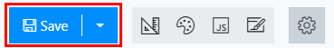
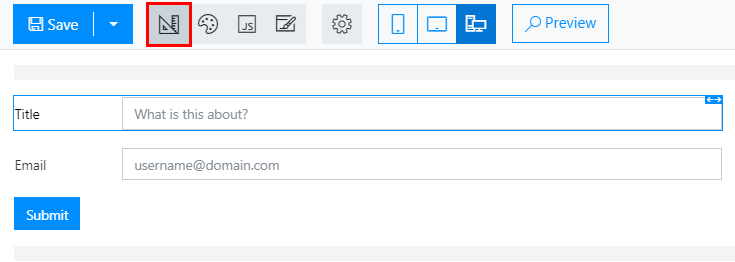
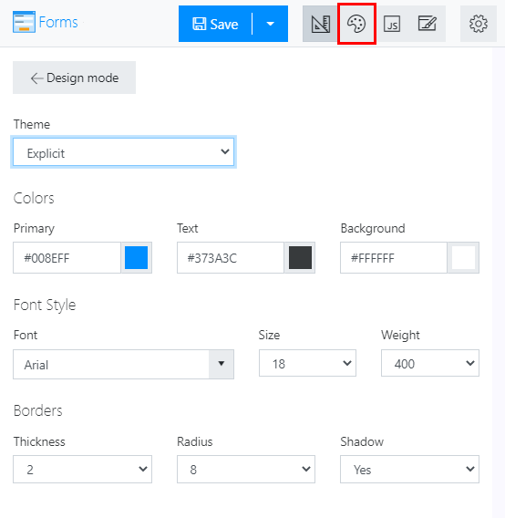
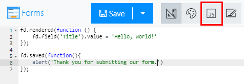
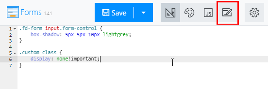
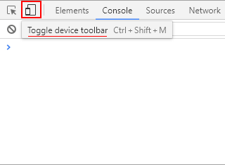

.. title:: Ribbon actions in Plumsail Forms (public forms)

.. meta::
   :description: What do the buttons in the ribbon do - adjust form layout for mobile devices, export and import forms, open general settings or preview form

Ribbon actions in Plumsail Forms (public forms)
==================================================================

What do the buttons in the ribbon of the editor do? Find more about layouts for mobile devices, export and import functionality, and other buttons.

.. contents::
 :local:
 :depth: 1

Save button
--------------------------------------------------
Use this button to save current layout of the form. Make sure that you give your form a name, before saving.

|save|

Once the form has been saved, you have an option to save it as new, effectively creating a copy of the form or creating a new version without overwriting an existing form.

|saveas|

Mode buttons
--------------------------------------------------

Design mode
**************************************************
This button activates the design mode - the main mode in which you drag and drop fields and controls onto the form, and configure their layout and properties. It's on by default.

|design|

Theme settings
**************************************************
This button allows you to configure theme settings - such as the colors used on the form, font settings, field borders, etc. Use one of existing premade themes or create your own. 

|theme|

JavaScript editor
**************************************************
This button allows you to customize JavaScript for the whole form - please, refer to our :doc:`JavaScript documentation <../javascript/general>` to learn about events, properties and methods available in our API

|js|

CSS editor
**************************************************
This button allows you to customize CSS for the whole form - if theme settings aren't enough, and you want to utilize CSS for further customization of the form, you have this option. Can also be used to hide certain elements on the form.

|css|

Export and Import
--------------------------------------------------
Use these buttons if you want to export configuration of your form. For example, you can do this to create a backup of the form, which you might later change, and revert back to the exported version. Or you can move forms between different Plumsail Account using this feature.

|export-import|

General Settings
--------------------------------------------------
This button simply opens General Settings menu on the right side of the screen. Only usable after the form has been saved.

|general-button|

.. |general-button| image:: ../images/designer/ribbon-actions/designer-ribbon-actions-web-general.png
   :alt: General Settings button

General Settings will allow you to configure if the form is active, if submissions need to be stored, if you need to receive email notifications on submissions or not. You can also copy form ID, widget and a Form Link from this menu.

|general-settings|

.. _designer-layouts:

Layouts - PC, Tablet or Phone
--------------------------------------------------
Modern Plumsail Forms are built to be responsive. On top of utilizing |Bootstrap| for its elements, Forms can also be specifically designed for different devices.

.. |Bootstrap| raw:: html

   <a href="https://getbootstrap.com/" target="_blank">Bootstrap 4</a>

Plumsail Forms do not simply rely on the screen size, instead the appropriate Form is chosen based on browser's user agent and then displayed. 
Phone forms are displayed for smartphones, Tablet forms are displayed for tablets and other devices utilize PC Form which is the default one.

Designing Forms
**************************************************
Designing forms for different devices has never been easier. All you need to do, is click 
the icon of the device you want to design form for, customize the form and click Save.

|layouts|

.. |layouts| image:: ../images/designer/ribbon-actions/designer-ribbon-actions-web-layouts.png
   :alt: Layouts icons

If you want to delete the layout after it has been customized, simply select the layout and click the icon again (it will turn white again when deleted). 

|layouts-phone|

Testing Forms
**************************************************
For testing purposes, you can just change user agent in your browser to see a different form. For example, when using Google Chrome you can open Developers tools
and click Toggle device toolbar icon next to Inspector which will allow you to change the device and see how the form is displayed on other devices.

|pic2|

Similar functionality is present in almost all modern browsers.

.. _designer-export:

Preview
--------------------------------------------------
This button will open a preview of your form:

|pic4|

This will allow you to test how the form functions:

|pic6|

.. |pic6| image:: ../images/designer/ribbon-actions/FormPreview.png
   :alt: Form Preview