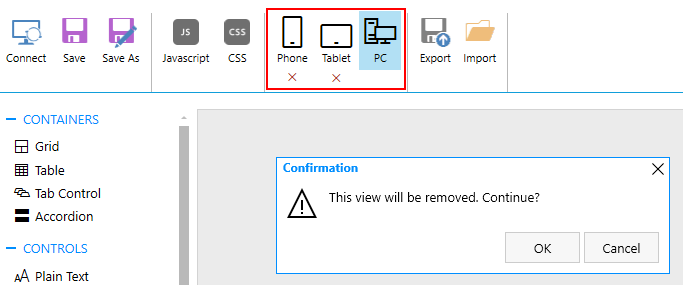
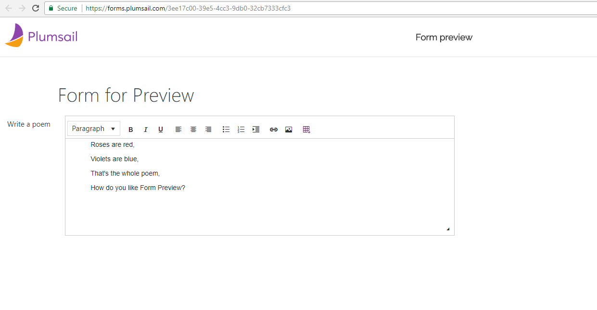

.. meta::
   :description: What do the buttons in the ribbon do

Ribbon actions in Plumsail Forms (public forms)
==================================================================

.. contents:: Contents:
 :local:
 :depth: 1

.. _designer-layouts:

Layouts - PC, Tablet or Phone
--------------------------------------------------
Modern Plumsail Forms are built to be responsive. On top of utilizing |Bootstrap| for its elements, Forms can also be specifically designed for different devices.

.. |Bootstrap| raw:: html

   <a href="https://getbootstrap.com/" target="_blank">Bootstrap 4</a>

Plumsail Forms do not simply rely on the screen size, instead the appropriate Form is chosen based on browser's user agent and then displayed. 
Phone forms are displayed for smartphones, Tablet forms are displayed for tablets and other devices utilize PC Form which is the default one.

Designing Forms
**************************************************
Designing forms for different devices has never been easier. All you need to do, is click 
the icon of the device you want to design form for, customize the form and click Save.

The red cross under the icon of the device indicates that the form is registered. Click on it to remove the specific form. 
There will be a confirmation prompt to avoid potential misclicks: 

|pic1|

.. important::  Make sure that the fields present on different layouts have the same internal names 
                and the same type to avoid errors on submission in Power Automate (MS Flow). These can be different fields with the same name as long as the type is the same, for example, 
                Textbox and MultilineTextBox.

Testing Forms
**************************************************
For testing purposes, you can just change user agent in your browser to see a different form. For example, when using Google Chrome you can open Developers tools
and click Toggle device toolbar icon next to Inspector which will allow you to change the device and see how the form is displayed on other devices.

|pic2|

.. |pic2| image:: ../images/designer/ribbon-actions/ToggleDeviceToolbar.png
   :alt: Toggle Device Toolbar

Similar functionality is present in almost all modern browsers.

.. _designer-export:

Export and Import
--------------------------------------------------
You can export currently selected form by pressing Export button. It will allow you to save the form as a file on your computer.

|pic3|

.. |pic3| image:: ../images/designer/ribbon-actions/ExportImport.png
   :alt: Export and Import

This can be used in variety of situations, especially if you need to design a number of similar forms. 

We also recommend storing backups for your important and/or complex forms, 
so if somebody changes the form later, it would be possible to restore it quickly.

Finally, you can import forms from the exported files, either yours or somebody else's, by pressing the Import button and selecting the form to import.

General Settings and Preview
--------------------------------------------------
These two buttons appear on the ribbon only after you've saved the form.

|pic4|

**General Settings for Plumsail forms** section contains important information for Activate submissions, namely Form ID, direct link to the form, as well as the widget that you can copy to insert form to a webpage for Plumsail Forms.

You can turn off the Activate submissions option for testing purposes. Thus the form won't be submitted to our server and neither be saved nor processed in Power Automate or Zapier, and the submission won't be counted either.

Save submissions will ensure that the submitted information is :doc:`stored in your Plumsail Account <../submissions>`.

Enable notifications option will send emails with submitted data to your email.

|pic5|

**Preview** button allows you to quickly open Plumsail Forms in your default browser:

|pic6|

