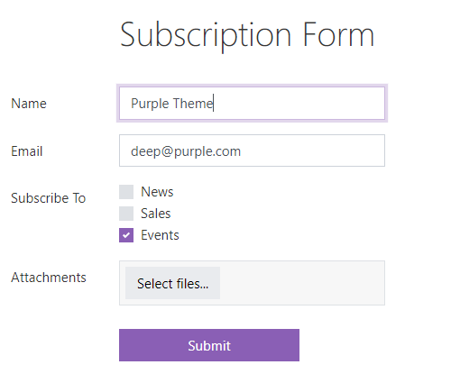
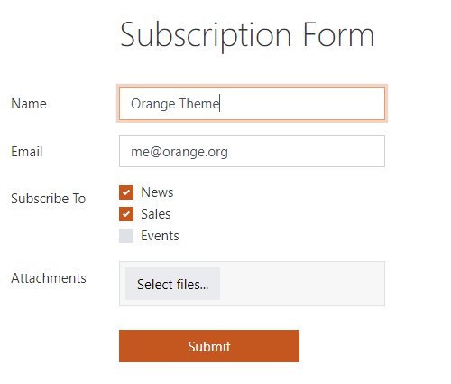
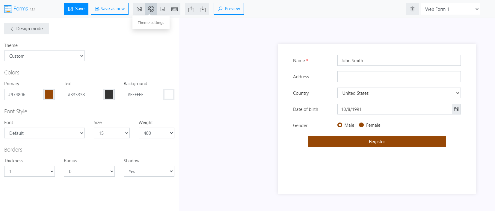
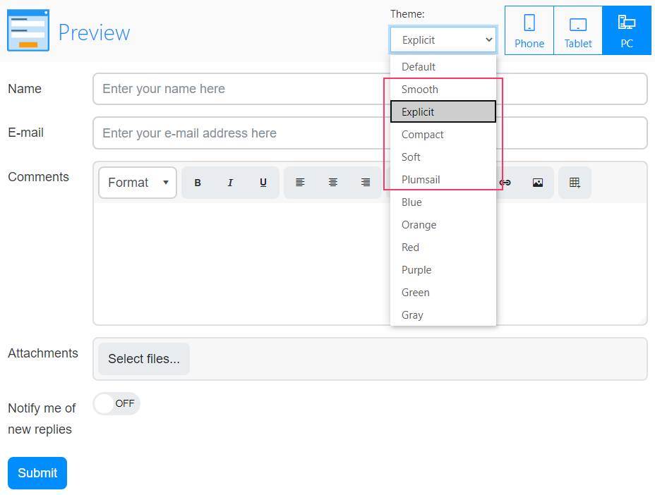

.. title:: Themes in Plumsail Forms (public forms)

.. meta::
   :description: How to configure colors and style of your form in the editor - select theme or build your own with primary and background colors, various fonts and borders

Configuring theme for online forms designed with Plumsail Forms
===============================================================================

.. _designer-publicthemes:

Themes for Public Web Forms
-------------------------------------------------------------
Using themes is an easy and quick way to change coloring scheme for all Fields, Controls and Containers, as well as default font, and field borders.

Here's an example of the same form with different themes:

|pic4| |pic5|

Select one of default or create your own custom theme via **Theme Settings**:

|pic9|

In order to apply a theme, don't forget to **Save** the form!

|

There is an option to compare different themes in Form Preview to see how they would look on the form, including your own custom theme:

|pic10|

You can always use additonal CSS to add more changes to the form and to further customize it for your needs.