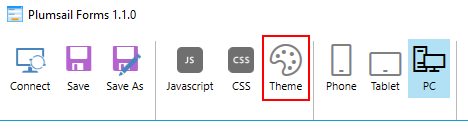
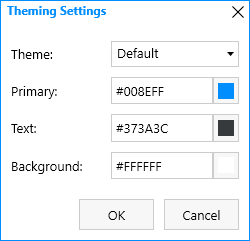
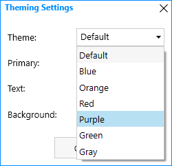
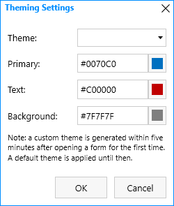
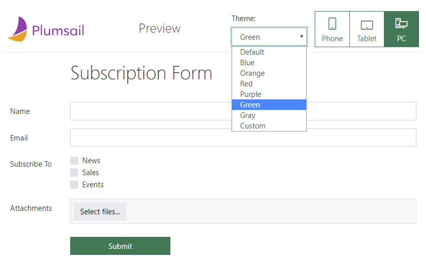

Configuring color theme for online forms designed with Plumsail Forms
===============================================================================

.. _designer-publicthemes:

Themes for Public Web Forms
-------------------------------------------------------------
Using themes is an easy and quick way to change coloring scheme for all Fields, Controls and Containers.

Here's an example of the same form with different themes:

|pic4| |pic5|

.. |pic4| image:: ../images/designer/themes/PlumsailPurple.png
   :alt: Purple Plumsail Form Theme
   :width: 40%

.. |pic5| image:: ../images/designer/themes/PlumsailOrange.png
   :alt: Orange Plumsail Form Theme
   :width: 40%

To adjust the theme for your Public Web form, click the Theme button in the designer:

|pic6|

You will see Theming Settings menu and here you can either select one of default themes:

|pic7| |pic8|

Or create your own custom theme by selecting colors (will need to wait a few minutes for custom theme to apply):

|pic9|

In order to apply a theme, don't forget to **Save** the form!

|

There is an option to compare different themes in Form Preview to see how they would look on the form, including your own custom theme:

|pic10|

You can always use additonal CSS to add more changes to the form and to further customize it for your needs.