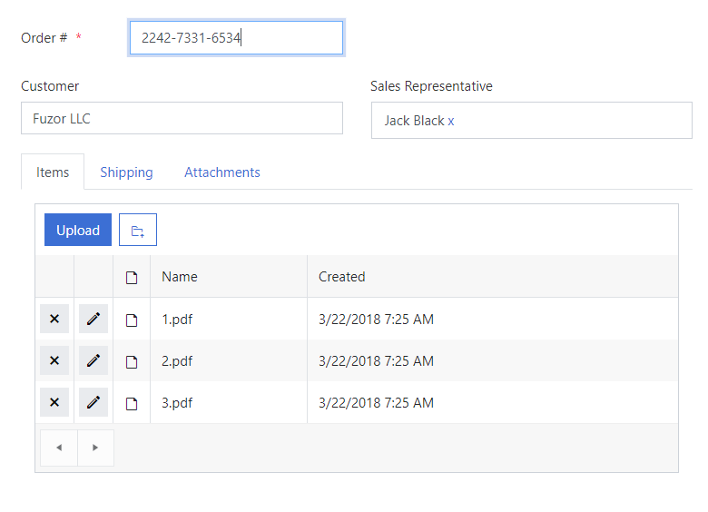
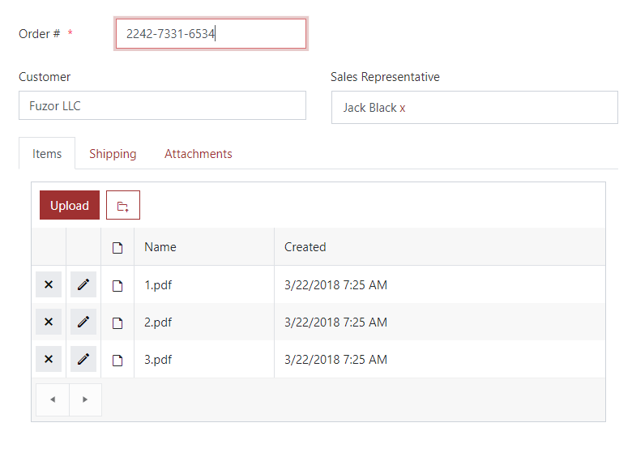

Themes
=========================================

.. contents:: Contents:
 :local:
 :depth: 1

Themes for SharePoint
-------------------------------------------------------------
Modern Forms for SharePoint now include support for SharePoint themes. The changes are purely aesthetic and only affect the colors of various elements on the form.
You can change the look of the SharePoint site in the Settings menu:

|pic1|

.. |pic1| image:: ../images/designer/themes/1_ChangeTheme.png
   :alt: Change the look of the SharePoint site

Now these changes will affect forms as well:

|pic2| |pic3|

Modern Forms for SharePoint also support custom themes, but applying a custom theme will take more time than applying one of default Microsoft themes.

It might take around 5 minutes for a custom theme to apply properly. Until the process is done, the form will still open with the default theme.

.. _designer-publicthemes:

Themes for Public Web Forms
-------------------------------------------------------------
Public Web Forms can also use their own themes. Using themes is an easy and quick way to change coloring scheme for all Fields, Controls and Containers.

Here's an example of the same form with different themes:

|pic4| |pic5|

.. |pic4| image:: ../images/designer/themes/PlumsailPurple.png
   :alt: Purple Plumsail Form Theme
   :width: 40%

To adjust the theme for your Public Web form, click the Theme button in the designer:

|pic6|

You will see Theming Settings menu and here you can either select one of default themes:

|pic7| |pic8|

Or create your own custom theme by selecting colors (will need to wait a few minutes for custom theme to apply):

|pic9|

In order to apply a theme, don't forget to **Save** the form!

|

There is an option to compare different themes in Form Preview to see how they would look on the form, includes your own custom theme:

|pic10|

You can always use additonal CSS to add more changes to the form and to further customize it for your needs.