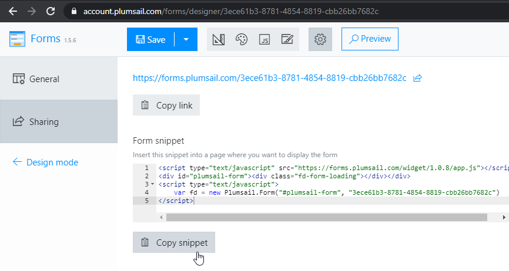

.. title:: Embed Plumsail web form on an Editor X site

.. meta::
   :description: How to publish our public web form to your Editor X site

Embed Plumsail web form on an Editor X website
==========================================================

.. note:: If you're using classic Wix.com platform, we have :doc:`an instruction for Wix <./wix>` as well 

You can add a custom Plumsail web form to an Editor X site in just a couple of easy steps with the help of our Widget:

#. | Login to your |Editor X| account
#. | Select the site where you want to publish a form
#. | Click **Site Actions** → **Edit site**
#. | Click **+** sign in the upper left corner  → **Quick Add** → **HTML iFrame**:
   | |embed|
#. | Position the iFrame where you want it to be on your page
#. | Copy widget snippet from your form's settings:
   | |copy|
#. | Paste the snippet into the iFrame's *Enter Code* → *Add your code here (HTTPS only)* on an Editor X site:
   | |paste|
#. | Your form will then appear on an Editor X site, adjust it to look good on PC, tablet and mobile, and it will be ready to go:
   | |ready|

.. |Editor X| raw:: html

   <a href="https://www.editorx.com/" target="_blank">Editor X</a>

   

