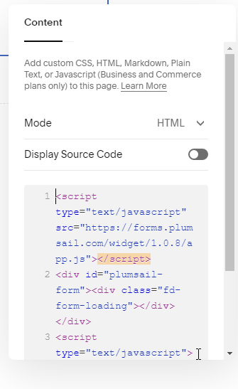
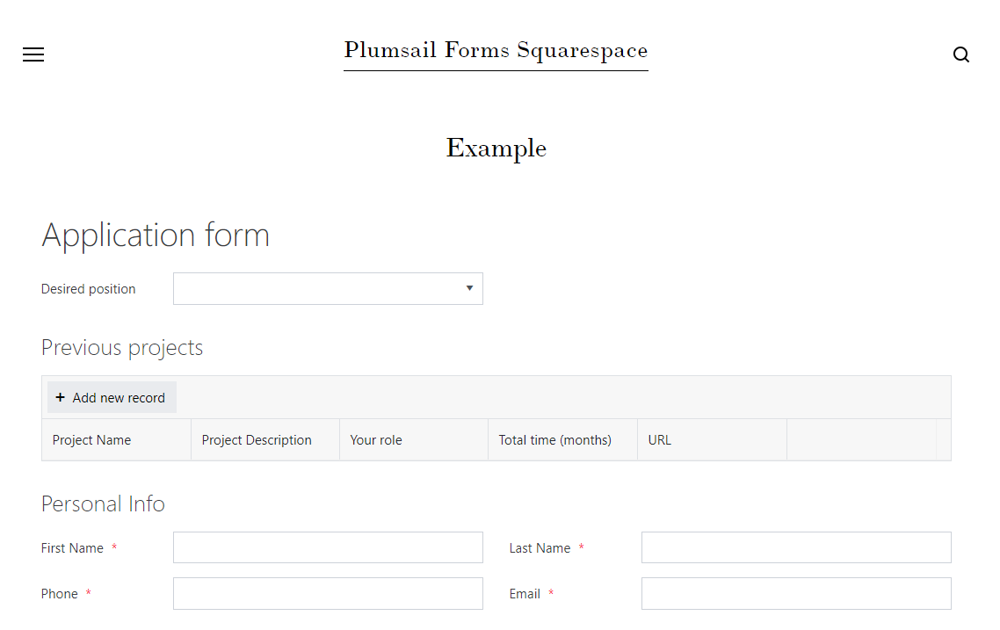

.. title:: Embed Plumsail web form on a Facebook page

.. meta::
   :description: How to publish our public web form to your Facebook page

Embed Plumsail web form on a Facebook page
==========================================================
You can add a Plumsail web form to a Facebook page in just a couple of easy steps with the help of our Widget:

.. important:: Your page has to have at least 2,000 fans in order to add a custom tab. This is due to |changes to Facebook API|.

#. | Login to |Facebook| account
#. | Go to "|Static HTML: iframe tabs|" page
#. | Select **Add Static HTML to a page**:
   | |app|
#. | Select the page where you want to add form to and click **Add Page Tab**:
   | |add-page-tab|
#. | Copy widget snippet from your form's settings:
   | |copy|
#. | Insert it into *index.html* tab, then click **Save & Publish**. The page with form should appear with other tabs on the left.

.. |changes to Facebook API| raw:: html

   <a href="https://developers.facebook.com/docs/graph-api/changelog/version2.11/#gapi-90-pages" target="_blank">changes to Facebook API</a>

.. |Facebook| raw:: html

   <a href="https://www.facebook.com/" target="_blank">Facebook</a>

.. |Static HTML: iframe tabs| raw:: html

   <a href="https://apps.facebook.com/static_html_plus/" target="_blank">Static HTML: iframe tabs</a>

   
.. |copy| image:: ../images/start/start-copy-snippet.png
   :alt: Copy Form Widget snippet in Sharing Settings

