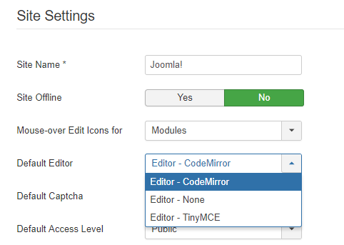
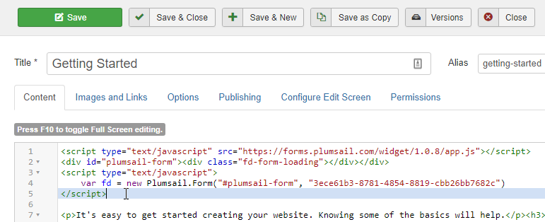

.. title:: Embed Plumsail web form on a Joomla! site

.. meta::
   :description: How to publish our public web form to your Joomla! site

Embed Plumsail web form on a Joomla! site
==========================================================
You can add a Plumsail web form to a Joomla! site in just a couple of easy steps with the help of our Widget:

#. | :doc:`Design a form <../design>` to publish
#. | Open Joomla! control panel, go to Global settings and select Editor – Code Mirror as the default editor:
   | |editor|
#. | Copy widget snippet from your form's settings:
   | |copy|
#. | Paste the snippet into the Code's Content on a Joomla! site and publish the page:
   | |content|

   
.. |copy| image:: ../images/start/start-copy-snippet.png
   :alt: Copy Form Widget snippet in Sharing Settings

