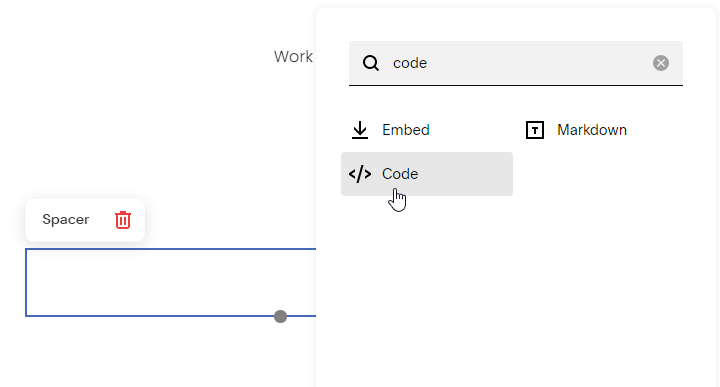
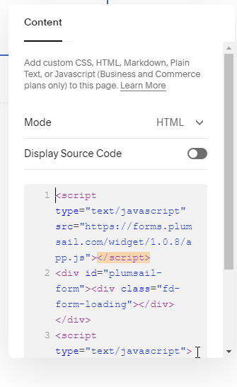
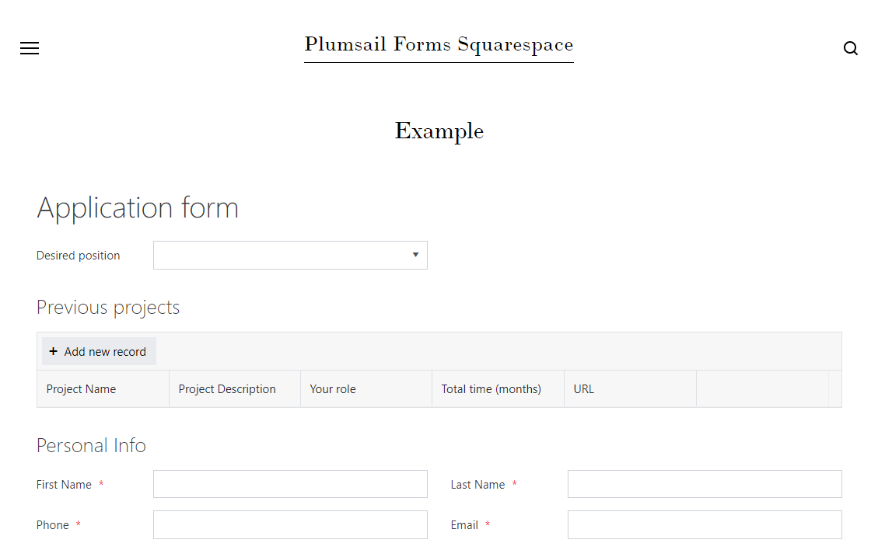

.. title:: Embed Plumsail web form on a Squarespace site

.. meta::
   :description: How to publish our public web form to your Squarespace site

Embed Plumsail web form on a Squarespace site
==========================================================
You can add a Plumsail web form to a Squarespace site in just a couple of easy steps with the help of our Widget:

.. important:: Squarespace Business and Commerce plans only

#. | :doc:`Design a form <../design>` to publish
#. | Login to |Squarespace| account
#. | Select the site where you want to publish a form
#. | Go to page you want to publish the form on and edit the page:
   | |edit|
#. | Click **Add** → search for *code* → add **Code** block:
   | |code|
#. | Copy widget snippet from your form's settings:
   | |copy|
#. | Paste the snippet into the Code's Content on a Squarespace site:
   | |content|
#. | Your form will then appear on a Squarespace site and will be ready to go:
   | |result|

.. |Squarespace| raw:: html

   <a href="https://www.squarespace.com/" target="_blank">Squarespace</a>

   
.. |copy| image:: ../images/start/start-copy-snippet.png
   :alt: Copy Form Widget snippet in Sharing Settings

