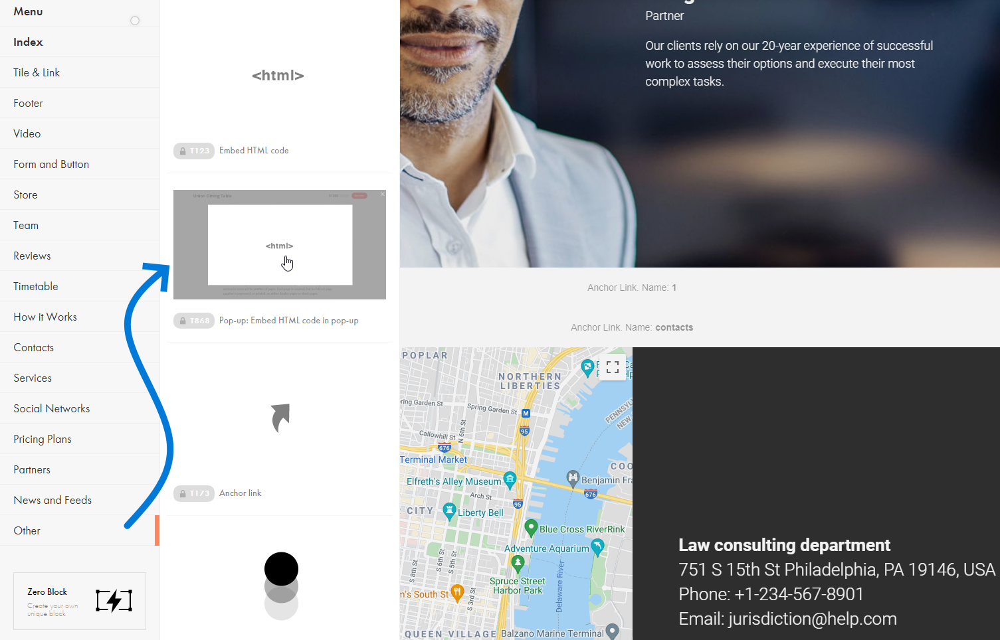
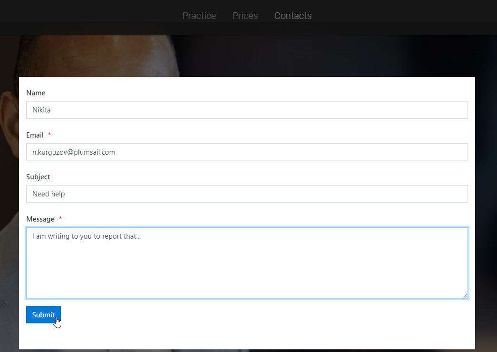

.. title:: Embed Plumsail web form on a Tilda site

.. meta::
   :description: How to publish our public web form to your Tilda site

Embed Plumsail web form on a Tilda site
==========================================================

.. contents::
 :local:
 :depth: 1

Regular page
---------------
You can add a custom Plumsail web form to a Tilda site in just a couple of easy steps with the help of our Widget:

#. | Login to |Tilda| account
#. | Select the site where you want to publish a form, and select the page
#. | Find a place to add your form between sections and click the **+** sign
#. | Select **Other** → **Embed HTML code**:
   | |embed|
#. | Copy widget snippet from your form's settings:
   | |copy|
#. | Paste the snippet into the embed's HTML Content → *HTML CODE / WIDGET CODE* on a Tilda site:
   | |paste|
#. | Adjust the settings and layout for the section:
   | |settings|
#. | Your form will then appear on a Wix site and will be ready to go:
   | |ready|

.. |Tilda| raw:: html

   <a href="https://www.tilda.cc/" target="_blank">Tilda</a>

   
.. |copy| image:: ../images/start/start-copy-snippet.png
   :alt: Copy Form Widget snippet in Sharing Settings

   

Pop-up form 
---------------
You can also add a custom Plumsail web form to a Tilda site in a pop-up:

#. | Login to |Tilda| account
#. | Select the site where you want to publish a form, and select the page
#. | Find a place to add your form between sections and click the **+** sign
#. | Select **Other** → **Embed HTML code in pop-up**:
   | |popup-embed|
#. | Copy widget snippet from your form's settings:
   | |copy|
#. | Paste the snippet into the embed's HTML Content → *HTML CODE / WIDGET CODE* on a Tilda site and copy the pop-up link:
   | |popup-content|
#. | Add a trigger to make sure the pop-up appears:
   | |popup-trigger|
#. | Paste pop-up link to the trigger:
   | |popup-link|
#. | Your form will then appear on a Wix site and will be ready to go:
   | |popup-ready|

.. |popup-settings| image:: ../images/embed/tilda/embed-tilda-popup-settings.png
   :alt: Settings of the embed part
   
