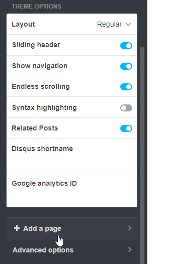
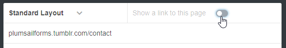
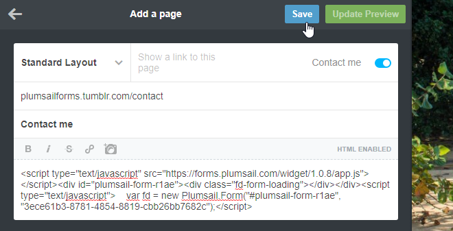
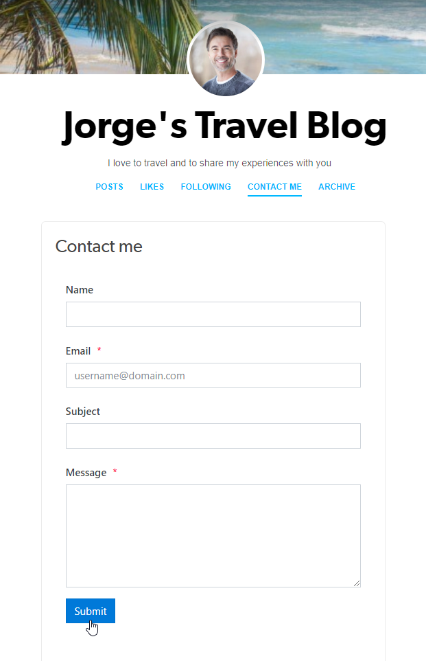

.. title:: Embed Plumsail web form in a Tumblr blog

.. meta::
   :description: How to publish our public web form to your Tumblr blog

Embed Plumsail web form in a Tumblr blog
==========================================================

You can add a custom Plumsail web form to a Tumblr blog in just a couple of easy steps with the help of our Widget:

#. | :doc:`Design a form <../design>` to publish
#. | Login to your |Tumblr| account
#. | Go to your account's settings and click Edit Theme:
   | |edit-theme|
#. | In theme settings, click **Add a page**:
   | |add-page|
#. | Give a URL and a name to the page and click *Show a link to this page* to make it accessible from your blog:
   | |show-page|
#. | Copy widget snippet from your form's settings:
   | |copy|
#. | Paste the snippet into the page's content on a Tumblr site and save the page:
   | |save-page|
#. | Your form will then appear on a page in your Tumblr blog and will be ready to go:
   | |result|

.. |Tumblr| raw:: html

   <a href="https://www.tumblr.com/" target="_blank">Tumblr</a>

  

.. |copy| image:: ../images/start/start-copy-snippet.png
   :alt: Copy Form Widget snippet in Sharing Settings