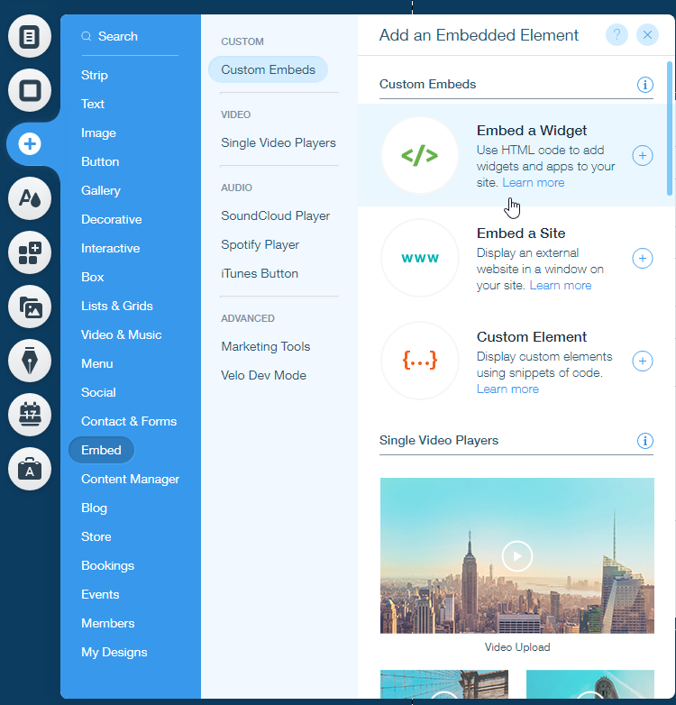

.. title:: Embed Plumsail web form on a Wix site

.. meta::
   :description: How to publish our public web form to your Wix site

Embed Plumsail web form on a Wix site
==========================================================

.. note:: If you're using Editor X, newer platform from Wix.com, we have :doc:`an instruction for Editor X <./editor-x>` as well 

You can add a custom Plumsail web form to a Wix site in just a couple of easy steps with the help of our Widget:

#. | :doc:`Design a form <../design>` to publish
#. | Login to |Wix| account
#. | Select the site where you want to publish a form
#. | Click **Edit site**
#. | Click **Add** → **Embed** → **Custom embeds** → **Embed a widget**:
   | |embed|
#. | Position the embed where you want it to be on your page
#. | Copy widget snippet from your form's settings:
   | |copy|
#. | Paste the snippet into the embed's HTML Settings → *Code* → *Add your code here (HTTPS only)* on a Wix site:
   | |paste|
#. | Your form will then appear on a Wix site and will be ready to go:
   | |ready|

.. |Wix| raw:: html

   <a href="https://www.wix.com/" target="_blank">Wix</a>

   
.. |copy| image:: ../images/start/start-copy-snippet.png
   :alt: Copy Form Widget snippet in Sharing Settings

