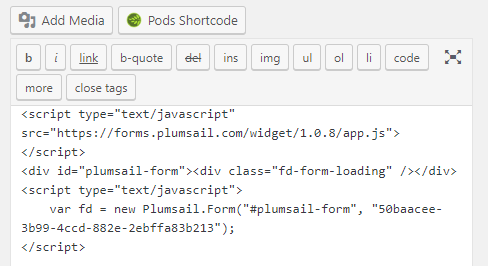

.. title:: Embed Plumsail web form on a Wordpress site

.. meta::
   :description: How to publish our public web form to your Wordpress site

Embed Plumsail web form on a Wordpress site
==========================================================
You can add a Plumsail web form to a Wordpress site in just a couple of easy steps with the help of our Widget:

#. | Open Wordpress site as an admin and navigate to the page where you want to embed the form.
#. | Copy widget snippet from your form's settings:
   | |copy|
#. | Paste the snippet into the page's content on the Wordpress site and publish the page:
   | |content|
   
.. |copy| image:: ../images/start/start-copy-snippet.png
   :alt: Copy Form Widget snippet in Sharing Settings

