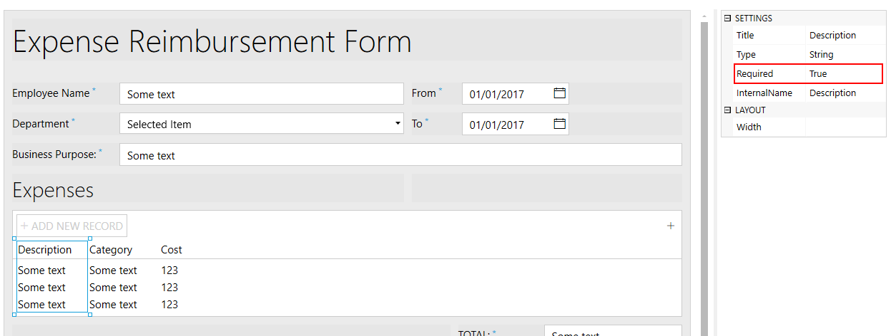

.. title:: Create Expense Reimbursement form with dates and total calculation

.. meta::
   :description: Build complex form with advanced logic that will calculate total expenses automatically

How to create Expense Reimbursement form with dates and total calculation
=========================================================================

With the recently added :ref:`designer-datatable` control, we can design a more complex form and then submit it to Power Automate flow.

In this example, we will design an Expense Reimbursement Form, which will include DataTable to list all the expenses,
as well as Ink Sketch controls to get signatures from the user and his supervisor.

.. contents::
 :local:
 :depth: 1

Design a form
--------------------------------------------------
First, we will design a form, which will include all the necessary information from the employee, such as name, ID, Department, and the purpose behind the expenses.
We will also include two date fields From and To, which will include time period during which the expenses took place.

Next, our form will have DataTable to store all the expenses and will include Description, Category and Cost.

After the table, we will have Total field which will automatically calculate and display Total amount of expenses.

Finally, the form will include a signature pad for the employee to sign the form.

Here's our result:

|

Let's now work on form's logic to make sure that all fields are set correctly on our form.

.. _data-table-form:

Add logic and scripts
--------------------------------------------------
So, what JavaScript logic do we need? First, we need to make sure that all fields are set correctly and that the form is signed.

First we set all fields as mandatory, as none of them are optional. This can be done in the designer by selecting a field and changing SETTINGS  → Required to True:

|

We can also do the same with DataTable columns by selecting the column and also changing SETTINGS  →  Required to True:

|

Now that the fields and columns are set as required, we can work on Form validators to make sure that the form is signed and that the fields have correct input.

Let's make sure that the Date "To" is greater or the same as Date "From":

|

We can also have another validator to make sure that the form is signed:
    

|  

Now, let's add both these validators to our form with this code:

.. code-block:: javascript
    
    //once the form is rendered:
    fd.rendered(function(){
        fd.validators.push({
            name: 'DateValidator',
            error: '"To" must be greater or the same as "From"',
            validate: function(value) {
                if (fd.field('From').value >= fd.field('To').value)
                    return false;
                    
                return true;
            }
        },
        {
            name: 'SignatureValidator',
            error: 'Please, sign the form before submitting',
            validate: function(value) {
                if (fd.control('Signature').value)
                    return true;
                    
                return false;
            }
        });
    });

Final piece of code that we need to implement is an automatic calculation of Total field. 

Each time a user changes values in Cost column of Expenses DataTable, Total needs to be recalculated. 

The field itself will be set to disabled state, so the user won't be able to change it directly, only by adding Cost to the records in Expenses DataTable:

| 

This can be done with JavaScript, which will add inside fd.rendered() event function after adding our validators:

.. code-block:: javascript

    fd.rendered(function(){
        //... validators are added here
        
        fd.field("Total").disabled = true;

        fd.control('ExpensesTable').$on('change', function(value) {
            var total = 0;
            if(value){
                for (var i = 0; i < value.length; i++){
                    total += parseInt(value[i].Cost);
                }
            }
            
            // Total field is a Text field, so I can add a dollar symbol to it:
            fd.field("Total").value = '$' + total;
        });
    });

Now that we are done with the form configuration, you can save and activate the form. Check out :doc:`how to share a form <../sharing>` and :doc:`how to access submitted information <../submissions>`.

.. Note::  For this form, you can also take a look at our instruction on how it can be :doc:`converted to PDF using Plumsail Documents <../how-to/data-table-flow>`.