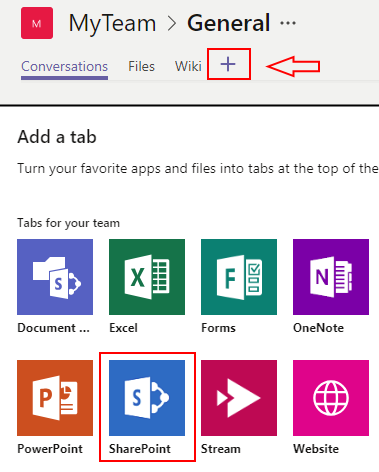
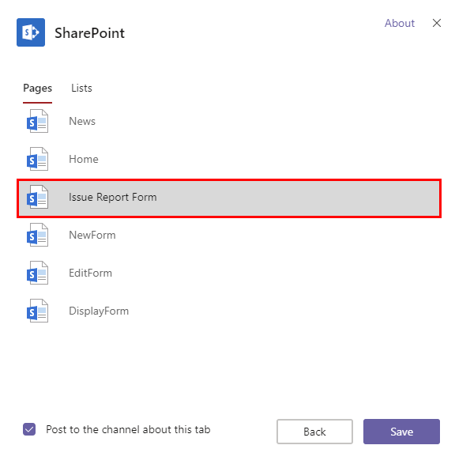
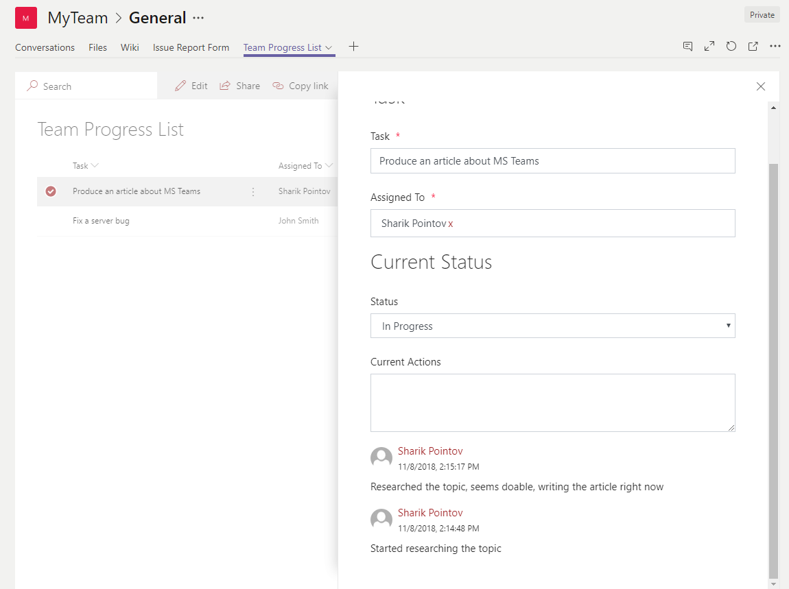

How to embed web form or SharePoint form into Microsoft Teams
==============================================================

.. contents:: Contents:
 :local:
 :depth: 1
 
Introduction
--------------------------------------------------
If you've ever wanted to have custom forms in MS Teams, Plumsail Forms allows for easy integration. 

Using SharePoint tab in MS Teams, you can get access to both Public Web Forms, by publishing them on a SharePoint page first and linking a tab to this page, 
and SharePoint Forms, by adding a List to a tab, and using Panel to display forms.

In this article, we'll go into more details and how you can achieve the same results to add advanced custom forms to MS Teams.

Public Web Form
---------------------------------------------------
Easiest option to add a web form to MS Teams is to publish it to a page first. 

Go to Site Pages of your Team Site, and create a New Page:

   
|

If you have |installed Modern SharePoint Forms|, you must have Plumsail Forms web part available, add it to the page:

   
|

Add ID of the Public Web Form to it and publish the page:

*Also, don't forget to disable comments on the page, since you probably won't need them (this is up to you, though).*

|

Finally, go to MS Teams, click + sign to Add a tab and select SharePoint:

|

Next, in Pages, select the page that you've just created:

|

And now you have a tab with a web form, that users can fill in at any time:

   
|

SharePoint Form
---------------------------------------------------
If you want to have a SharePoint Form, it's best to add as a SharePoint List.

First, make sure that you have a List that you want to customize on your Team Site or create one:

   
|

Customize New, Edit and Display Forms in the designer, and don't forget to add a Form Panel to all of them:

   
|

Then, go to MS Teams, click + sign to Add a tab and select SharePoint:

   
|

Next, in Lists, select the List that you've customized the forms for:

  
|

Now you have a List View with custom forms in a panel, which you can configure exactly as you need:

.. |installed Modern SharePoint Forms|  raw:: html

   <a href="https://plumsail.com/docs/forms-sp/installation-sp.html" target="_blank">installed Modern SharePoint Forms</a>