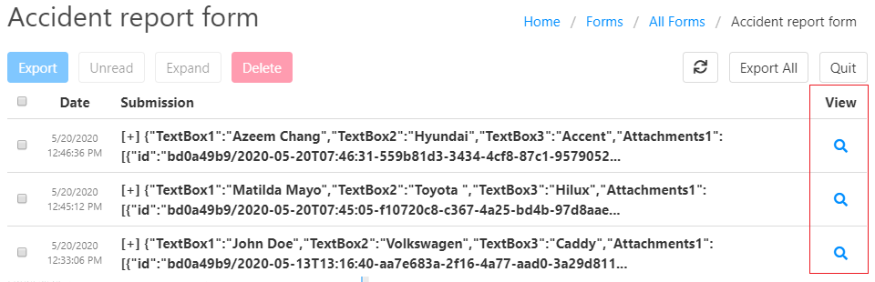
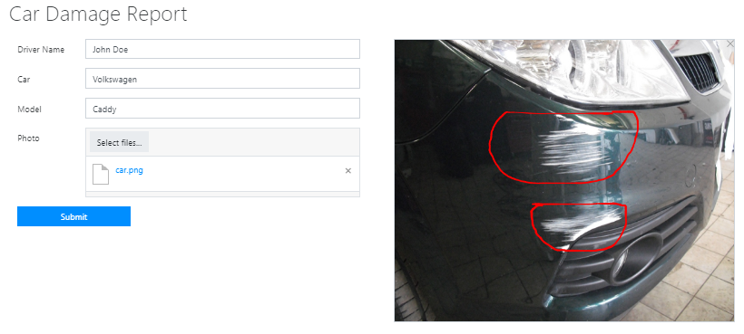

.. title:: Make notes on images in web forms designed with Plumsail Forms

.. meta::
   :description: Allow users of your forms to upload images and leave some markings or drawings on them using a mouse or a touchscreen

How to make notes on images in web forms designed with Plumsail Forms 
===============================================================================

.. contents:: Contents:
 :local:
 :depth: 1

Introduction
--------------------------------------------------

You can use the 'Ink Sketch' control to leave marks over a selected image. The image won't be changed, but your drawings will be placed on top of it. 

|pic0|

This functionality can be useful in many cases: a user can draw directions on a map, leave marks in a patient card, make corrections in blueprints, specify damaged parts of a vehicle in an accident report form.

Configuration
--------------------------------------------------

Please follow the instruction below to put an attached image in the background of an 'Ink Sketch' control.

**1.** Add 'Attachments' field and 'Ink Sketch' control to the form.

|pic1|

You need to know the internal name of the Ink Sketch control and the Attachments field to use them further in your code. 
To find the internal name, click on a field or control. In the right pane, you will see the 'Internal Name' property. 

|pic2|

You can either change the internal name or leave it as it is.

**2.** Specify the desired height and width of the 'Ink Sketch' control. 

|pic3|

By default, the ink color is black. In the control settings, you can change the color. 

|pic4|

**3.** To put an attached image to the background of the 'Ink Sketch' control, you need to insert the below snippet to the JavaScript editor of the designer. 

.. code-block:: javascript
    
    var attachmentsName = 'Attachments0'; 
    var inkSketchName = 'Signature0'; 
    var canvasSize = '600px 500px';
    
    function updateBackground() {  

        var attachmentsField = fd.field(attachmentsName); 
        var inkSketchControl = fd.control(inkSketchName); 

        if (attachmentsField.value && attachmentsField.value.length > 0) { 

            //Getting URL of the attached file  
            var imageURL = attachmentsField.value[0].url;  

            //Setting the background 
            inkSketchControl.$el.style = 'background-image: url("' + imageURL + '"); background-size:' + canvasSize + '; background-repeat: no-repeat;';  

        } else { 

            //Clearing the background 
            inkSketchControl.$el.style = 'background-image: none;';          

        }    
    }  
    
    fd.rendered(function(){  

        // updating the backgroung on changing the Attachments field 
        fd.field(attachmentsName).$on('change', updateBackground);
 
        // updateing the background on form loading 
        updateBackground();  
    });  

To apply it to your form, you need to: 
- replace 'Attachments0' and 'Signature0' with the internal names of your 'Attachment' field and 'Ink Sketch' control; 
- specify the 'Ink Sketch' control canvas size in 'canvasSize' variable. 

View submissions
--------------------------------------------------

You can save form submissions in your Plumsail Account:

 - Login to your Plumsail Account 
 - Choose 'Forms' in the products list 
 - Click the 'Forms' item in the left menu 
 - Select a form which submissions you want to store in your account 
 - And turn on the 'Save posts' option 

|pic5|

Now, once a user submits a form, you can view the submission by clicking the View icon:

|pic6|

Here is an example of the submitted form: 

|pic7|

Please see |Ink Sketch properties| and |Ink Sketch control| documentation for more information about the control.

.. |Ink Sketch properties| raw:: html

   <a href="https://plumsail.com/docs/forms-web/javascript/controls.html#ink-sketch" target="_blank">'Ink Sketch properties'</a>

.. |Ink Sketch control| raw:: html

   <a href="https://plumsail.com/docs/forms-web/designer/controls.html#ink-sketch" target="_blank">'Ink Sketch control'</a>