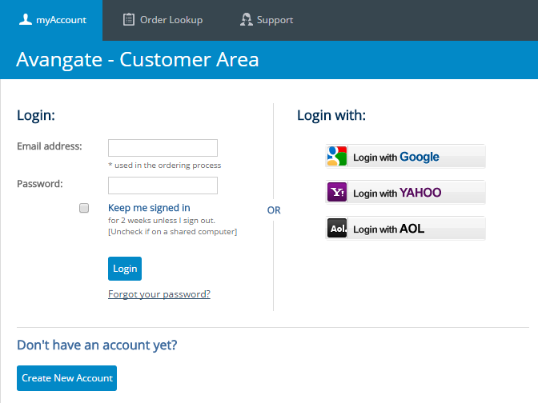
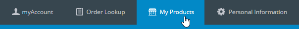
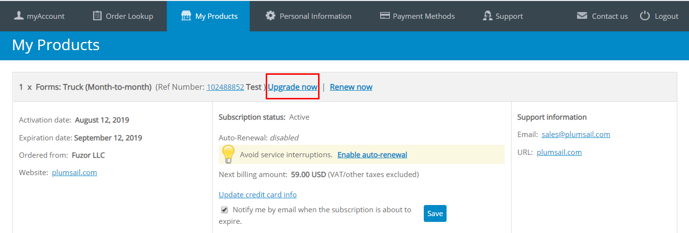

How to upgrade or renew your Plumsail Forms subscription
==============================================================
To upgrade/renew a subscription you need to sign into your personal store account. Navigate to https://secure.avangate.com/myaccount and sign in using your email and password. If you don’t have a password, you can easily receive it. Just click “Create New Account” and specify your order number or email address which you used to purchase the product. 

Avangate will send you the link to get your password.

|pic1|

Once you signed in click at “My Products” at the top menu:

|pic2|

You will see the list of your products. Locate the product you want to upgrade/renew. You will see subscription status and expiration date. Click “Upgdare now” or "Renew now".

.. Note:: If you don’t see your product or the “Renew” link in the list, contact sales@plumsail.com to get renew link.

You will be redirected to the confirmation and payment page, where you will be able to choose a payment method and specify your payment information. Your subscription/maintenance will be activated within one working day after receiving the payment.

|pic3|

Optionally you can enable auto-renewal for the product. See the “Enable auto-renewal” link at the picture above. So, renewal will be performed automatically using the credit card information you submitted.