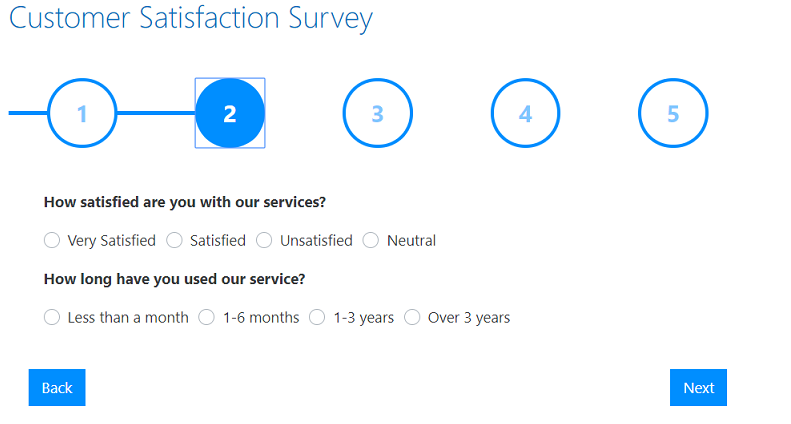

Build excel charts based on submissions
=========================================================================

.. contents:: Contents:
 :local:
 :depth: 1

Introduction
--------------------------------------------------

In this article, you will know how to gather information from submissions and build simple charts for data analysis in Excel. 

For this, we've created a Customer Satisfaction survey to analyze service loyalty and clients' average age. 

Form overview 
--------------------------------------------------

|pic0|

The form has the following fields: 

- Name (text field), 

- Email (text field), 

- Age (numeric field), 

- How satisfied is the customer with the services? (radios field), 

- How long has the customer using the service? (radios field), 

- What does the customer like the most about the services? (radios field), 

- What does the customer dislike the most about the services? (radios field), 

- Will the customer use the services in the future? (dropdown field), 

- Will the customer recommend the service? (dropdown field), 

- Comments (multiline text field). 

Questions in the form are structured with |wizard containers|.  

You can download the form template |here|. 

Export submissions 
--------------------------------------------------

First, you need to enable saving the form submissions. For this: 

- Login to your |Plumsail Account| 

- Choose 'Forms' in the products list 

- Click the 'Forms' item in the left menu 

- Select a form which submissions you want to store in your account 

- And turn on the 'Save posts' option 

|pic1|

Then, in your Plumsail account, you will see a list of submitted forms. Export the data to a CSV-file. 

|pic2|

Build charts 
--------------------------------------------------

To import CSV file to excel, please do the following:  

- Go to the Data tab >> From Text/CSV 

|pic3|

- Navigate to CSV file. Click import

|pic4|

- In the dialog window, set the Delimiter to Tab and click the 'Load' button. 

|pic5|

You can build charts and tables based on the loaded data. For example, you can build a Pareto chart to analyze the age distribution of your customers. 

|pic6|

.. |Plumsail Account|  raw:: html

   <a href="https://account.plumsail.com/" target="_blank">Plumsail Account</a>

.. |wizard containers|  raw:: html

   <a href="https://plumsail.com/docs/forms-web/designer/containers.html#wizard" target="_blank">wizard containers</a>

.. |here|  raw:: html

   <a href="..\_static\forms\service_quality_form.xfds" target="_blank" download= "service_quality_form">here</a>