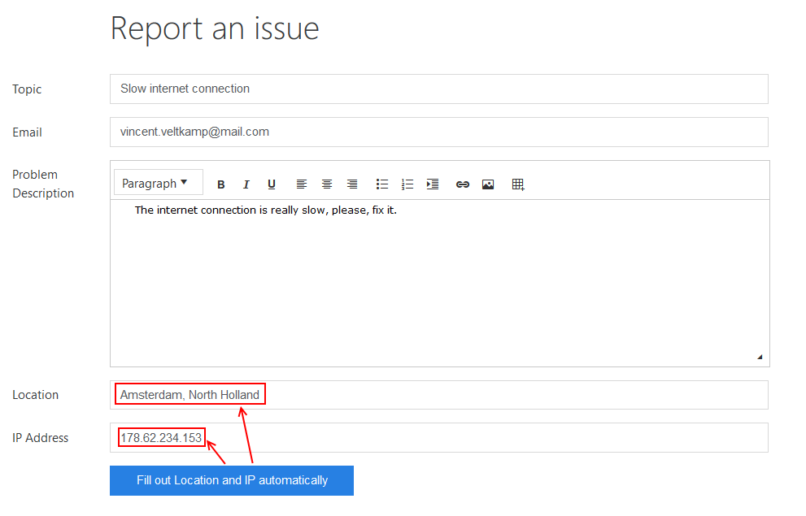

.. title:: Work with fields using JS on Plumsail Forms (public forms)

.. meta::
   :description: How to populate, hide, show, disable, make required and modify fields, on various events, with custom conditions using JavaScript
   
How to populate, hide, disable, or make mandatory fields of public web forms in JavaScript 
============================================================================================

In this article you can find examples of how to use JavaScript to make 
your forms more interactive by hiding, disabling and making fields mandatory based on certain conditions.
You can also mix and match these examples to achieve the results you are looking for.

In order to access fields in JavaScript, you'll need use **fd.field()** method of which expects an Name of a field you want to retrieve.
All fields have Name property which is unique for every field on the form. 
Find more about using JavaScript on fields :doc:`here </javascript/fields>`.

|

In any case, you can check the Name property of the field in the designer when you select the field.
Read more about different field properties :doc:`here </designer/fields>`.

Another thing to be aware of is that you shouldn't simply place JavaScript inside the editor on its own, it must be executed inside **fd** events 
like **rendered()** or **beforeSave()** in order to actually access the fields or controls that you target.

If you just add these scripts on their own or inside wrong event in JavaScript editor,
they will not have access to the specified fields, or will execute at the wrong time.
Read more about different events in :doc:`Manager section </javascript/manager>`.

.. contents::
 :local:
 :depth: 1

Populate field value
--------------------------------------------------
Set the field once the form loads:

.. code-block:: javascript

    fd.rendered(function(vue) {
        fd.field('StartDate').value = new Date();
    });

For some fields, such as Lookup or Person, you might need to wait until the field is ready, before you can assign a value:

.. code-block:: javascript

    fd.field('Lookup').ready().then(function(field) {
        //set Lookup field value once the field loads
        field.value = 5;
    });

Handle field change
-----------------------------------------------------------
Set the field once value of another field changes:

.. code-block:: javascript

    fd.rendered(function() {

        function setPercentComplete() {
            if (fd.field('Status').value == 'Completed') {
                // Setting the Percent Complete to 100
                fd.field('PercentComplete').value = '100';
            } 
        }

        // Calling setPercentComplete when Status value changes
        fd.field('Status').$on('change',setPercentComplete);

        // Calling setPercentComplete on form loading
        setPercentComplete();

    });

Disable field
-----------------------------------------------------------
Disable field once specific conditions are meant.

.. code-block:: javascript

    fd.rendered(function() {

        function disablePercent() {
            if (fd.field('Status').value == 'Completed' && fd.field('PercentComplete').value == '100') {
                // Setting field PercentComplete to a disabled state
                fd.field('PercentComplete').disabled = true;
            } 
            else{
                // Setting field PercentComplete to an editable state
                fd.field('PercentComplete').disabled = false;
            }
        }

        // Calling disablePercent when the PercentComplete value changes
        fd.field('PercentComplete').$on('change',disablePercent);

        // Calling disablePercent on form loading
        disablePercent();

    });

Hide/show field
--------------------------------------------------
Hide/show fields once value of another field changes:

.. code-block:: javascript

    fd.rendered(function() {

        function hideOrShowDueDate() {
            if (fd.field('StartDate').value) {
                // Show the Due Date field
                $(fd.field('DueDate').$parent.$el).show();
            } else {
                // Hide the Due Date field
                $(fd.field('DueDate').$parent.$el).hide();
            }
        }

        // Calling hideOrShowDueDate when the Start Date value changes
        fd.field('StartDate').$on('change',hideOrShowDueDate);

        // Calling hideOrShowDueDate on form loading
        hideOrShowDueDate();

    });

Require field based on condition
--------------------------------------------------
Set field to required state if conditions are meant:

.. code-block:: javascript

    fd.rendered(function() {

        function setDueDateRequired() {
            if (fd.field('StartDate').value) {
                // Set Due Date required
                fd.field('DueDate').required = true;
            } else {
                // Set Due Date as not required if there is no Start Date
                fd.field('DueDate').required = false;
            }
        }

        // Calling setDueDateRequired when the Start Date value changes
        fd.field('StartDate').$on('change',setDueDateRequired);

        // Calling setDueDateRequired on form loading
        setDueDateRequired();

    });

Modify fields with Button control
--------------------------------------------------
Button and Hyperlink controls have an Click property which holds JavaScript code which is executed when the control is clicked.

This can be used for variety of purposes and you don't need to include JavaScript inside **fd** events 
as by the time the button has loaded, other fields have already loaded as well.

The basic version is something like this, the following code goes inside Click propert:

.. code-block:: javascript

    fd.field('Title').value = "Hello, world!"

Modify fields with Button control and an external API
-------------------------------------------------------
In this more complex example with a request to an external API, |ipinfo.io| API will help us determine person's location and IP.

.. |ipinfo.io| raw:: html

   <a href="https://ipinfo.io/" target="_blank">ipinfo.io</a>

That's what our form will look like filled out:

|

Here is the code placed inside my button's Click property:

.. code-block:: javascript

    $.get("https://ipinfo.io", function (response) {
	    fd.field('Location').value = response.city + ", " + response.region;
	    fd.field('IP').value = response.ip;
    }, "jsonp");