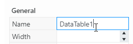
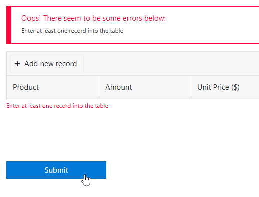
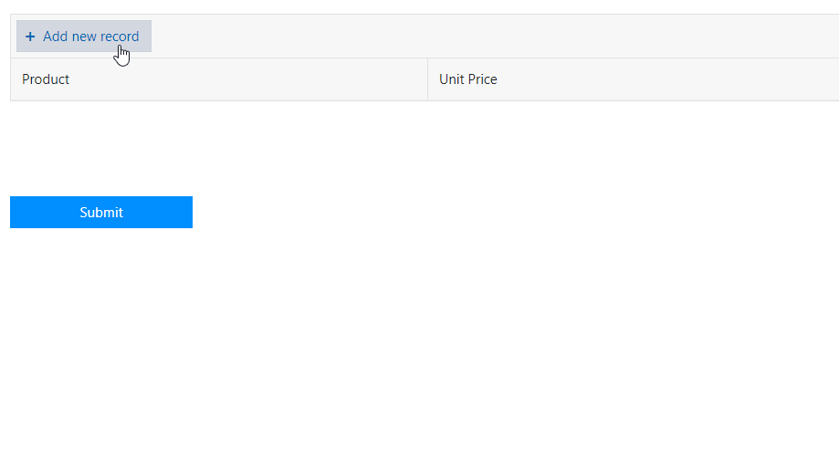
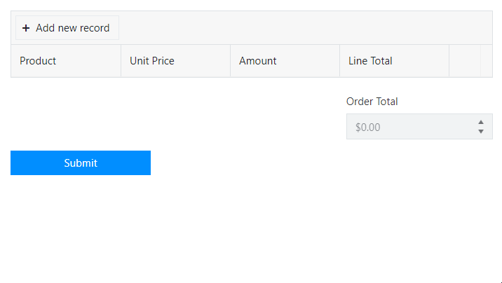
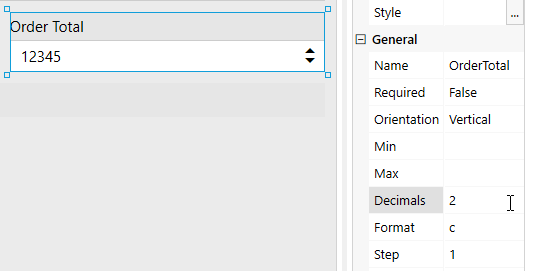

.. title:: Work with Data Table using JS on Plumsail Forms (public forms)

.. meta::
   :description: How to make Data Table required, set field values based on other fields, calculate total
   
How to make Data Table required, set field values based on other fields, and calculate total
============================================================================================

In this article you can find examples of how to use JavaScript to work with Data Table control, and the various things you can do.

In order to access Data Table in JavaScript, you'll need use **fd.control('DataTableName')** method, which expects the name of a Data Table you want to work with.
All fields and controls have the name property, which you can check in the editor:

Another thing to be aware of is that you shouldn't simply place JavaScript inside the editor on its own, it must be executed inside **fd** events 
like **rendered()** or **beforeSave()** in order to actually access the fields or controls that you target.

If you just add these scripts on their own or inside wrong event in JavaScript editor,
they will not have access to the specified fields, or will execute at the wrong time.
Read more about different events in :doc:`Manager section </javascript/manager>`.

For more information on working with Data Table control specifically, please, refer to the :ref:`Data Table section of our JS documentation<js-datatable>`.

.. contents::
 :local:
 :depth: 1

Make Data Table record required
-----------------------------------------------------------
Sometimes, you just need to ensure that at least one record is added to the Data Table. 

|

This can be achieved with a simple validator:

.. code-block:: javascript
    
    //make at least one record required
    fd.rendered(function(){
        fd.control('DataTable1').validators.push({
            name: 'DataTable1 validator',
            error: 'Enter at least one record into the table',
            validate: function(value) {
                //change this number to make more records required
                if (value.length < 1) {
                    return false;
                }

                return true;
            }
        });
    });

.. Note::   You can adjust the number in the code to make more records required or add other conditions for a more complex validation.

Populating Dropdown column
-----------------------------------------------------------
To populate dropdown column of DataTable control dynamically, use the code:

.. code-block:: javascript

    fd.rendered(function() {
        fd.control('DataTable1').$on('edit', function(e) {
            console.log(e)
            if (e.column.field === "Column1") {
                //pass widget + current column value
                console.log(e.model);
                populateColumn(e.widget, e.model.Column1);
            }
        })

    });

    function populateCategories(widget, value) {

        widget.setDataSource({
            data: ['Category1', 'Category2', 'Category3']
        });

        //set value if one was select
        widget.value(value);
    }

Set fields based on other fields
--------------------------------------------------
Sometimes, you might want to set fields automatically, without direct user input:

|

For example, the product prices are not something a user should be able to change. Instead, they can be set dynamically, depending on the selected product.

We'll use a simple |JS Object| to store product prices, and automatically set unit price on product selection. Here is the code:

.. code-block:: javascript

    //we store prices in JS object
    var merch = {};
    //use bracket notation to accurately copy dropdown values
    merch['Baseball cap'] = 9.99;
    merch['T-shirt'] = 19.99;
    merch['Key chain'] = 4.99;

    fd.rendered(function(){
        //set unit price column (2nd column) to be non-editable, as we set it with code
        fd.control('DataTable1').columns[1].editable = function(){return false};
        
        fd.control('DataTable1').$on('change', function(value) {
            console.log(value); // DataTable's value
            if(value){
                //these changes are not manual
                manualChange = false;
                for(var i = 0; i < value.length; i++){
                value[i].UnitPrice = merch[value[i].Product];
                }
                //refresh to update all values
                fd.control('DataTable1').widget.refresh()
            }
        });
    });

.. |JS Object| raw:: html

   <a href="https://developer.mozilla.org/en-US/docs/Web/JavaScript/Reference/Global_Objects/Object" target="_blank">JS Object</a>

Calculate total for a row and the whole table
--------------------------------------------------
Finally, we're going to calculate total for a row, and for the whole Data Table.

|

Here is the code:

.. code-block:: javascript

        fd.rendered(function() {
            //Disable OrderTotal field
            fd.field('OrderTotal').disabled = true;

            //Make LineTotal column noneditable
            fd.control('DataTable1').columns[3].editable = function(){return false};

            fd.control('DataTable1').$on('change', function(value) {
                //variable to count Order Total
                var orderTotal = 0.0;

                //if there are records in the table
                var isTableModified = false;
                if(value){
                    //go through each one by one
                    for (var i = 0; i < value.length; i++){
                        //if this record has Amount and UnitPrice
                        if(value[i].Amount && value[i].UnitPrice){
                            //set LineTotal to their product
                            var cost = value[i].Amount * value[i].UnitPrice;

                            if (value[i].LineTotal != cost) {
                                value[i].LineTotal = cost;
                                isTableModified = true;
                            }
                        }

                        //add Total to the Order Total
                        orderTotal += parseFloat(value[i].LineTotal);
                        console.log(orderTotal);
                    }
                }

                //here we refresh the table
                if (isTableModified) {
                    fd.control('DataTable1').widget.refresh();
                }

                //we set Order Total field to sum of Totals
                fd.field('OrderTotal').value = orderTotal;
            });
        });

If you're getting an incorrect value in one of your fields, for example, in OrderTotal, make sure that the format is correctly configured and an appropriate number of decimals is selected:

