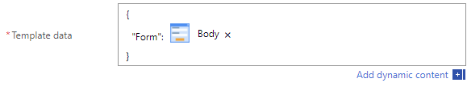

.. title:: Data Table to PDF with HTML-template and Plumsail Documents

.. meta::
   :description: Use Microsoft Power Automate and Plumsail Documents to generate HTML-template and convert Data Table to PDF
   
How to generate HTML-template for Data Table and convert it into PDF document with Power Automate 
==========================================================================================================

This article will describe how you can convert :ref:`designer-datatable` into HTML template with |Plumsail Documents|. You can use any form with DataTable control, but we'll use our :doc:`example Expense Reimbursement form <../examples/expense-reimbursement>`.

It's an example of using Plumsail Forms data with Plumsail Documents, and you can also check how to :doc:`convert web form with Data Table into PDF </how-to/data-table-flow>`.

In here, we will also show you how you can format data inside Data Table with HTML-template for columns such as date.

.. contents::
 :local:
 :depth: 1

Microsoft Flow using HTML template functionality
--------------------------------------------------
We will use Plumsail Documents connector, which you can read about setting up |Plumsail Documents connector|. 

You can either create Custom connector or use MS Flow Premium connector, 
but you will need to have an API key from |Plumsail Account| in both cases.

.. |Plumsail Account| raw:: html

   <a href="https://auth.plumsail.com/account/login" target="_blank">Plumsail Account</a>

.. |Plumsail Documents connector| raw:: html

   <a href="https://plumsail.com/docs/documents/v1.x/getting-started/use-from-flow.html" target="_blank">here</a>

Once the connector is set up, search for HTML Template and select *Plumsail Documents - Create HTML from template*:

.. image:: ../images/how-to/data-table-flow/data-table-flow-01.png
   :alt: Search for HTML Template and select Plumsail Documents - Create HTML from template

| 

Once the connector is set up, search for HTML Template and select *Plumsail Documents - Create HTML from template*:

| 

Once the action is added, we need to fill in both *Source HTML* and *Template Data*. 

Since *Source HTML* uses *Template Data* quite extensively, it's best to first define *Template Data*.

*Template Data* needs to be composed as a JavaScript object where we include all our data, in our case - just the form.

First, I'll create very basic structure for our object:

.. code-block:: javascript

    {
        "Form": INSERT FORM HERE
    }

Now, we can insert Form Body inside "Form":

| 

And that's it! We don't need anything else in the template as we can access all our data from the submitted form.

Now we can write Source HTML and use our Template data to populate it. We can also include style with it by either linking HTML to CSS file or just include style tag inside Source HTML. 
Even JavaScript can be included and it will be executed unless it's asynchronous.

Here's an HTML that I've used:

.. code-block:: HTML

    <!doctype html>
    <html>
    <head>
        <meta charset="utf-8">
        <title>Expense Reimbursement Request</title>
        
    </head>
    <body>
        <h1>Expense Reimbursement Request</h1>
        
Name: {{Form.Name}}

        
Department: {{Form.Department}}

        
Business Purpose: {{Form.Purpose}}

        
From: {{Form.From:d}} To: {{Form.To:d}} 

        <h2>Table of expenses:</h2>
    <table>
        <tr>
            <th>Description</th>
            <th>Category</th> 
            <th>Cost</th>
            <th>Date</th>
        </tr>
        {{#each Form.ExpensesTable}}
        <tr>
            <td>{{Description}}</td>
            <td>{{Category}}</td> 
            <td>${{Cost}}</td>
            <td>{{Date:d}}</td>
        </tr>
        {{/each}}
    </table>
        <h3>Total: {{Form.Total}}</h3>
        

            <h4>Signature:</h4>
            
        

    </body>
    </html>

As you can see, there are several interesting things I've used here. First of all, I've formatted the dates like this:

.. code-block:: HTML

    
From: {{Form.From:d}} To: {{Form.To:d}} 

Adding **:d** after date will automatically convert any date to American Short Date format *MM/dd/yyyy*.

Plumsail Documents HTML Template engine is based on |mustache#| and provides the same formatting based on |String.Format|.

Another thing of interest is iteration through each item in ExpensesTable:

.. code-block:: HTML

        {{#each Form.ExpensesTable}}
        <tr>
            <td>{{Description}}</td>
            <td>{{Category}}</td> 
            <td>${{Cost}}</td>
            <td>{{Date:d}}</td>
        </tr>
        {{/each}}

Since ExpensesTable is passed as an array of objects, it's really easy to do, and then I can also access various columns inside {{#each}}{{/each}}.

As you can see, I've formatted the dates and added a dollar sign before cost, to make result more readable and easier to understand.

*   **Note:** *While formatting with String.Format is very easy, it happens on the server and the server automatically converts everything to en-US culture*.
    
    *If you want to format your values to a different culture, you can either do it ouside HTML Template engine or use JavaScript which is also executed when HTML template is created*.

.. |mustache#| raw:: html

   <a href="https://github.com/jehugaleahsa/mustache-sharp" target="_blank">mustache#</a>

.. |String.Format| raw:: html

   <a href="https://msdn.microsoft.com/en-us/library/system.string.format.aspx" target="_blank">String.Format</a>

.. |Plumsail Documents| raw:: html

   <a href="https://plumsail.com/documents/" target="_blank">Plumsail Documents</a>

Now we can use HTML result to send an email, use Send an email action and set Is HTML option to Yes:

|

Here's the resulting HTML we receive from the flow:

