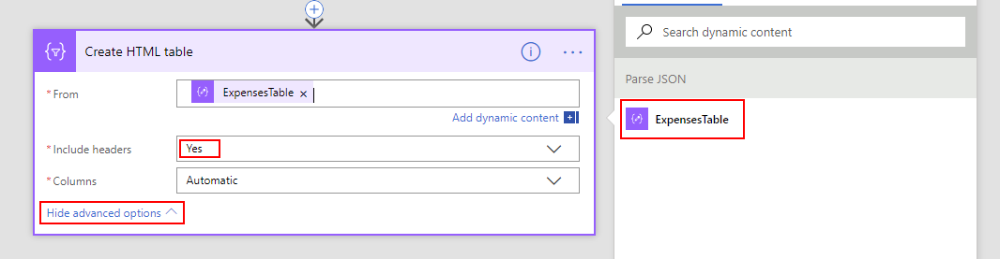
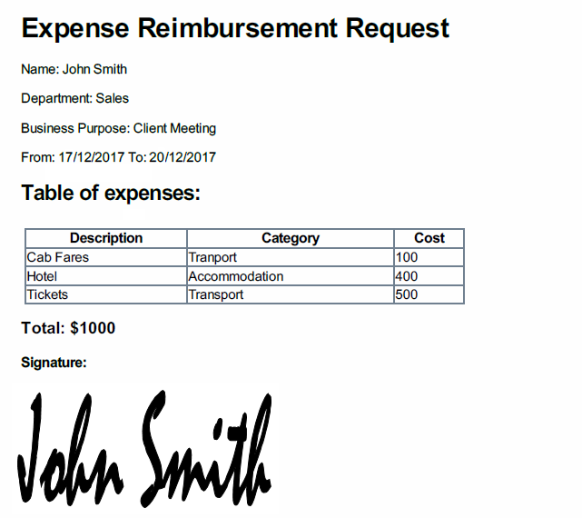
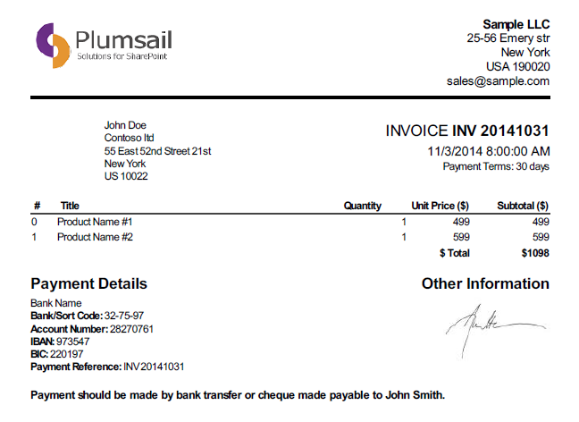

.. title:: Data Table to PDF with HTML-template and Plumsail Documents

.. meta::
   :description: Use Microsoft Power Automate and Plumsail Documents to generate HTML-template and convert Data Table to PDF

How to convert web form with Data Table into PDF and send for approval with Power Automate 
==================================================================================================

In this article, we'll convert a form with a DataTable into PDF. You can use any form with DataTable control, but we'll use our :doc:`example Expense Reimbursement form <../examples/expense-reimbursement>`.

.. contents::
 :local:
 :depth: 1

Microsoft Power Automate flow with HTML Table
--------------------------------------------------
In this example we will first create HTML Template from the submitted data and then transform HTML into PDF and send it via Email.

We will use |Plumsail Documents| to create HTML with template which would use submitted data, then convert this HTML into PDF.

If you haven't read our introduction to using MS Flow with Plumsail Forms, you can find information on how to add our custom connector :doc:`here </microsoft-flow>`.

You can also find information about how to subscribe to Form submission in the :ref:`creating-flow` section.

Once you set up the basics of the Flow for our Form, including Form submission trigger and JSON Parse action, we can start working on our HTML.

| 

First, let's convert our DataTable into HTML Table. Search for HTML Table and select *Data Operations - Create HTML table* action:

| 

Here, we pass ExpensesTable in From field, I also open Advanced options and select *Include headers* - Yes:

| 

Plumsail Documents in Power Automate for DataTable
------------------------------------------------------------------

Now, we will use Plumsail Documents connector, which you can read about setting up |Plumsail Documents connector|. 

You can either create Custom connector or use MS Flow Premium connector, 
but you will need to have an API key from |Plumsail Account| in both cases.

.. |Plumsail Account| raw:: html

   <a href="https://auth.plumsail.com/account/login" target="_blank">Plumsail Account</a>

.. |Plumsail Documents connector| raw:: html

   <a href="https://plumsail.com/docs/documents/v1.x/getting-started/use-from-flow.html" target="_blank">here</a>

Once the connector is set up, search for HTML Template and select *Plumsail Documents - Create HTML from template*:

.. image:: ../images/how-to/data-table-flow/data-table-flow-01.png
   :alt: Search for HTML Template and select Plumsail Documents - Create HTML from template

| 

Once the action is added, we need to fill in both *Source HTML* and *Template Data*. 
Since *Source HTML* uses *Template Data* quite extensively, it's best to first define *Template Data*.

*Template Data* needs to be composed as a JavaScript object where we include all our data - original form output, our HTML table.

*Template Data* is also the place where we will format our dates to look more appealing in the end result.

First, I'll create the basic structure for our object:

.. code-block:: javascript

    {
        "Form": INSERT FORM HERE,
        "Table": INSERT HTML TABLE HERE,
        "From": CONVERT DATE HERE,
        "To": CONVERT SECOND DATE HERE
    }

Now, we can insert Form Body inside "Form" and result of HTML Table conversion inside "Table":

| 

Next, we need to convert Dates. If you go to Expression, you can select **formatDateTime()** function 
then go back to Dynamic Content and insert one of date fields as first parameter in formatDateTime(**Date Here**, ...):

| 

Then add format as the second parameter so it looks like this and click OK:

.. code-block:: javascript

    formatDateTime(body('Parse_JSON')?['From'], 'MM/dd/yyyy')

This is our final version of Template Data:

| 

Now we can write Source HTML and use our Template data to populate it. We can also include style with it by either linking HTML to CSS file or just include style tag inside Source HTML.

Here's an HTML that I've used:

.. code-block:: HTML

    <!doctype html>
    <html>
    <head>
        <meta charset="utf-8">
        <title>Expense Reimbursement Request</title>
        
    </head>
    <body>
        <h1>Expense Reimbursement Request</h1>
        
Name: {{Form.Name}}

        
Department: {{Form.Department}}

        
Business Purpose: {{Form.Purpose}}

        
From: {{From}} To: {{To}} 

        <h2>Table of expenses:</h2>
        {{Table}}
        <h3>Total: {{Form.Total}}</h3>
        

            <h4>Signature:</h4>
            
        

    </body>
    </html>

Last thing that we need to do is convert HTML into PDF. Search for Plumsail Documents and select *Plumsail Documents - Convert HTML to PDF*:

| 

Now we place Result HTML from the last action inside Source HTML field:

| 

.. _email-pdf-attachment:

Send an email with PDF attachment
--------------------------------------------------

We'll use Microsoft's *Office 365 Outlook - Send an email* action to send an email. Select it:

|

Fill in the information for the email, then open Advanced options and add result PDF as an attachment:

|

Now, when we run the Flow, I receive an email with this PDF:

|

Summary
--------------------------------------------------
In conclusion, I just wanted to bring your attention on how easy it is to transform any Plumsail Form submitted to Flow into PDF with |Plumsail Documents|.

Just follow three easy steps - submit form to Flow and parse JSON, transform data to HTML template and transform HTML template to PDF.

You can read more about the first step in our :ref:`creating-flow` article.

Trasnforming to HTML is also an easy step with Plumsail Documents, read more about it here - |Create HTML|. 

You can even include any custom layout in HTML template, for example, your company's logo in the header of template and extra information in the footer:

|

Finally, transforming to PDF couldn't be easier and just done in one easy step, where you take output HTML and transform it directly to PDF.

It's described fully in |Create PDF| article.

.. |Plumsail Documents| raw:: html

   <a href="https://plumsail.com/documents/" target="_blank">Plumsail Documents</a>

.. |Create HTML| raw:: html

   <a href="https://plumsail.com/docs/documents/v1.x/flow/how-tos/documents/create-html-from-template.html" target="_blank">Create HTML document from template</a>

.. |Create PDF| raw:: html

   <a href="https://plumsail.com/docs/documents/v1.x/flow/how-tos/documents/create-pdf-from-html-template.html" target="_blank">Create PDF from HTML template</a>