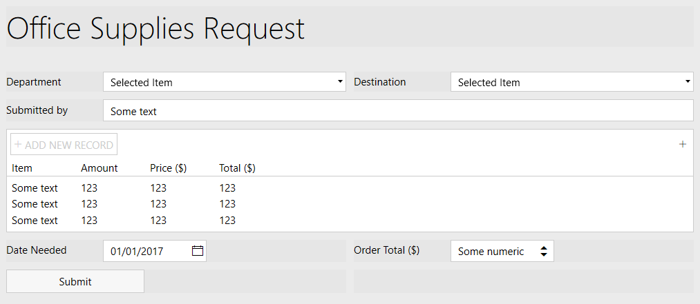
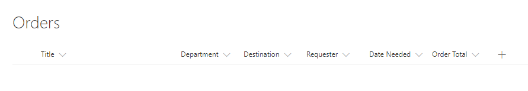
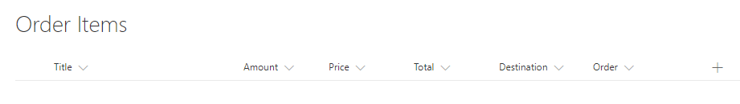
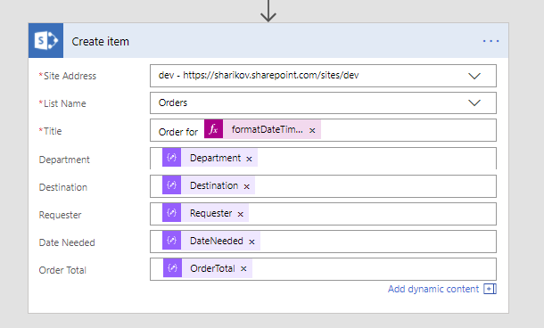
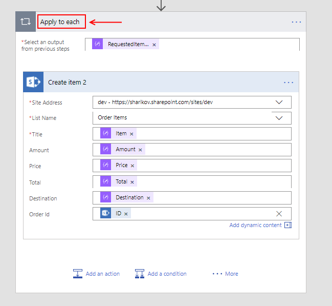
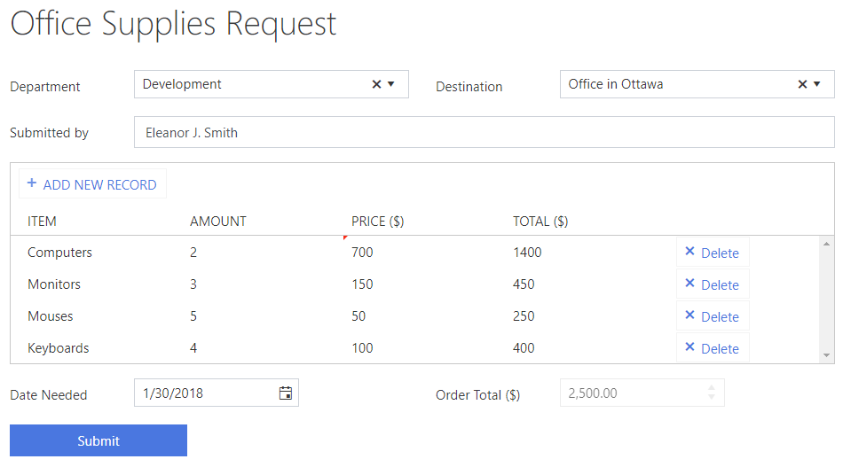
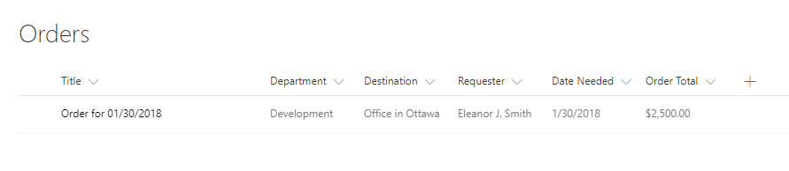
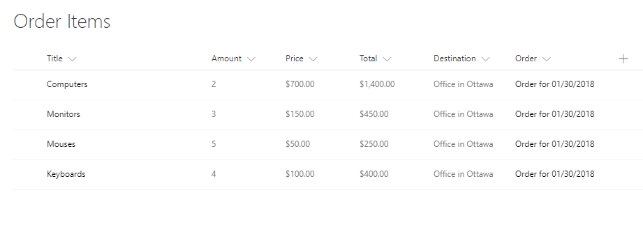

Creating a web form with Data Table and saving data into SharePoint lists
===========================================================================

.. contents:: Contents:
 :local:
 :depth: 1
 
Description
--------------------------------------------------
We've discussed how a form with DataTable can be :doc:`converted into PDF and sent via email</how-to/data-table-convert-html>`, 
now we'll use DataTable to add items to SharePoint.

We'll create an Office Supplies Request form which when submitted will create items in two SharePoint lists - Orders and Ordered Items.
As you might've guessed, general information from the form will go into orders 
while specific information about each record in DataTable will create an item in Ordered Items list. Ordered Items will have a lookup to tie them to the Order.

Form and Form's Logic
--------------------------------------------------
The Form will be fairly straightforward - we need the department of the company, location to be delivered to, who've made the request, 
date all items have to be delivered, and finally the table itself.

I will also include Order Total field to calculate total value of the order and here's our form:

|

Now is the harder part, adding JavaScript calculations to the Form. I have two fields that need to be calculated - Order Total and Total for each row. 
This calculation needs to happen every time there is a change to the DataTable, so we can use **change** event.

What we'll do is, we'll create a variable to store the Order Total, then we'll go through each row and calculate Total for it and add this Total to Order Total. 
Finally, we'll update Table value with all the Totals calculated and we'll set Order Total field value to Order Total.

Order Total will be disabled, and Total value will be not be editable either. That's in order to prevent users from changing these fields manually.

Here's the code:

.. code-block:: javascript

    //once the form is rendered
    fd.rendered(function() {
        //Disable Order Total field
        fd.field('OrderTotal').disabled = true;

        //Make Total column noneditable
        fd.control('RequestedItemsTable').columns[3].editable =
            function(){return false};

        fd.control('RequestedItemsTable').$on('change', function(value) {
            //variable to count Order Total
            var orderTotal = 0;

            //if there are records in the table
            var isTableModified = false;
            if(value){
                //go through each one by one
                for (var i = 0; i < value.length; i++){
                    //if this record has Amount and Price
                    if(value[i].Amount && value[i].Price){
                        //set Total to their product
                        var cost = value[i].Amount * value[i].Price;
                        
                        if (value[i].Total != cost) {
                            value[i].Total = cost;
                            isTableModified = true;
                        }
                    }

                    //add Total to the Order Total
                    orderTotal += parseInt(value[i].Total);
                }
            }

            //here we make our change to the table
            if (isTableModified) {
                fd.control('RequestedItemsTable').value = value;
            }

            //we set Order Total field to sum of Totals
            fd.field('OrderTotal').value = orderTotal;
        });
    });

We can also add some other rules and validators to our form, but for this example it should be enough. Next, we need to create and configure SharePoint Lists to store this data.

SharePoint Lists
--------------------------------------------------
We need two SharePoint Lists - Orders and Ordered Items.

Orders should have Title, Department, Destination, Requester, Date Needed, and Order Total columns:

|

Order Items List on the other hand has to have Title, Amount, Price, Total, Destination and Order columns:

|

Now, that the form and lists are ready, it is time to create custom Flow and let it populate lists with data.

Flow
--------------------------------------------------
We will use Flow to first create an Order and then add each record as an item to Order Items.

If you haven't read our introduction to using Power Automate (MS Flow) with Plumsail Forms, you can find information on how to add our custom connector :doc:`here </microsoft-flow>`.

You can also find information about how to subscribe to Form submission in the :ref:`creating-flow` section.

Once you've subscribed and parsed JSON from the Form, click **Add an action** and search for *SharePoint*. 
We'll need to add *SharePoint - Create Item*, select our Orders list and fill in all the columns with Form fields, like this:

|

To make Title unique I've added Date Needed to it, with formatting:

.. code-block:: javascript

    formatDateTime(body('Parse_JSON')?['DateNeeded'], 'MM/dd/yyyy')

Next, we search and select *SharePoint - Create Item* once again, this time we choose Order Items list and start filling in all the columns. 
Once we add any column from our DataTable, the action will automatically be transformed to run as many times as there are records in the DataTable:

|

Everything else is fairly straightforward, when filling in Order lookup column, we need to select to add custom value and fill in the ID from our previous Item created.

That's pretty much it, now we can click **Save Flow** and run some tests.

Result
--------------------------------------------------
So, here's my form in the browser, filled in with the test data:

|

I press submit, then the Flow processes the request. There are no errors, so everything went smoothly.

Here's an item created in SharePoint Order List:

|

And here are all the items added to the Order Items List, all tied to the Order itself with a Lookup:

|