.. title:: Send an email from form with Power Automate

.. meta::
   :description: Use Microsoft Power Automate to send a customized email with form data

How to send an email from form with Power Automate
=====================================================

You can send a customized email with form data using Power Automate (MS Flow) and Plumsail Forms connector. 

Here you find instructions on how to create an automated flow from scratch. 
You can also create the same flow from the |template0| and jump to :ref:`configure_email` step.

.. |template0| raw:: html

   <a href="https://flow.microsoft.com/en-us/galleries/public/templates/834771e8c74d428791ea78ff5ea81396/send-an-office-365-outlook-email-when-a-plumsail-form-is-submitted/" target="_blank">Microsoft Power Automate template</a>

.. contents::
 :local:
 :depth: 2
 
Configure the Flow 
--------------------------------------------------
Open |Microsoft Power Automate| page and go to *My Flows* → *New* → *Automated - from blank*. 

.. |Microsoft Power Automate| raw:: html

   <a href="https://flow.microsoft.com/" target="_blank">Microsoft Power Automate</a>

|pic1|

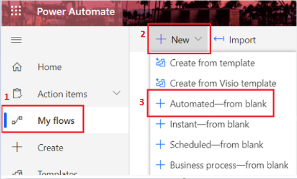

|

Select the trigger that starts the flow. Search for *Plumsail* and select 'Form is submitted' trigger, click *Create*.

|pic02|

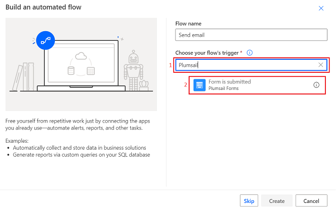

|

If this is the first time you are using Plumsail Forms connector, you will be asked to sign in to Plumsail account to create a connection. 
Click *Sign in* and enter your account credentials.

|pic03|

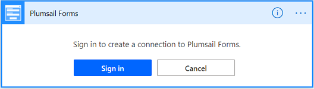

|

Select the name of the form from the drop-down list.

|pic04|

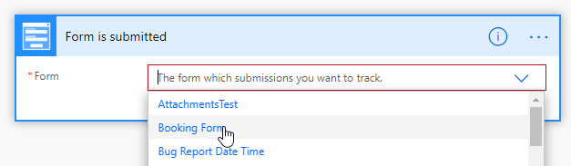

.. _configure_email:

Configure 'Send an email' action
--------------------------------------------------

In this example, we use |Office 365 Outlook connector| to send emails from the Outlook account, but you can use any other connector like |Mail|, |Gmail|, or |SMTP|.

.. |Office 365 Outlook connector| raw:: html

   <a href="https://emea.flow.microsoft.com/en-us/connectors/shared_office365/office-365-outlook/" target="_blank">Office 365 Outlook connector</a>

.. |Mail| raw:: html

   <a href="https://emea.flow.microsoft.com/en-us/connectors/shared_sendmail/mail/" target="_blank">Mail</a>

.. |Gmail| raw:: html

   <a href="https://emea.flow.microsoft.com/en-us/connectors/shared_gmail/gmail/" target="_blank">Gmail</a>

.. |SMTP| raw:: html

   <a href="https://emea.flow.microsoft.com/en-us/connectors/shared_smtp/smtp/" target="_blank">SMTP</a>

Click *New step* and search for *Send email* action. Select 'Send an email (V2)'.

|pic05|

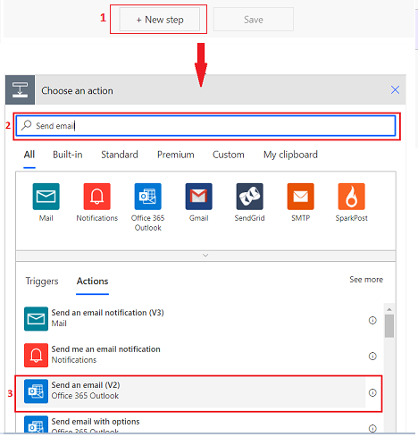

|

You can add any dynamic content from the form to the subject and body of the email. 

|pic06|

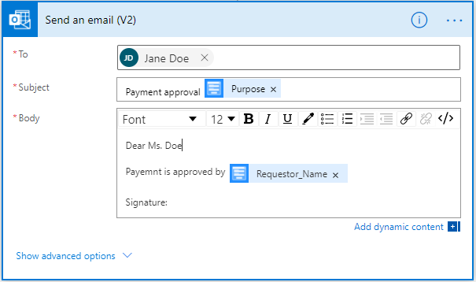

Adding Ink Sketch to email body
^^^^^^^^^^^^^^^^^^^^^^^^^^^^^^^^^^

The |Ink Sketch control| picture stored as a base64 string. 
To insert a base64 string to the email body, first, you need to switch the body input to the code view. 

.. |Ink Sketch control| raw:: html

   <a href="https://plumsail.com/docs/forms-web/designer/controls.html#ink-sketch" target="_blank">Ink Sketch control</a>

|pic7|

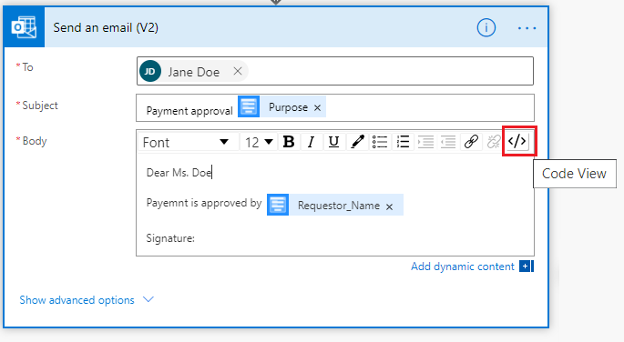

Then, paste this HTML code line to the email body and add field that stores Ink Sketch data from the dynamic content. 

.. code-block:: html

    

|pic8|

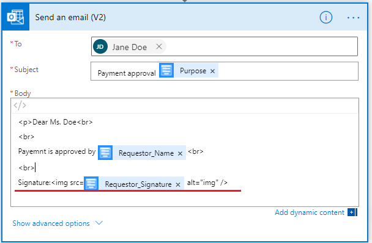

Adding DataTable to email body
^^^^^^^^^^^^^^^^^^^^^^^^^^^^^^^^^^

The |DataTable control| stored as an array of objects.

.. |DataTable control| raw:: html

   <a href="https://plumsail.com/docs/forms-web/designer/controls.html#datatable" target="_blank">DataTable control</a>

Add 'Create HTML table' step to convert an array of objects to HTML table.
For the *From* field select DataTable control from the dynamic content and set *Columns* to 'Automatic'.

|pic14|

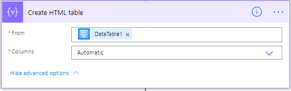

|

To insert the HTML table to the email body, switch the body input to the code view. 

|pic7|

|

Then, add the output of the 'Create HTML table' step to the email body.

|pic15|

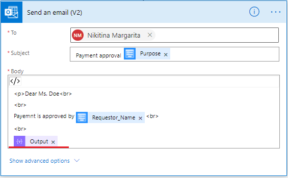

Adding attachments to email
^^^^^^^^^^^^^^^^^^^^^^^^^^^^^

To send an email with multiple attachments, add these steps.

|pic9|

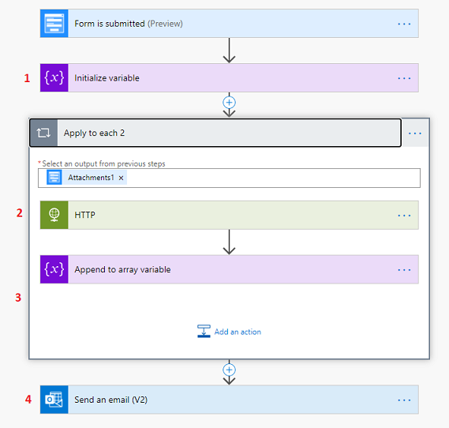

**1. Initialize variable**

Name the variable and set its type to 'Array'.

|pic10|

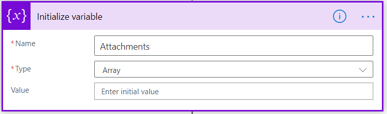

**2. HTTP**

Add the 'Apply to each' action for iterating through the attachments. 'Attachments1' is the common field output.
	
To get the content of the attached files add 'HTTP' action. Select GET in *Method* dropdown field and add url to the *Uri* field.

|pic11|

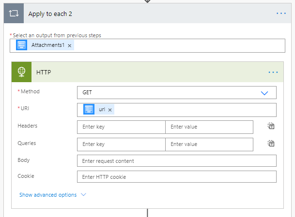

|
	
**3. Append to array variable**

Add 'Append to array variable' action inside 'Apply to each' step. 
Select the variable name from the drop-down. In the value section, map file name and its content. 

.. code-block:: html

   {
      "Name": ,
      "ContentBytes": 
   }

|pic12|

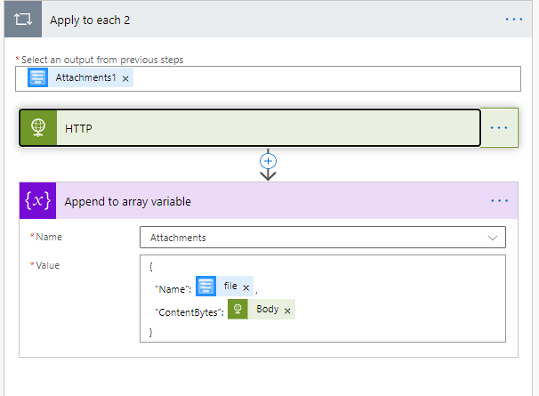

|

**4. Send an email**

Go to 'Send an email' action.
Сlick *Show advanced options*, switch attachments field to input entire array. 
Add the variable output to the attachments input field.

|pic13|

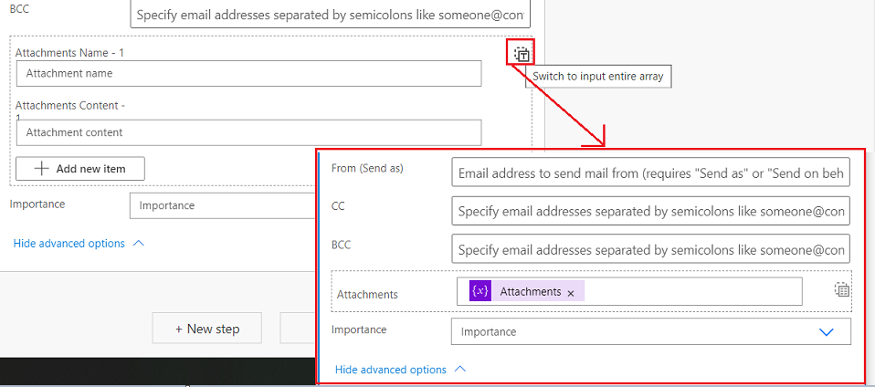