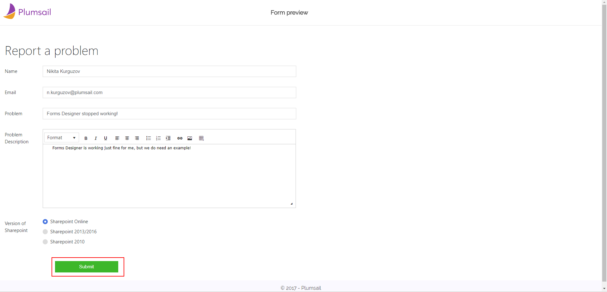

Send an email from form with Power Automate (MS Flow)
=====================================================

.. contents:: Contents:
 :local:
 :depth: 1
 
Introduction
--------------------------------------------------

One of the basic functionalities you can add to your form is to send an email once the form is submitted. 
It can be used in variety of cases - to receive feedback from the clients, to get latest update from your employees and just to get some information in general.

In this example, we will design a form for customers to report their problems and use Flow to send submitted information 
to our company's |location_link|.

.. |location_link| raw:: html

   <a href="https://plumsail.com/SharePoint-helpdesk/" target="_blank">Helpdesk</a>

Design a form
--------------------------------------------------

First, design the form. Think about what information you might need in the email, what can be used as a subject for the email, etc.

Don't forget to include the Submit button, so the form can be actually submitted. Flow only starts operating once the form is submitted.

Here's the simple form designed to receive customers feedback on Forms Designer problems:

.. image:: ../images/how-to/email/1_DesignForm.png
   :alt: Design Form

|

Once you design and save the form, you will see **General Settings** button pop up on top. This section contains important information you'll need to use while setting up the Flow:

|

**Important!** If you add changes the form, you first need to save it and only after saving the information in General Settings will update.

Configure the Flow - First steps
--------------------------------------------------

First, open Microsoft Flow page and go to My Flows >> New >> Automated - from blank:

.. image:: ../images/how-to/email/email-02.png
   :alt: My Flows

|

We'll need to find the correct trigger for Forms Submission. Search for *Plumsail* and you'll find the right one - *Plumsail Forms - Form is submitted*. Choose it and click *Create*:

|

Next, you just need to select your form:

.. image:: ../images/how-to/email/how-to-email-flow-select-form.png
   :alt: Select your form

|

Configure the Flow - Send an email
--------------------------------------------------

We'll use Microsoft's *Office 365 Outlook - Send an email* action to send an email. Select it:

.. image:: ../images/how-to/email/email-01.png
   :alt: Send an email

|

Now, you can use various fields from the Form to compose an email. I've configured a very basic email and selected our support email address to send an email to.
Finally, press *Save Flow*, unless you want other actions to take place after an email is sent:

|

Final Result
--------------------------------------------------

Here is the preview of my form. I've filled in some basic information to serve as an example and clicked *Submit*:

|

And here is the ticket in our Helpdesk, automatically created once the email is received:

   
|

In the similar fashion, you can send emails to your own support team, or perhaps collect some data for your work or even personal email.
It's up to you, but there is nothing difficult in configuring it just like I showed you.