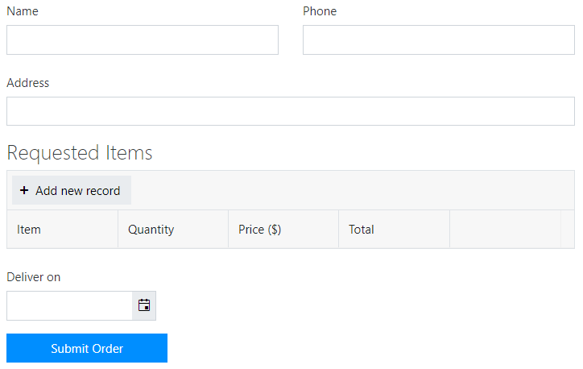
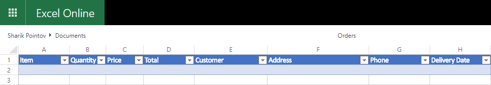
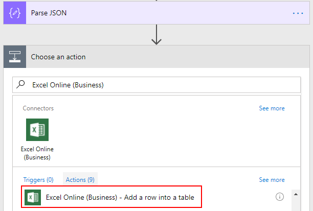
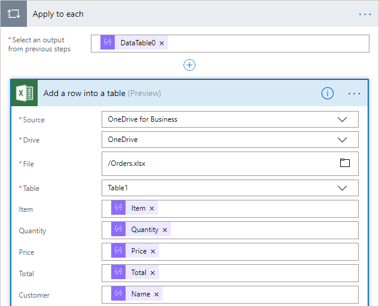
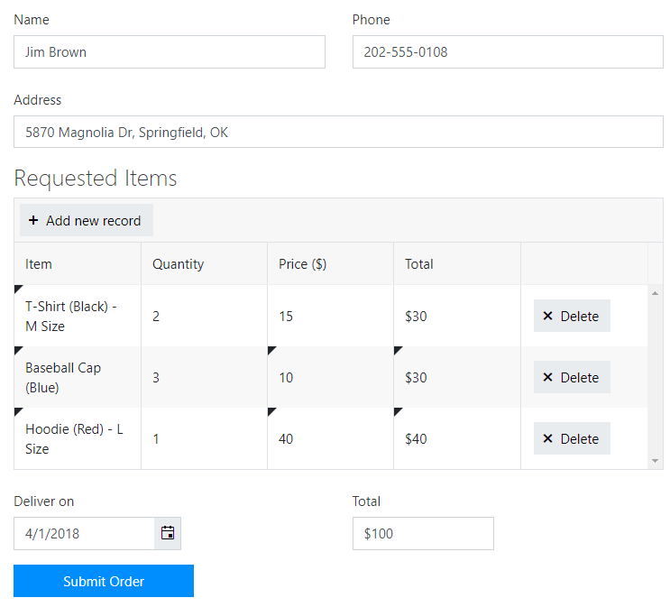
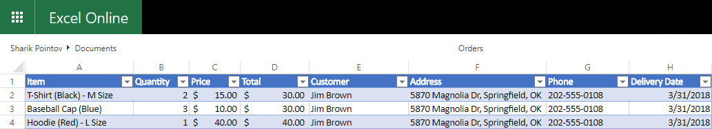
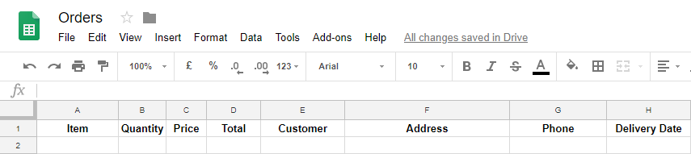
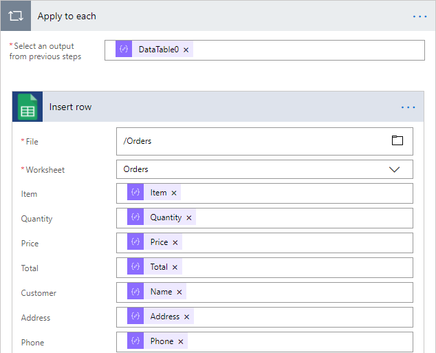
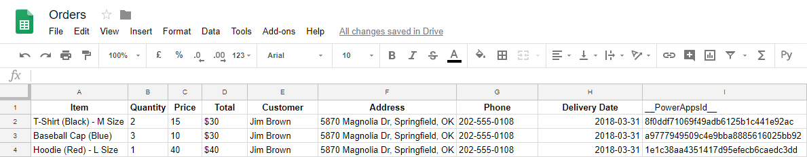

.. title:: From Data Table to Excel or Google Sheets with Power Automate

.. meta::
   :description: Use Power Automate to add rows to Excel or Google Sheets from public web form's Data Table

How to create Excel or Google Sheet rows from Data Table with Power Automate 
================================================================================

.. contents:: Contents:
 :local:
 :depth: 1
 
Introduction
--------------------------------------------------
In this article, we are going to show you how you can use Data Table, MS Flow and Plumsail Forms connector in order to add multiple rows to an Excel Table in Office 365, though it can also be used for any Excel file stored online, for example in Dropbox or Box account, or even on your own site. 

We will also show how to add multiple rows to a Google Sheet. 

For an example on how to add just one row, check out the `following article <./excel-single-row.html>`_.

This is the form used in this example:

|pic1|

Excel Table
--------------------------------------------------
In this example, we are using *OneDrive for Business* as storage for our Excel file. When you create 
an Excel Online file in Office 365, it's automatically stored there. We've created Orders.xlsx file 
and added table to it:

|pic2|

If you are working with a regular Excel file, you might not need to add a table, but the current 
version of Excel Online (Business) connector only supports adding rows to Tables, that's why it's 
better to create the Table straight away.

When you create custom Flow, follow this instruction to receive and parse data from submitted form - :ref:`creating-flow`.

After Parsing JSON, we need to add data to Excel. Search for *Excel Online (Business)* and select *Add a row into a table* action:

|pic3|

Next, we fill in all the required information about our file, the table we want to add a row to, as 
well as what information we want to add - we insert data parsed from the form. As you insert fields parsed from Data Table, the action will automatically switch to *Apply to each*:

|pic4|

*Apply to each* means that this action will run once for every row in the Data Table. 

Once the information is filled in, we can press Save Flow and test Flow submission with our Form:

|pic5|

And here's the result after submission:

|pic6|

Google Sheet
--------------------------------------------------
I've created Orders spreadsheet in my Google account:

|pic7|

There is no need to add a table to it, but you should name columns in the first row
in order to assign values with MS Flow.

Now, you can create new custom Flow, by following this instruction - :ref:`creating-flow`.

After Parsing JSON, search for *Google Sheets* and select *Insert row* action:

|pic8|

.. |pic8| image:: ../images/how-to/excel-single-row/8_Search_Google.png
   :alt: Search for Google Sheets

If this is your first time using this connector, you will most likely need to connect to your 
Google Account and give MS Flow access to your files. Once this is done, fill out the required info:

|pic9|

Once again, *Apply to each* will automatically be used once you add fields from the Data Table, and it means that the action will run once for every row in the Data Table.

After that, the Flow can be saved. To test it out, I once again fill out the form:

|pic5|

And we get the following result:

|pic10|

You might have also noticed an additional column generated by MS Flow called *__PowerAppsId__*. It can be hidden away if necessary, at the same time it allows you to access the specific row with other *Google Sheets* actions, such as *Get row*, for example:

|pic11|

.. |pic11| image:: ../images/how-to/excel-single-row/11_Get_Row.png
   :alt: Google Sheets - Get row