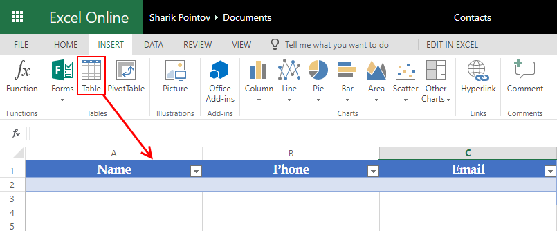
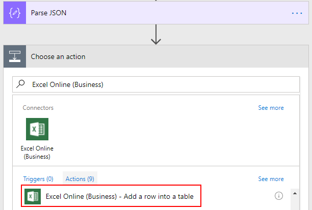
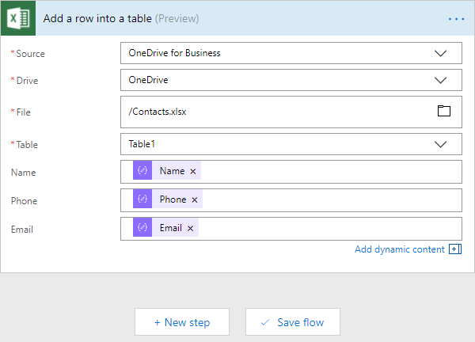
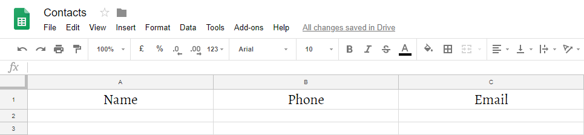
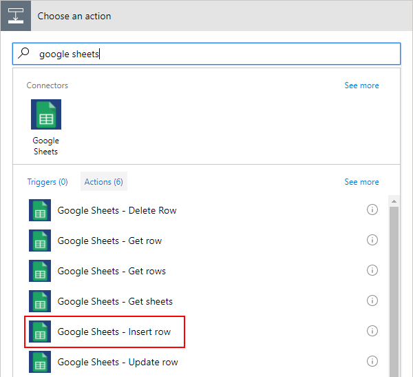
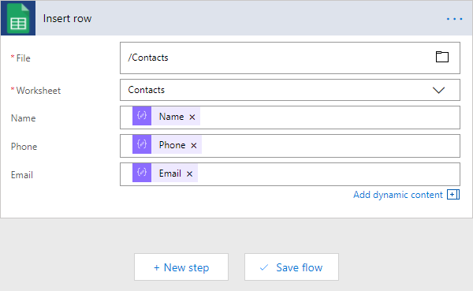
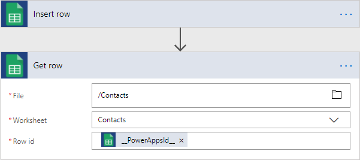

Add row to Excel Table (Office 365) or Google Sheet from Public Web Form
========================================================================

.. contents:: Contents:
 :local:
 :depth: 1
 
Introduction
--------------------------------------------------
In this article, we are going to show you how you can use MS Flow and Plumsail Forms connector in 
order to add rows to an Excel Table in Office 365, though it can also be used for any Excel file 
stored online, for example in Dropbox or Box account, or even on your own site. 

We will also show how to add rows to a Google Sheet. Without further ado, let's get started!

Excel Table
--------------------------------------------------
For both of the examples, we'll be using a very simple contact form with just three fields - Name, Phone, and Email:

|pic1|

In this example, we are using *OneDrive for Business* as storage for our Excel file. When you create 
an Excel Online file in Office 365, it's automatically stored there. We've created Contacts.xlsx file 
and added table to it:

|pic2|

If you are working with a regular Excel file, you might not need to add a table, but the current 
version of Excel Online (Business) connector only supports adding rows to Tables, that's why it's 
better to create the Table straight away.

When you create custom Flow, follow this instruction to receive and parse data from submitted form - :ref:`creating-flow`.

After Parsing JSON, we need to add data to Excel. Search for *Excel Online (Business)* and select *Add a row into a table* action:

|pic3|

Next, we fill in all the required information about our file, the table we want to add a row to, as 
well as what information we want to add - we insert data parsed from the form:

|pic4|

Once this is done, we can press Save Flow and test Flow submission with our Form:

|pic5|

And here's the result after submission:

|pic6|

Google Sheet
--------------------------------------------------
We are still using the same contacts form as before:

|pic1|

But now, we will use Google Sheet to store submitted data instead. Here I've created Contacts spreadsheet:

|pic7|

There is no need to add a table to it, but you should name columns in the first row
in order to assign values with MS Flow.

Now, you can create new custom Flow, by following this instruction - :ref:`creating-flow`.

After Parsing JSON, search for *Google Sheets* and select *Insert row* action:

|pic8|

If this is your first time using this connector, you will most likely need to connect to your 
Google Account and give MS Flow access to your files. Once this is done, fill out the required info:

|pic9|

After that, the Flow can be saved. To test it out, I once again fill out the form:

|pic5|

And we get the following result:

|pic10|

You might have also noticed an additional column generated by MS Flow called *__PowerAppsId__*. It can be hidden away if necessary, at the same time it allows you to access the specific row with other *Google Sheets* actions, such as *Get row*, for example:

|pic11|

