Upload files to SharePoint Document Library
==================================================

.. contents:: Contents:
 :local:
 :depth: 1

Introduction
--------------------------------------------------
Plumsail Forms have Attachments field which can be used to upload files.
There is a variety of actions that you can perform with Attachments, but one of the basic examples is uploading files to Document Library in SharePoint.

In this example, we will design a simple form with Attachments field and configure Flow to send uploaded files to Document Library on your SharePoint site.

Preparation
--------------------------------------------------
First step is to design a Document Library, if you don't have one. You can use default Shared Documents library, if you wish.
We will add custom columns to the library to make the case more interesting.

I have designed a Document Library with two extra columns - *Department*, which is single line plain text, and *Case #*, which is a number column:

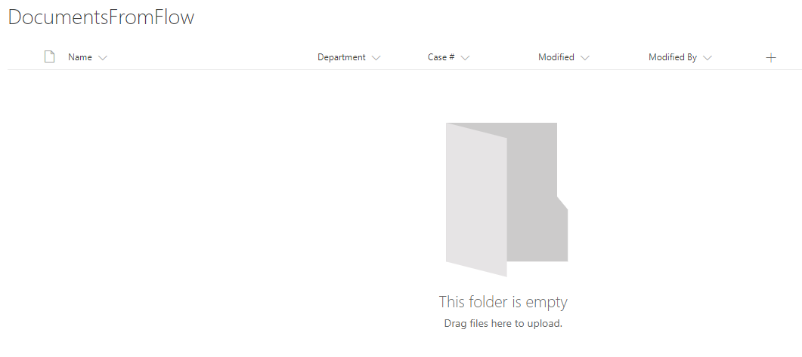

|

Next, after designing the Library, create Plumsail form in Forms Designer and don't forget to add the Attachments field.

I've designed this simple form:

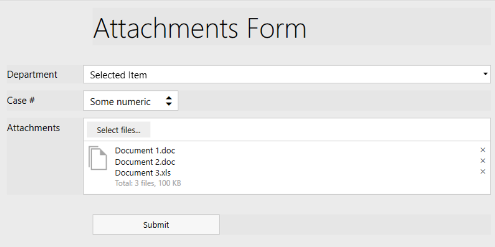

|

Once you design and save the form, you will see **General Settings** button pop up on top. This section contains important information you'll need to use while setting up the Flow:

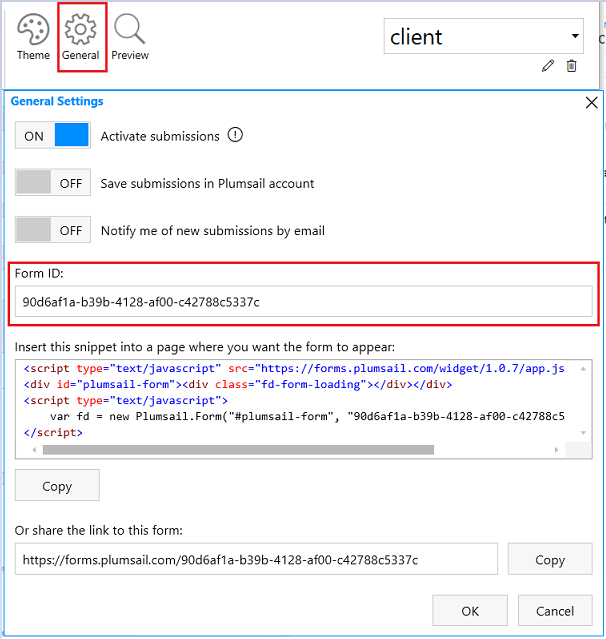

|

Now, after the form is saved, it is time to configure Flow.

**Important!** If you add changes the form, you first need to save it and only after saving the information in General Settings will update.

Configure the Flow - First steps
--------------------------------------------------

First, open Microsoft Flow page and go to My Flows >> New >> Automated from blank:

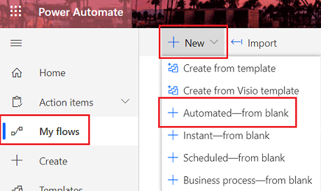

|

We'll need to find the correct trigger. Search for *Plumsail* and you'll find the right one - *Plumsail Forms - Form is submitted*. Add it:

.. image:: ../images/how-to/file/file-02.png
   :alt: Add Plumsail trigger

|

Next, you need to fill in Form ID. It can be found in **Flow Settings** in the designer.

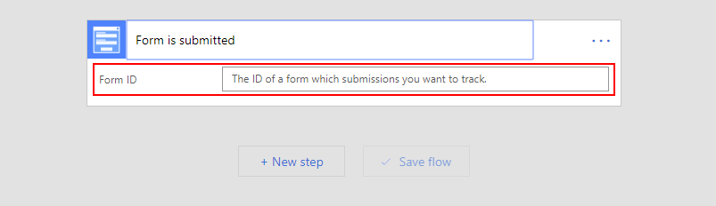

|

Click *Add an action* after you fill in the ID.

Configure the Flow - Create file in SharePoint
--------------------------------------------------

First, you need to search for *HTTP* and select **HTTP - HTTP** action to download file from the Url created on form submission:

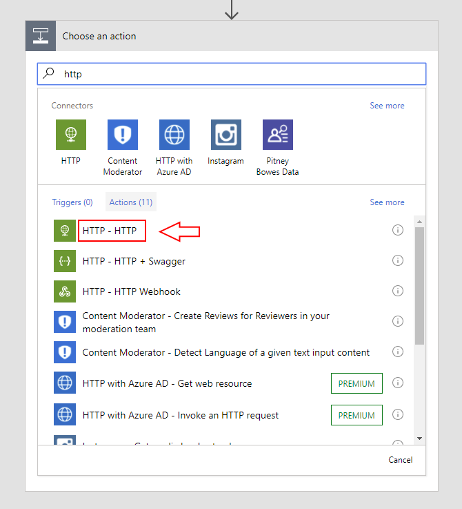

|

In the opened window select GET in *Method* dropdown field and add **url** to the *Uri* field. 
This will automatically transform this action into repeating one which will be performed for each file in Attachments.

It should look like this as a result:

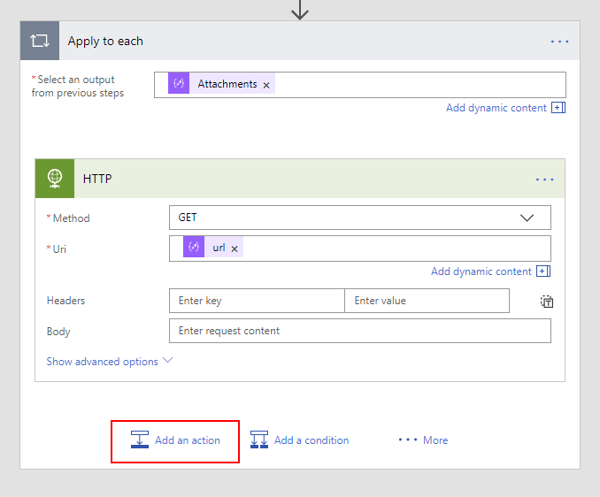

|

Click *Add an action* when you fill in the data. You will now need to search for *SharePoint file* and select **SharePoint - Create file**:

.. image:: ../images/how-to/file/4_SharePoint_CreateFileSearch.png
   :alt: SharePoint - Create file search

|

It should still be the same step, so in this next window you can fill the following data - your Site address, Document Library you want to create file in,
File name - select purple file value from parsed JSON, File Content - Body from HTTP request:

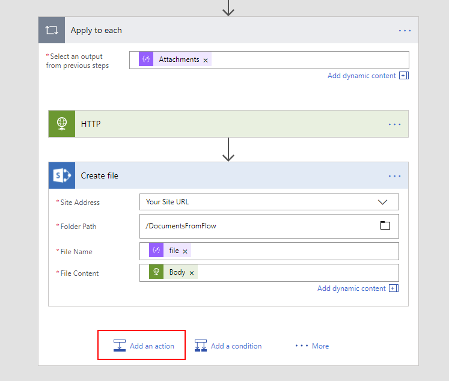

|

This is enough to create file in the library, so if this is all you wanted you can save the Flow now. 

Created files will already have the same name as Attachments, but if you want to change additional columns, 
you need to click *Add an action*, search for *SharePoint update file* and add **SharePoint - Update file properties** action:

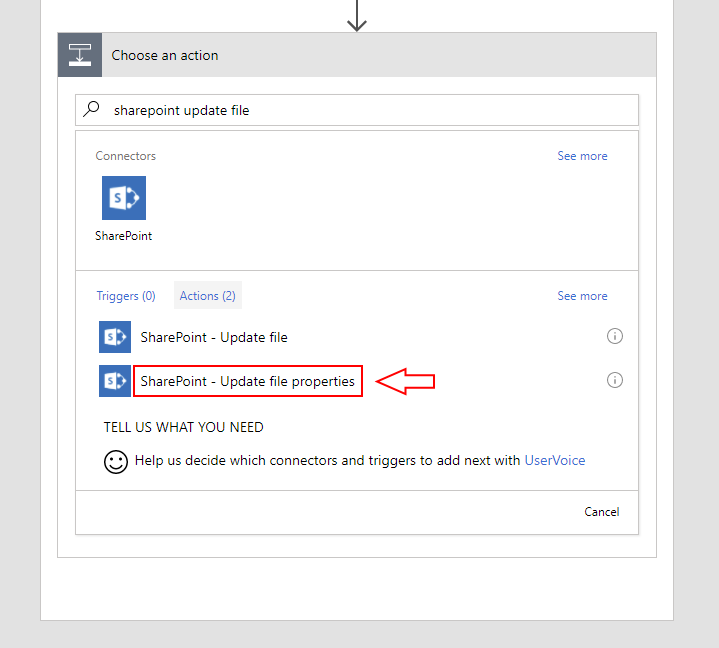

|

We are still on the same step, just adding another action. 
In the next window, you will need to once again select your Site Address and Library name. 
Next, add *ItemId* to the Id field to select the correct item and fill in other columns with information from the form.

Title is not important as it is not displayed anywhere and we've already given name to the file, 
but in my scenario I will fill Department and Case # columns with information from the form:

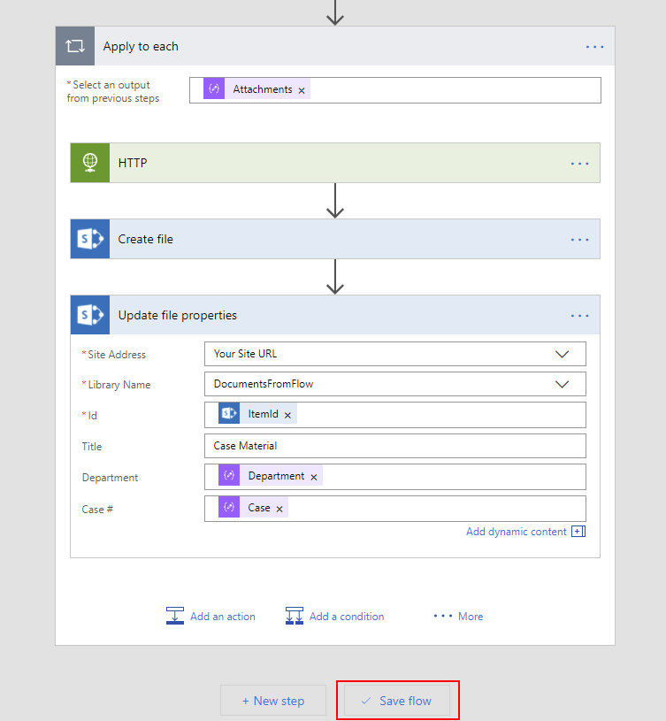

|

Now you can click *Save Flow* and **Done**.

Final Result
--------------------------------------------------
Make sure that the Flow is active and open Form preview. I've filled mine with example data and clicked *Submit*:

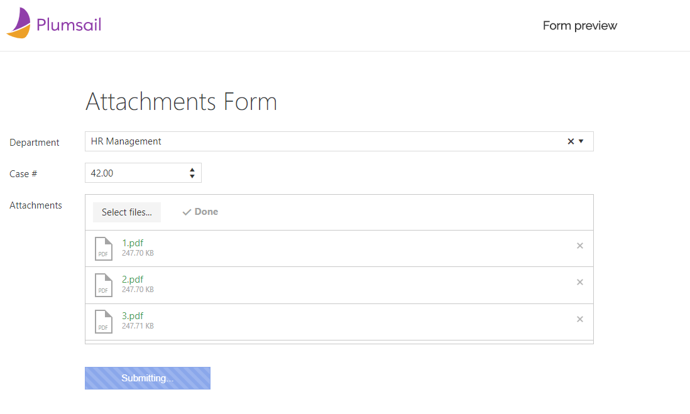

|

Once the Form is submitted and processed with Flow, here are the files in my Documents Library:

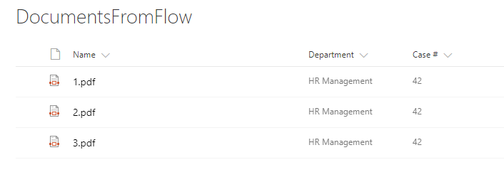

|

In this example we've added files from the Attachments field to Document Library.
This can be used in combination with any other Flow, for example, you can also :doc:`send an email after form is submitted </how-to/email>` or :doc:`create items in SharePoint List at the same time </how-to/item>`.