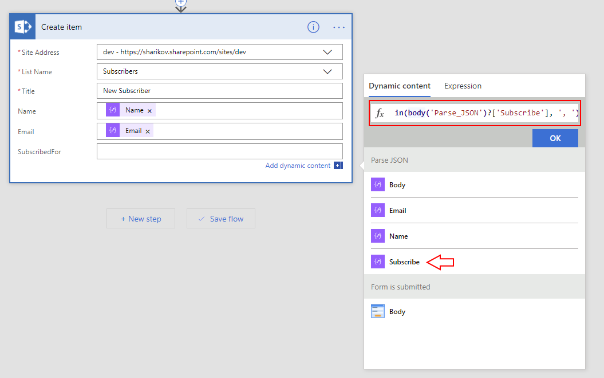
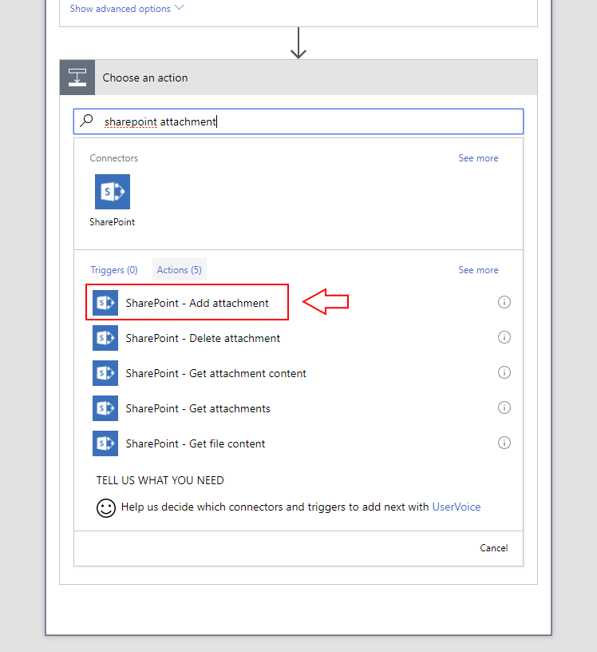

Create an item in SharePoint List
==================================================

.. contents:: Contents:
 :local:
 :depth: 1
 
Description
--------------------------------------------------
One of the simplest and very practical use cases for Plumsail Forms might be adding items to SharePoint Lists.
You are not tied to SharePoint forms, items can be added from the Flow.

In this example, we will design a form for customers to subscribe to some form of updates from your company
and use Flow to add this information to a list on your SharePoint site.

Preparation
--------------------------------------------------
First step is to design a list, if you don't have one. It's best to start from the list, 
so you know what fields you will need on your form rather than another way around.

I will design simple list with three extra Single line plain text columns:

|

Next, after designing the list, create Plumsail form in Forms Designer. 
You can also design Modern SharePoint form if you want to create items in the different list when you submit this one, 
but you'll need to Submit Data to Flow in General Settings.

I've designed this simple form:

.. image:: ../images/how-to/item/1_DesignForm.png
   :alt: Design Form

|

Once you design and save the form, you will see **General Settings** button pop up on top. This section contains important information you'll need to use while setting up the Flow:

.. image:: ../images/how-to/item/General.png
   :alt: General Settings

|

Now, after the form is saved, it is time to configure Flow.

**Important!** If you add changes the form, you first need to save it and only after saving the information in General Settings will update.

Configure the Flow - First steps
--------------------------------------------------

First, open Microsoft Flow page and go to My Flows:

.. image:: ../images/how-to/email/2_MyFlows.png
   :alt: My Flows

|

On My Flows page, click *Create from blank* to create new Flow:

.. image:: ../images/how-to/email/3_CreateFromBlank.png
   :alt: Create from blank

|

We'll need to find the correct trigger for Forms Submission. Click *Search*:

.. image:: ../images/how-to/email/4_Search.png
   :alt: Search

|

Search for *Plumsail* and you'll find the right one - *Plumsail Forms - Form is submitted*. Add it:

.. image:: ../images/how-to/email/5_AddPlumsailTrigger.png
   :alt: Add Plumsail trigger

|

Next, you need to fill in Form ID. It can be found in **Flow Settings** in the designer.

.. image:: ../images/how-to/email/7_AddID.png
   :alt: Add ID from General Settings

|

 Click *Add an action* after you fill in the ID.

Configure the Flow - Create item in SharePoint
--------------------------------------------------

We'll use Microsoft's *SharePoint - Create item* action to create an item in a list. Select it:

|

You will need to add your site address. If it's your first time configuring SharePoint action, 
select *Enter custom value* in dropdown menu and type in or copy and paste your site address, something like *https://mydomain.sharepoint.com/sites/mysite*

You will also need to select List in List Name field:

.. image:: ../images/how-to/item/3_SiteAddressEnterCustomValue.png
   :alt: Site Address and List Name

|

Now you will see a menu with all columns that can be filled with Flow. 
Some columns are an exception and cannot be filled using this action, for example, Choice column. We advice to use columns that can be filled.

In our case, we have Title and three more Single line text columns, these can be easily filled. Select information from the form in menu on the right.

You might have noticed that I used Checkboxes on my form and they produce an array of strings as an output.
If I were to simply add this value to any of the fields, it would result in multiple actions performed for each value in the array. 

It's not a bad option and might be useful in some situations, but if you have lots of Checkboxes on your form, it can quickly get out of hand.

Here, I will use Expression of Workflow Definition Language to combine every value from the array into single string.
In menu on the right, instead of clicking on the field, click Expression and type in **join()**:

.. image:: ../images/how-to/item/4_Expression.png
   :alt: Site Address and List Name

|

Now go back to Dynamic content tab, place the *caret* (a.k.a. the *cursor*) between the round brackets and click on field you want to join as a string.

You can also add a delimiter between each string, I've added **', '** as a delimiter.

Here is the result:

|

Final result should look like this:

.. image:: ../images/how-to/item/6_Final.png
   :alt: Final

|

Now you can click *Save Flow* and **Done**.

Final Result
--------------------------------------------------
Make sure that the Flow is active and open Form preview. I've filled mine with example data and clicked *Submit*:

|

Once the Form is submitted and processed with Flow, which can take some time, depending on how complex your form is, I get this result:

.. image:: ../images/how-to/item/8_Result.png
   :alt: Result

|

This example is simple, but you've seen how an item can be added to the list and how to convert array of strings into one string.
This can be used in combination with any other Flow, for example, you can also :doc:`send an email after form is submitted </how-to/email>` and item is created.

Adding attachments to created items
--------------------------------------------------
Another thing you can do is to upload attachments to newly created items. Make sure to include Attachments field on your form before creating the Flow:

|

When you add all the actions previously described, click *+ New Step", search for *HTTP* and select **HTTP - HTTP** action:

.. image:: ../images/how-to/file/2_HTTP.png
   :alt: HTTP Search

|

Next, select GET in *Method* dropdown field and add **url** to the *Uri* field. 
This will automatically transform this action into repeating one which will be performed for each file in Attachments.

It should look like this as a result:

|

Do not click *+ New Step"! Click *Add an action* instead, search for *SharePoint Attachment* and select **SharePoint - Add attachment** action:

|

It should still be the same step, so in this next window you can fill the following data - your Site address, List name - select the same as before,
File name - select purple file value file from parsed JSON, File Content - select green Body from HTTP request:

|

Now, the Flow is ready and can be saved. Click *Save Flow* and **Done**. 

We can test how the Flow works with Form Preview:

.. image:: ../images/how-to/item/attachments/5_ExampleForm.png
   :alt: Example form

|

And here are the attachments added to SharePoint via the Flow:

|