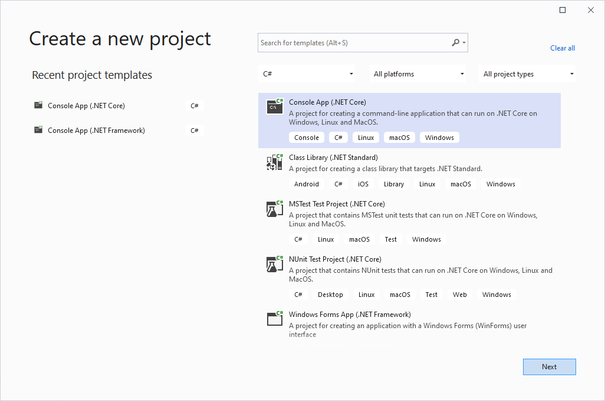
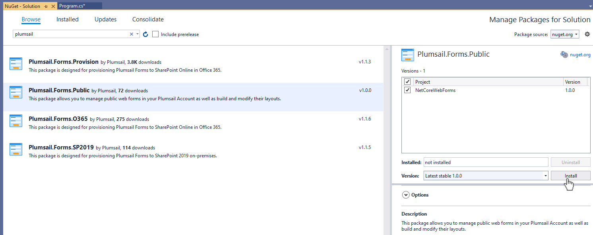
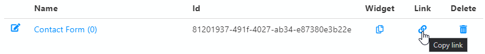
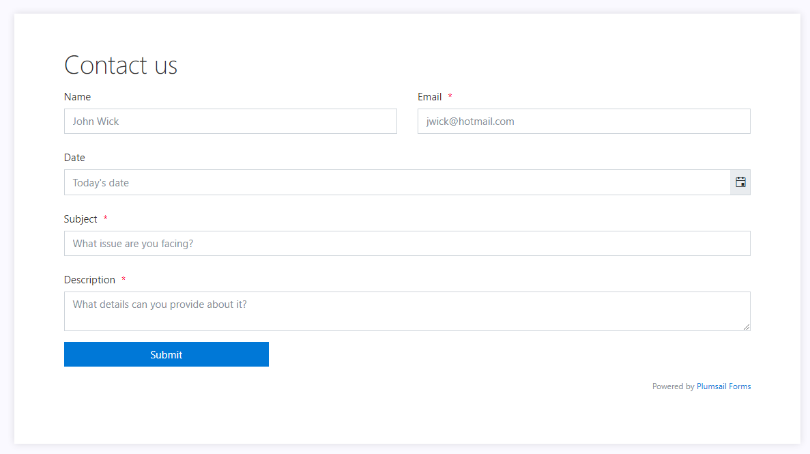

.. title:: Create a contact web form in Visual Studio 

.. meta::
   :description: Example of creaing and provisioning of Plumsail's public web forms in Visual Studio - follow this case to create new forms from scratch

Create a contact web form in Visual Studio
=======================================================================

.. contents:: Contents:
 :local:
 :depth: 1
 
Introduction
--------------------------------------------------
Sometimes, you might not want to work with the editor at all. :doc:`Dragging and dropping fields </design>` is easy, but if you want to scale your production of forms - you can use our provisioning API for public web forms that allows creation of forms in Visual Studio with the help of our |NuGet package|.

In this example, you'll see how easy it is to create a public web form in the Visual Studio, and you can follow the same path to create and provision your own form. This method might be very beneficial, if you want to have the same form available in multiple accounts and want to provision them quickly and efficiently.

.. |NuGet package| raw:: html

   <a href="https://www.nuget.org/packages/Plumsail.Forms.Public" target="_blank">NuGet package</a>

Create application and install NuGet package
--------------------------------------------------
Run the Visual Studio. Make sure you have *.NET Framework v.4.7.2* or higher installed. In the Visual Studio, create a new Project and select 
Console App (.NET Core):

|pic3|

In the newly created project, open Tools, find NuGet Package Manager and select Manage NuGet Packages for Solution...

Open the Browse tab, search for 'plumsail', and install **Plumsail.Forms.Public** package:

|pic4|

Adjust the code
--------------------------------------------------
Once the package and its dependencies have installed, go to Program.cs and replace all the code there with the following:

.. code-block:: c#

    using Plumsail.Forms.Public;
    using Plumsail.Forms.Public.Fields;
    using Plumsail.Forms.Public.Controls;
    using System;

    namespace NetCoreWebForms
    {
        class Program
        {
            static async System.Threading.Tasks.Task Main(string[] args)
            {
                var formName = "Contact Form";
                Console.WriteLine("Creating a " + formName);

                var login = "mymail@mail.com";
                var password = "admin1";

                var client = new FormsClient(login, password);

                var form = client.NewForm();
                form.SavePosts = true;
                form.NotifyOwner = false;
                form.Enabled = true;

                form.Layout.Css = "";
                form.Layout.JavaScript = "";
                form.Layout.Theme = new Theme(PredefinedThemes.);

                var grid = new Grid(
                    new GridRow(
                        new GridCell(new Text("FormTitleControl")
                        {
                            Content = "<h1>Contact us</h1>",
                            Class = "text-control-class"
                        }, width: 12)
                    ),
                    new GridRow(
                        new GridCell(new SingleLineTextField("Name")
                        { 
                            Title = "Name",
                            ControlHint = "John Wick",
                            Orientation = Orientation.Vertical
                        }, width: 6),
                        new GridCell(new SingleLineTextField("Email")
                        {
                            Title = "Email",
                            ControlHint = "jwick@hotmail.com",
                            Required = true,
                            Orientation = Orientation.Vertical
                        }, width: 6)
                    ),
                    new GridRow(
                        new GridCell(new DateField("Date")
                        {
                            Title = "Date",
                            ControlHint = "Today's date",
                            Orientation = Orientation.Vertical
                        }, width: 12)
                    ),
                    new GridRow(
                        new GridCell(new SingleLineTextField("Subject")
                        {
                            Title = "Subject",
                            ControlHint = "What issue are you facing?",
                            Required = true,
                            Orientation = Orientation.Vertical
                        }, width: 12)
                    ),
                    new GridRow(
                        new GridCell(new MultiLineTextField("Description")
                        {
                            Title = "Description",
                            ControlHint = "What details can you provide about it?",
                            Required = true,
                            Orientation = Orientation.Vertical
                        }, width: 12)
                    ),
                    new GridRow(
                        new GridCell(new Submit("Submit1")
                        {
                            Width = 300
                        }, width: 6)
                    )
                );
                form.Layout.PC = grid;
                try
                {
                    await form.Save();
                    Console.WriteLine(form.Name + " saved succesfully!");
                }
                catch (InvalidLoginException)
                {
                    Console.WriteLine("Authorization failed!");
                }
                catch (BadRequestException ex)
                {
                    Console.WriteLine("Error: " + ex.Message); 
                }
            }
        }
    }

Run the app
--------------------------------------------------
After saving the file, run the app. Congratulations, you've successfully created and provisioned your first form! Check the result in your account's forms section:

|pic5|

It should look like this:

|pic6|

The example shown in this article is very basic. To learn more about various methods available check out :doc:`this provisioning article </how-to/provision-api>`.