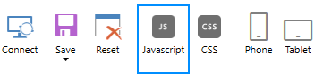

Align form and fields to the right (Arabic and other languages)
================================================================

.. contents:: Contents:
 :local:
 :depth: 1
 
Description
--------------------------------------------------
Some languages require form to be read right to left, for example, Arabic or Farsi. That would mean that all titles should be moved to the right, repositioned on the form.

This functionality is actually fully supported in **Plumsail Forms**! 

All you need to do, actually, is to open JS code editor:

|pic1|

Insert the following code:

.. code-block:: javascript

    fd.rendered(function() {
        $('body').addClass('k-rtl');
    })

Then **save the form**:

|pic2|

You'll get the following result in the browser:

|pic3|

