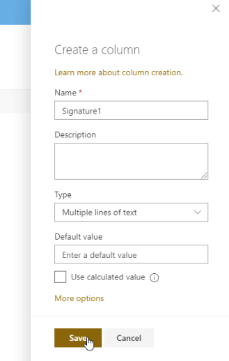

.. title:: Save Data Table, Ink Sketch, and Likert Scale to SharePoint

.. meta::
   :description: Use Microsoft Power Automate to save advanced controls from public web forms to SharePoint, and make them appear in List View

How to save Data Table, Ink Sketch, and Likert Scale to SharePoint columns with Power Automate 
====================================================================================================

Both Public Web Forms and SharePoint forms can include our custom controls - Ink Sketch, DataTable or Likert Scale.

In this article, we'll prepare SharePoint List and Public Web Forms with these controls.
Anonymous users will be able to send them to MS Power Automate (MS Flow) where they'll get saved to SharePoint.

.. contents:: Contents:
 :local:
 :depth: 1

SharePoint list and its forms
--------------------------------------------------
First of all, you need SharePoint List with Plain Text columns where you want to save controls to. Please, check out |this article|, so they render properly in the List View.

.. |this article| raw:: html

   <a href="https://plumsail.com/docs/forms-sp/how-to/save-table-signature.html" target="_blank">this article on how to save Ink Sketch, DataTable and Likert Scale to SharePoint columns</a>

|pic0|

Customize the form for the list and check that it works properly:

|pic1|

After saving, you should see the following result:

|pic2|

Public form with DataTable, InkSketch, and Likert
--------------------------------------------------
You also need to create a Public Web Form for anonymous submissions to MS Power Automate:

|pic3a|

I've placed all the same controls on the Public Web Form, which you can see here:

|pic3b|

Flow configuration
---------------------------------------------------
Open MS Power Automate and create a new automated flow:

|pic4|

Copy the ID of the form:

|pic5|

Paste the ID of the form inside **Plumsail Forms** - **Form is submitted** trigger:

|pic5b|

To save DataTable or Likert Scale, use Data Operations - **Compose** action:

|pic6|

Input the control value there:

|pic7|

.. |pic7| image:: ../images/how-to/save-controls-to-sp/save-controls-to-sp-compose2.png
   :alt: Fill in controls value into Compose action

Then, use this output when populating SharePoint columns. For Ink Sketch, just use the value from the form:

|pic8|

Save the Flow! Now, let's test it - fill out the Preview form and Submit it:

|pic9|

If the Flow runs succesfully, you'll get the following result:

|pic10|

