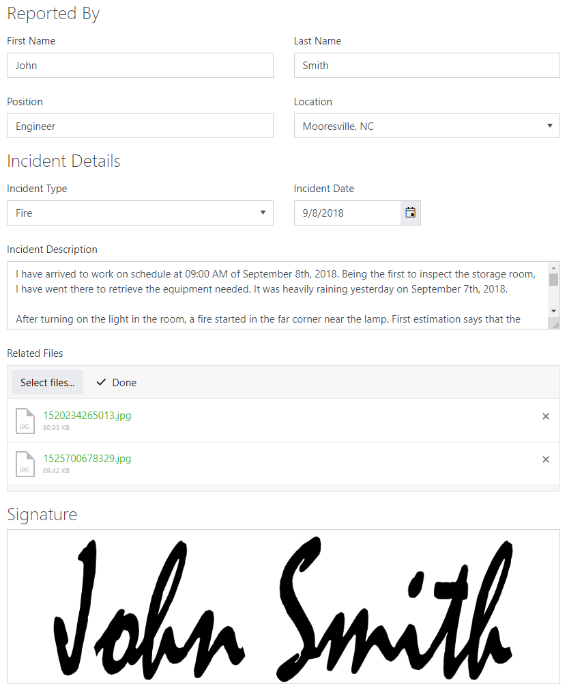
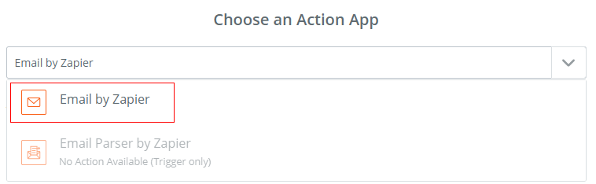

Send an email with attachments and signature using Zapier
==========================================================

.. contents:: Contents:
 :local:
 :depth: 1
 
Introduction
-----------------------------------------------------------
In this article, we'll show you how you can use our forms to collect a lot of data and send it via the email, presented in the format you need.

We'll use this incident report form, a template of which you can download |Incident Report Form|.

|pic1|

.. |Incident Report Form| raw:: html

   <a href="/forms/templates/incident-report-form/" target="_blank">here</a>

Zapier
--------------------------------------------------

Now, you can create new custom Zap, by following this instruction - :ref:`creating-zap`.

After completing the setup for your form, search for *Email by Zapier*:

|pic2|

*You can also use any other Email service app, for example, SendinBlue, MailChimp, Gmail or others. The exact steps can be different.*

Select *Send Outbound Email* action and click Continue:

|pic3|

Next, you need to fill out the important fields, such as *To*, *Subject*, *Body*, etc.

|pic4|

Use HTML to format your email. Use various tags, add style properties, customize the result until it satisfies your needs.

This includes formatting signature into an image. Since Ink Sketch data is sent as Base64 encoding, it can be used in src property of  tag, like this:

.. code-block:: html

    

Attachments are added by using File URLs from the attachments fields, they will be automatically downloaded by Zapier and sent via the email.

*Note: to properly format dates, please, first use Formatter action from Zapier. 
This will allow you to make the date more presentable, as well as make sure that Time Zones do not interfere with the date output.*

Continue after filling out the action, and **skip the test** if you are adding attachments. Zapier will fail to find any at this point and will consider the test unsuccesful.

|pic5|

Once done, name and activate the Zap:

|pic6|

As a result, when the form submitted, you will receive a formatted email, with signature in it, and all the related files attached:

|pic7|

