Likert Scale to Excel Chart through Zapier
==================================================

.. contents:: Contents:
 :local:
 :depth: 1
 
Introduction
--------------------------------------------------
This article will show you how you can use our forms, Zapier and Excel file to gather information from anonymous submissions and build charts with it.

We'll use Customer Feedback Form which you can download from our templates |Customer Feedback Form|.

.. |Customer Feedback Form| raw:: html

   <a href="/forms/templates/customer-feedback-form/" target="_blank">here</a>

|pic1|

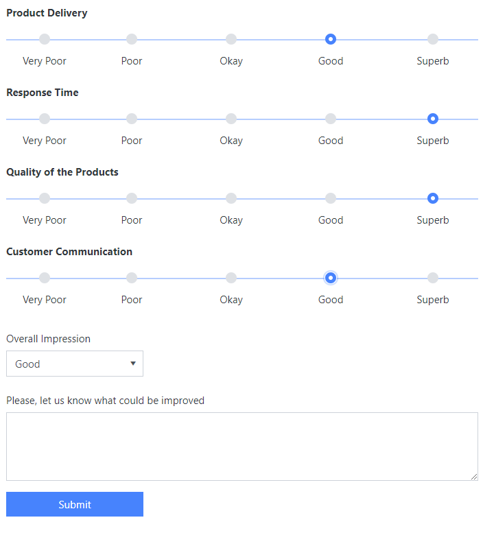

This form contains a Likert Scale control to get customer's feedback about various sides of our service, as well as an Overall Impression field.

The rest of the fields will be unused in this example, though there are many practical uses for them. 
We just want to get the poll's statistic and build a chart from it for each category, like this:

|pic2|

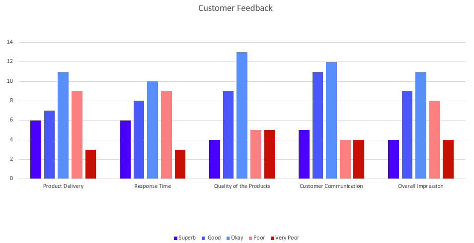

Configuring Excel file
--------------------------------------------------
In Excel file, I've created columns for each category the customer will rate. This is the page where the submissions will be stored. 
I've created a table as well, for easier sorting and use in functions.

|pic3|

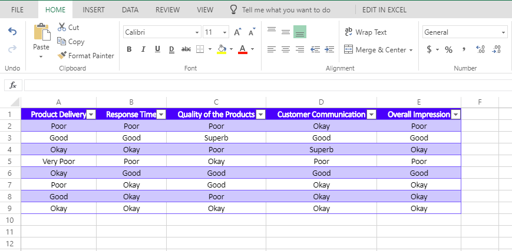

On the second page, we can create rows and columns which will count amount of each answers per Category, like this:

|pic4|

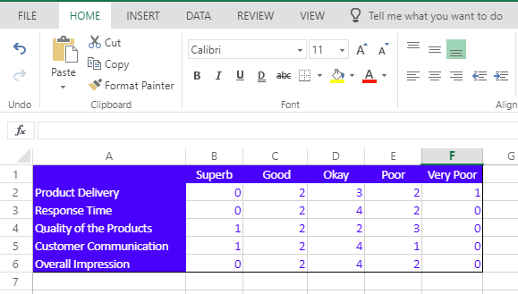

For this, I've simply used Excel formulas for each column, which count the amount of specific answers:

.. code-block:: html

    =COUNTIF(Table1[Product Delivery],"Superb")
    =COUNTIF(Table1[Product Delivery],"Good")
    =COUNTIF(Table1[Product Delivery],"Okay")
    =COUNTIF(Table1[Product Delivery],"Poor")
    =COUNTIF(Table1[Product Delivery],"Very Poor")

Finally, after adding some test data, I've built a column chart with the following configuration:

|pic5|

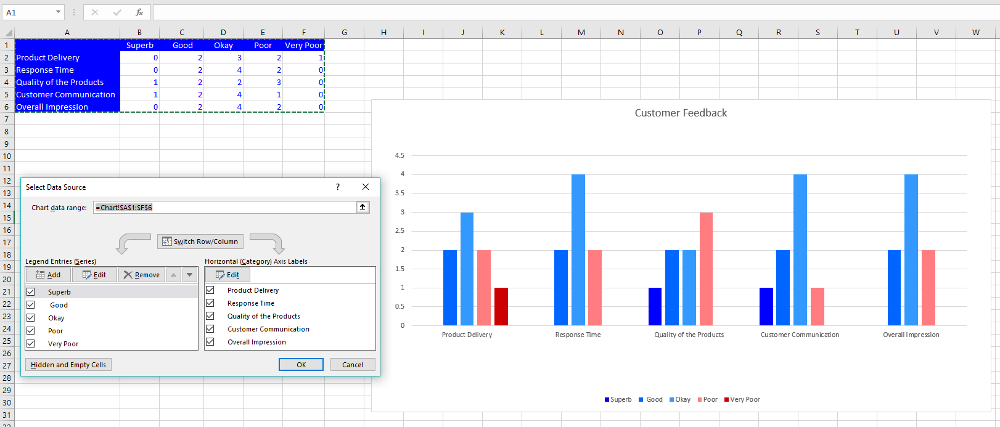

Setting up Zapier
--------------------------------------------------
You'll need to subscribe to form submissions in Zapier, here's an instruction for this  - :ref:`creating-zap`.

For this case, we'll need to use Formatter extensively:

|pic6|

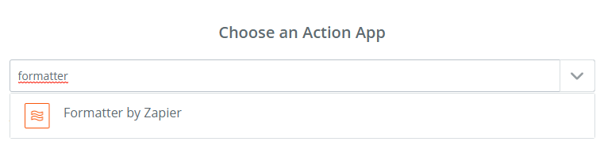

Pick Utilities action:

|pic7|

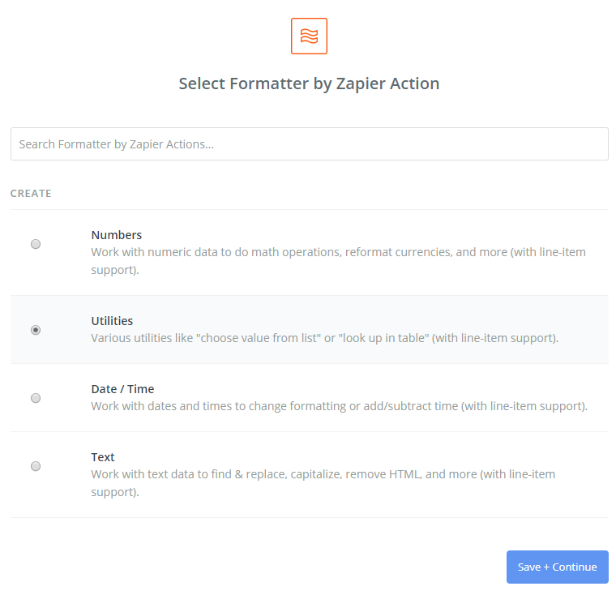

Select Transform: *Pick from List*, Operation: *Use a Custom Value (advanced)*, Custom Value for Operation: *0* (in future steps use *1*, *2* and *3*) and Input: *{{LikertScale}}*.

|pic8|

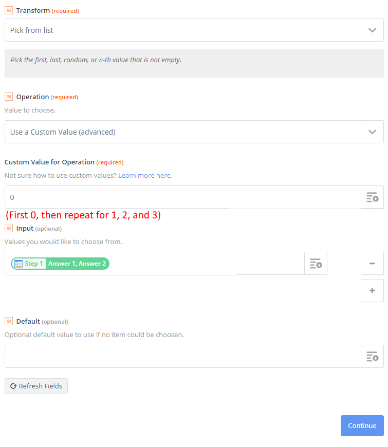

It's very important to Send Test To Formatter, so the Zapier knows what kind of output to expect. 

|pic9|

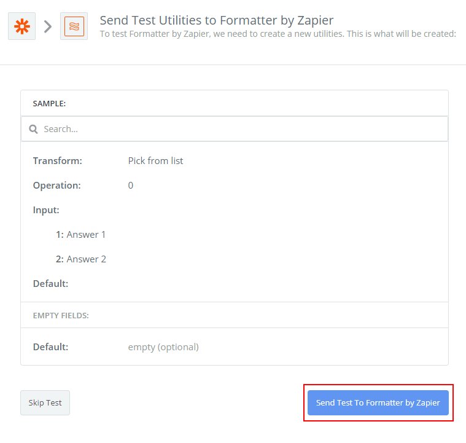

First actions will return Answer 1 and Answer 2, but the later ones will return null. 
That's okay, the data will be accessible later, the tests must be performed.

|pic10|

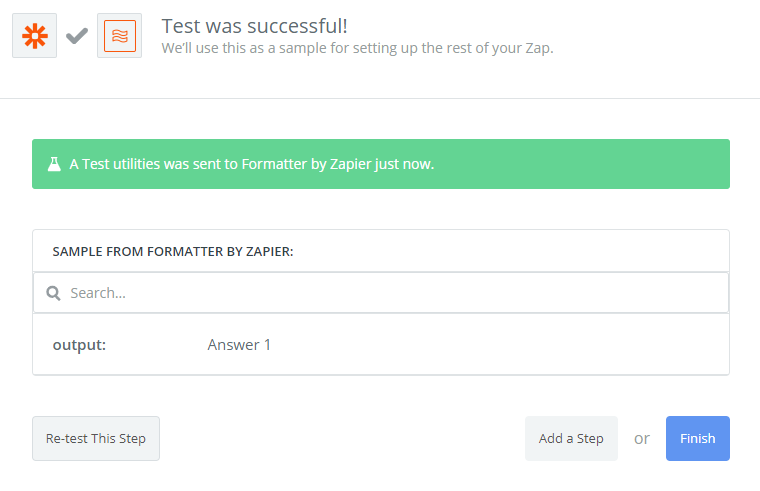

This will select the first answer from Likert scale. You'll need to repeat this step four times total, replacing *0* with *1*,*2* and *3*, so you have 4 Formatter Utilities actions:

|pic11|

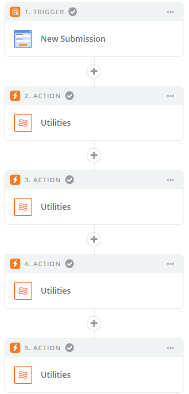

This will allow you to split Likert Scale answers into multiple variables to fill out Excel Row. Finally, find and select Excel: 

|pic12|

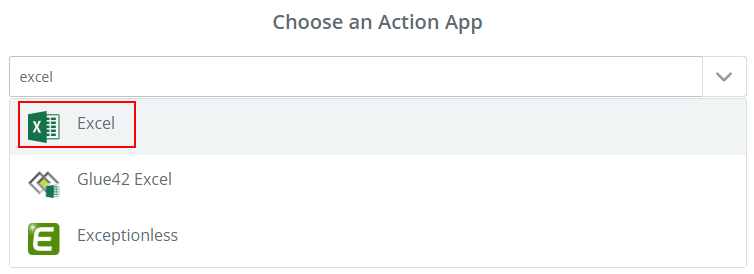

Choose Add Row action:

|pic13|

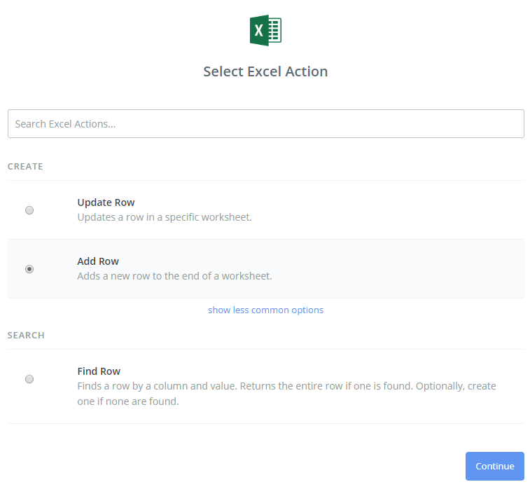

Select Spreadsheet (file), Worksheet (page), and fill out columns with information that we've just parsed with Formatter:

|pic14|

Name and activate the Zap!

|pic15|

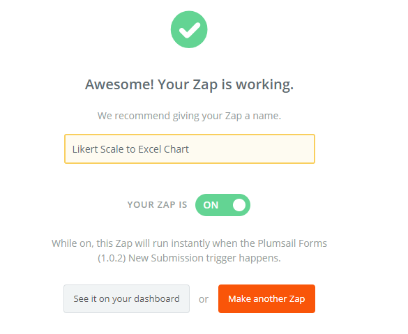

This is it. Now, whenever somebody submits the form, data will automatically be added as a row to Excel, and the Chart will update in real time.

|gif|

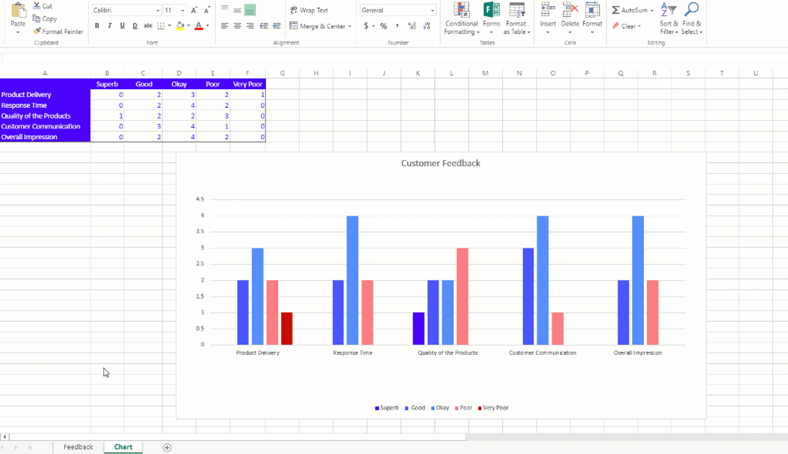