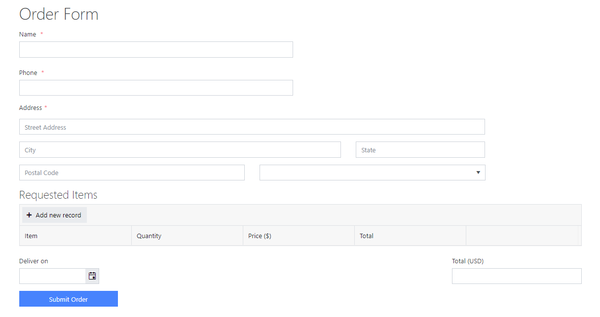
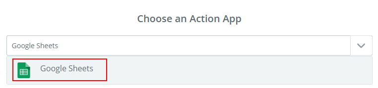
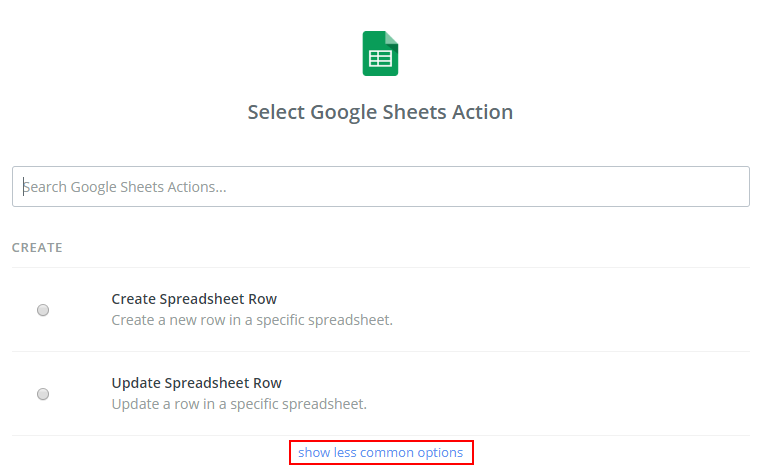
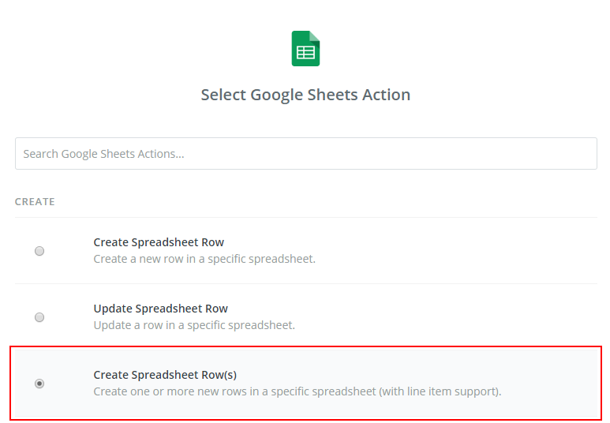
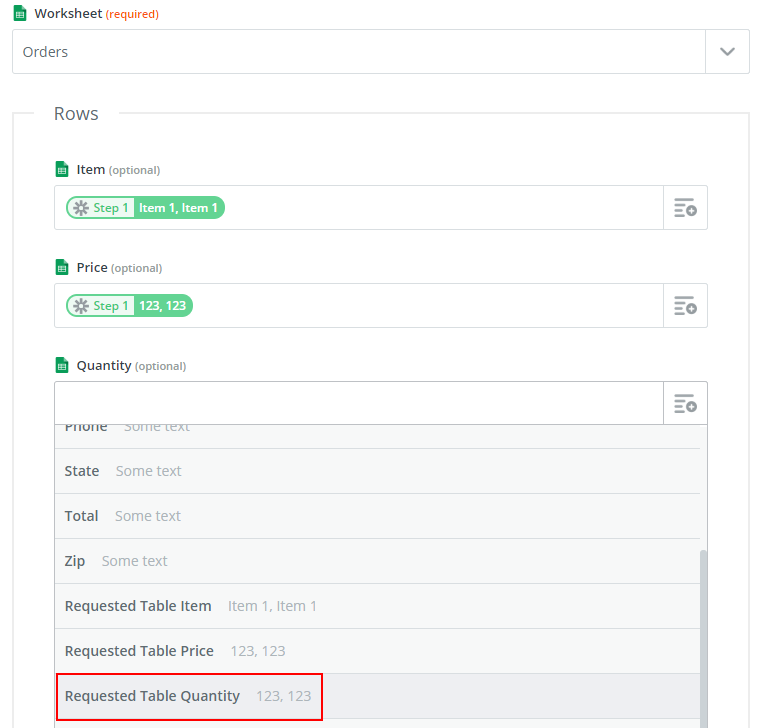
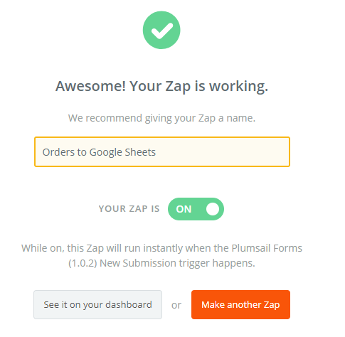
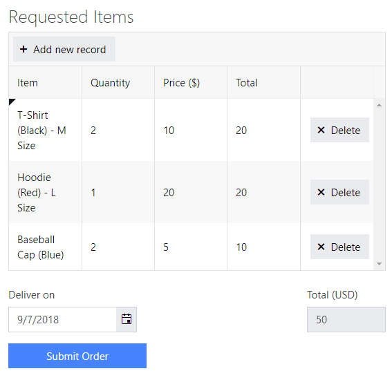
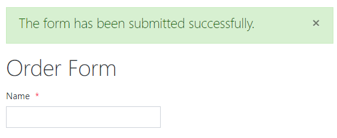
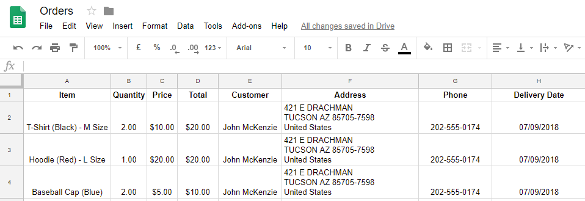

How to create rows in Google Sheets from Data Table with Zapier 
==================================================================

.. contents:: Contents:
 :local:
 :depth: 1
 
Introduction
--------------------------------------------------
In this article, we are going to show you how you can use Data Table and Zapier to add multiple rows to a Google Sheet.

The same method can be used to add just one row, if you are not using a Data Table, and just need to add a record on form submission.

For an example on how to work with Data Table and Google Sheets/Excel in MS Flow instead, check out the `following article <./excel-datatable.html>`_.

We will use the Order Form in this example, which you can download |Order Form|.

|pic1|

.. |Order Form| raw:: html

   <a href="/forms/templates/order-form/" target="_blank">here</a>

Google Sheet
--------------------------------------------------
I've created Orders spreadsheet in my Google account:

|pic|

.. |pic| image:: ../images/how-to/excel-datatable/3_Orders_Google.png
   :alt: Orders Google spreadsheet

You should use the first row to add names to each column. Don't forget to name your worksheet appropriately as well, where you want results to be stored.

Zapier
--------------------------------------------------

Now, you can create a new custom Zap, by following this instruction - :ref:`creating-zap`.

After completing the setup for your form, search for *Google Sheets* the Google Sheets App:

|pic2|

If this is your first time using this connector, you will most likely need to connect to your 
Google Account and give Zapier access to your files. 

To select the appropriate action you'll either need to use search or click *show less common options*:

|pic3|

It's extremely important to select the action that can add multiple rows - Create Spreadsheet Row(s), so that each row from our Data Table is inserted as new:

|pic4|

Then, fill out the columns with the data from the form:

|pic5|

Since Data Table columns have multiple records, they'll add a row for each record.

Once the columns are filled, the action is saved, it is time to name and activate the Zap:

|pic6|

Now, each time you fill out a form:

|pic7|

And submit it:

|pic8|

You'll get all the records added to your Google Sheet:

|pic9|

