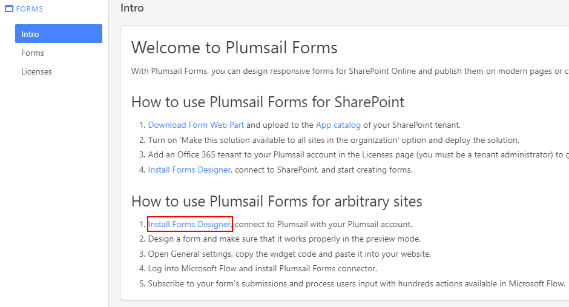

Installation of Plumsail Forms for public web forms
==========================================================

.. contents:: Contents:
 :local:
 :depth: 1

Video Guide
--------------------------------------------------
You can follow the instruction or watch a video here:

.. raw:: html

    <iframe width="560" height="315" src="https://www.youtube-nocookie.com/embed/WuidPMLnQbA" frameborder="0" allow="accelerometer; autoplay; encrypted-media; gyroscope; picture-in-picture" allowfullscreen></iframe>

First step - Register a Plumsail Account
--------------------------------------------------
Plumsail Forms product uses our service called Plumsail Account. Using Plumsail Account you can manage your license, 
and it also stores all your Public Web Forms. All Public Web Forms created by you are tied to your Plumsail Account.

Register
**************************************************
You can register by filling out |location_link|.

.. |location_link| raw:: html

   <a href="https://auth.plumsail.com/account/register?ReturnUrl=http://account.plumsail.com/" target="_blank">Plumsail Account registration form</a>

Sign in
**************************************************
You can log in by going to the |location_link2| and entering your login and password. Make sure you've registered first.

.. |location_link2| raw:: html

   <a href="https://auth.plumsail.com/account/login" target="_blank">Plumsail Account login page</a>

Download designer and start designing forms
--------------------------------------------------
You can |download| from your Plumsail Account in Forms section on the Intro tab:

|pic1|

.. |download| raw:: html

   <a href="https://account.plumsail.com/forms/intro" target="_blank">download the designer app</a>

Download and install the app, the process is very simple. Press *Run* and follow the instructions: 

|pic2|

After that, you can start designing your own custom forms. Find more about :doc:`how to design Public Web Forms with the designer </design>`.