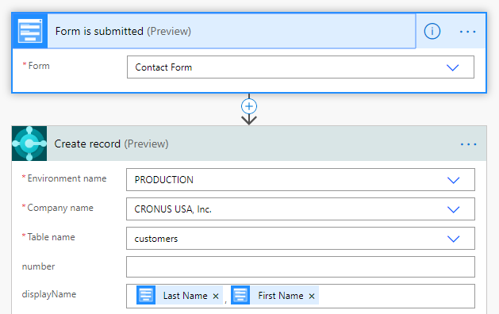

.. title:: Add records to Dynamics 365 Business Central from Plumsail Form with MS Power Automate

.. meta::
   :description: Templates for public web forms integration with Dynamics 365 Business Central in MS Power Automate

Add records to Dynamics 365 Business Central with MS Power Automate
==========================================================================

.. contents::
 :local:
 :depth: 1

Add records, such as items and customers, to Dynamics 365 Business Central when someone submits Plumsail Form with |MS Power Automate| and |Business Central Flow| connector.

|flow process img|

.. |MS Power Automate|  raw:: html

   <a href="https://flow.microsoft.com/" target="_blank">MS Power Automate</a>

.. |Business Central Flow|  raw:: html

   <a href="https://flow.microsoft.com/en-us/connectors/shared_dynamicssmbsaas/business-central/" target="_blank">Business Central</a>