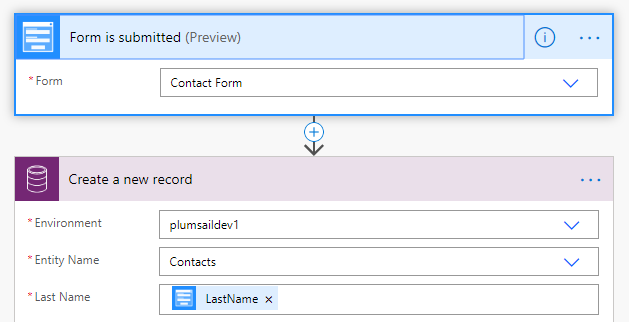

.. title:: Add records to Dynamics 365 CRM from Plumsail Form with MS Power Automate or Zapier

.. meta::
   :description: Templates for public web forms integration with Microsoft Dynamics 365 CRM in MS Power Automate or Zapier

Add records to Microsoft Dynamics 365 CRM with MS Power Automate or Zapier
==========================================================================

.. contents::
 :local:
 :depth: 1

MS Power Automate
--------------------------------------------------
Add records, such as leads and contacts, to Microsoft Dynamics 365 CRM when someone submits Plumsail Form with |MS Power Automate| and |Common Data Service Flow| connector.

|flow process img|

.. |MS Power Automate|  raw:: html

   <a href="https://flow.microsoft.com/" target="_blank">MS Power Automate</a>

.. |Common Data Service Flow|  raw:: html

   <a href="https://us.flow.microsoft.com/en-us/connectors/shared_commondataservice/common-data-service/" target="_blank">Common Data Service</a>

.. important::   The flow must be created in the same environment, where the CRM is located, or the Common Data Service connector won't be available.

Zapier
--------------------------------------------------
Add records, such as leads and contacts, to Microsoft Dynamics 365 CRM when someone submits Plumsail Form with |Zapier| and |Dynamics 365 CRM| connector.

Recommended templates: 

|zapTemplateImg|

.. |Zapier|  raw:: html

   <a href="https://zapier.com/" target="_blank">Zapier</a>

.. |Dynamics 365 CRM|  raw:: html

   <a href="https://zapier.com/apps/microsoft-dynamics-crm/integrations" target="_blank">Microsoft Dynamics 365 CRM</a>

.. |zapTemplateImg|  raw:: html

   

