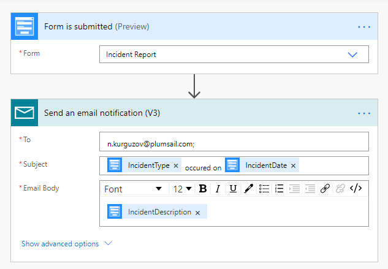

.. meta::
   :description: Examples and templates for public web forms integration

Send email from Plumsail Form with MS Power Automate or Zapier
==================================================================

.. contents:: Contents:
 :local:
 :depth: 1
 
MS Power Automate
--------------------------------------------------
Send an e-mail message when someone submits Plumsail Form with |MS Power Automate| connector.

|flow process img|

The recommended connector is |Mail|, but the emails are sent from Power Automate. 
To have more control of where the emails come from, you can alternatively use one of the following connectors: |Office 365 Outlook|, |Gmail|, or |SMTP|.

|Examples|

.. toctree::
      :maxdepth: 1
      
      Send email notification <../how-to/email>
      Generate PDF with Data Table and send by email <../how-to/data-table-flow>

.. |MS Power Automate|  raw:: html

   <a href="https://flow.microsoft.com/" target="_blank">MS Power Automate</a>

.. |Mail|  raw:: html

   <a href="https://emea.flow.microsoft.com/en-us/connectors/shared_sendmail/mail/" target="_blank">Mail</a>

.. |Office 365 Outlook|  raw:: html

   <a href="https://emea.flow.microsoft.com/en-us/connectors/shared_office365/office-365-outlook/" target="_blank">Office 365 Outlook</a>

.. |Gmail|  raw:: html

   <a href="https://emea.flow.microsoft.com/en-us/connectors/shared_gmail/gmail/" target="_blank">Gmail</a>

.. |SMTP|  raw:: html

   <a href="https://emea.flow.microsoft.com/en-us/connectors/shared_smtp/smtp/" target="_blank">SMTP</a>

Zapier
--------------------------------------------------
Send an e-mail message when someone submits Plumsail Form with |Zapier| connector.

Recommended templates: 

|zapTemplateImg|

The recommended connector is |Email by Zapier|, but the emails are sent from Zapier. 
To have more control of where the emails come from, you can alternatively use one of the following connectors: |Microsoft Outlook|, |Gmail2|, or |SMTP2|.

|Examples|

.. toctree::
      :maxdepth: 1
      
      Send email with signature and attachments <../how-to/zapier-email>

.. |Zapier|  raw:: html

   <a href="https://zapier.com/" target="_blank">Zapier</a>

.. |Email by Zapier|  raw:: html

   <a href="https://zapier.com/apps/email/integrations" target="_blank">Email by Zapier</a>

.. |Microsoft Outlook|  raw:: html

   <a href="https://zapier.com/apps/microsoft-outlook/integrations" target="_blank">Microsoft Outlook</a>

.. |Gmail2|  raw:: html

   <a href="https://zapier.com/apps/gmail/integrations" target="_blank">Gmail</a>

.. |SMTP2|  raw:: html

   <a href="https://zapier.com/apps/smtp/integrations" target="_blank">SMTP</a>

.. |zapTemplateImg|  raw:: html

   

.. |Examples|  raw:: html

   <h3><a>Examples</a></h3>