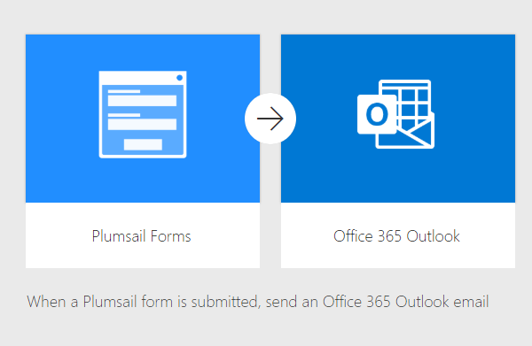

Send email from Plumsail Form with MS Power Automate or Zapier
==================================================================

.. contents:: Contents:
 :local:
 :depth: 1
 
MS Power Automate
--------------------------------------------------
Use data from a submitted Plumsail Form to send an email from Office365 Outlook with this |flow template|.

|flow template img|

.. |flow template|  raw:: html

   <a href="https://emea.flow.microsoft.com/en-us/galleries/public/templates/834771e8c74d428791ea78ff5ea81396/send-an-office-365-outlook-email-when-a-plumsail-form-is-submitted/" target="_blank">flow template</a>

.. note::   Replace Outlook with Mailchimp, Sendinblue, Gmail or another email service to send email from it instead.

Zapier
--------------------------------------------------
Use data from a submitted Plumsail Form to send an email from Gmail with this |zap template|.

|zap template img|

.. |zap template|  raw:: html

   <a href="https://zapier.com/app/editor/template/122891" target="_blank">zap template</a>

.. note::   Replace Gmail with Mailchimp, Sendinblue, Microsoft Outlook or another email service to send email from it instead.