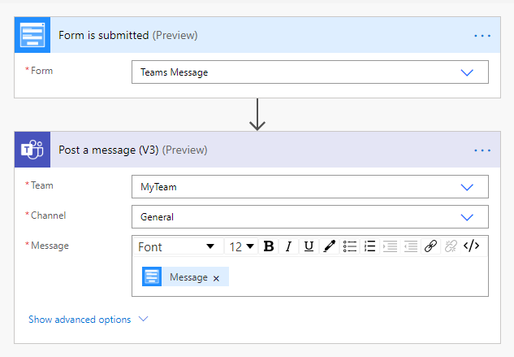

Send MS Teams message from Plumsail Form with MS Power Automate or Zapier
==========================================================================

.. contents:: Contents:
 :local:
 :depth: 1
 
MS Power Automate
--------------------------------------------------
Send a message in MS Teams channel when someone submits Plumsail Form with |MS Power Automate|.

|flow process img|

The recommended connector is Microsoft Teams.

.. |MS Power Automate|  raw:: html

   <a href="https://flow.microsoft.com/" target="_blank">MS Power Automate</a>

Zapier
--------------------------------------------------
Send a message in MS Teams channel when someone submits Plumsail Form with |Zapier|.

Recommended templates: 

|zapTemplateImg|

.. |Zapier|  raw:: html

   <a href="https://zapier.com/" target="_blank">Zapier</a>

.. |zapTemplateImg|  raw:: html

   <a href="https://zapier.com/app/editor/template/181089" target="_blank" class="img-link public-integration">Send message in MS Teams for new Plumsail Forms submissions</a>

.. |Examples|  raw:: html

   <h3><a>Examples</a></h3>