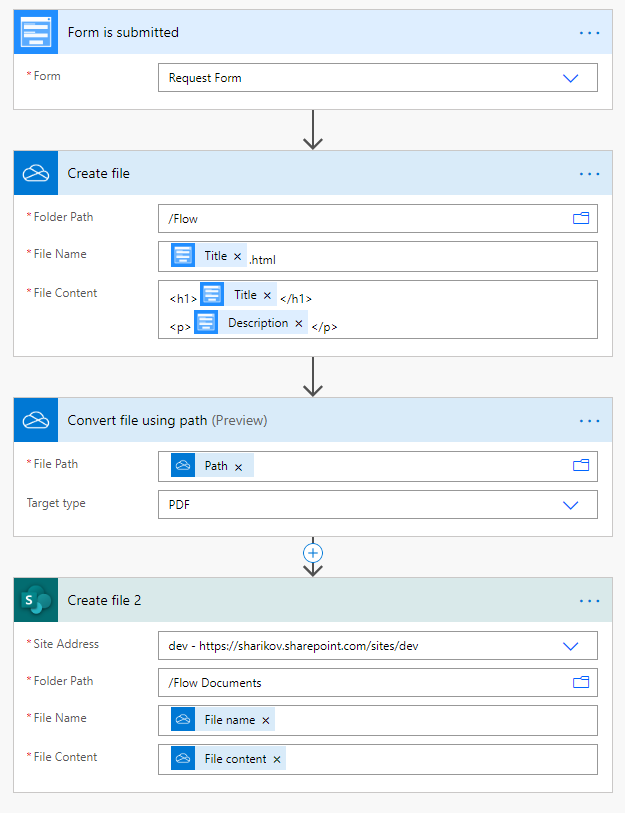

Generate PDF from Plumsail Form with MS Power Automate
==================================================================

Generate PDF file when someone submits Plumsail Form with |MS Power Automate|.

|flow process img|

You can use OneDrive for Business to generate HTML and convert it to PDF, then create final file where you need it - SharePoint, OneDrive, etc.

Alternatively, you can use |Plumsail Documents| to create PDF files from template.

|Examples|

.. toctree::
      :maxdepth: 1
      
      Convert form with Data Table into PDF with Plumsail Documents <../how-to/data-table-flow>

.. |MS Power Automate|  raw:: html

   <a href="https://flow.microsoft.com/" target="_blank">MS Power Automate</a>

.. |Plumsail Documents| raw:: html

   <a href="https://plumsail.com/documents/" target="_blank">Plumsail Documents</a>

.. |Examples|  raw:: html

   <h3><a>Examples</a></h3>