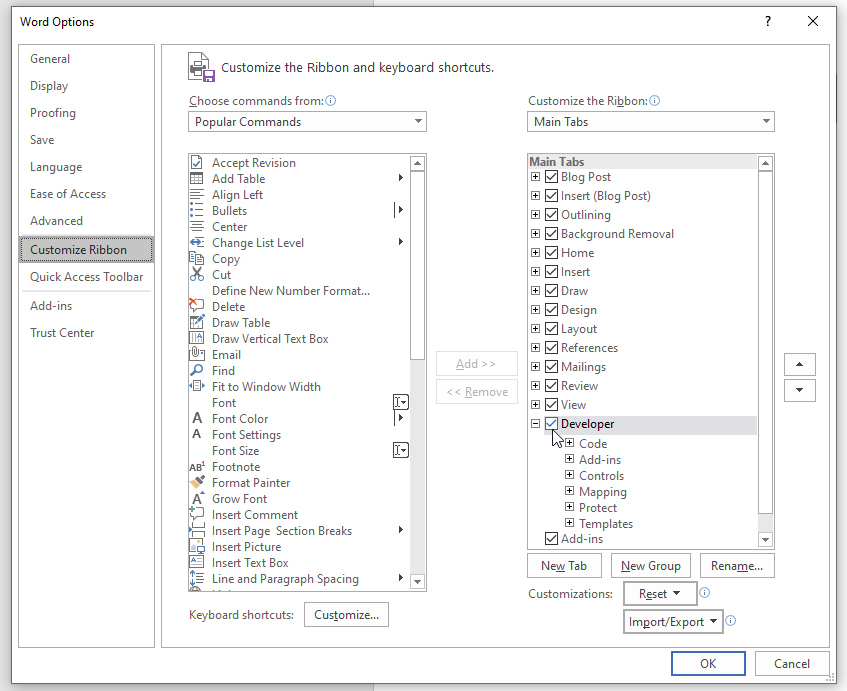
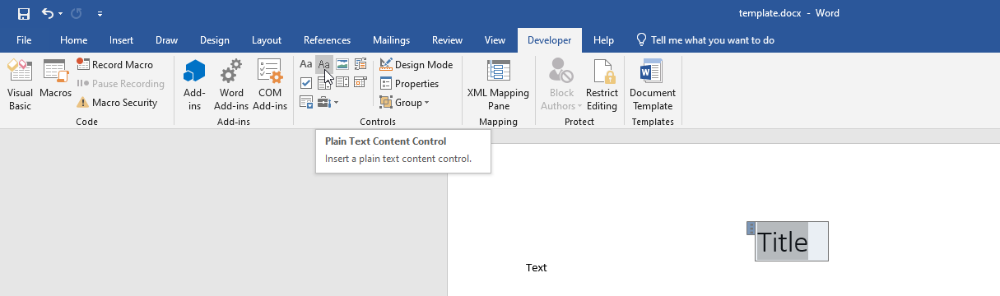
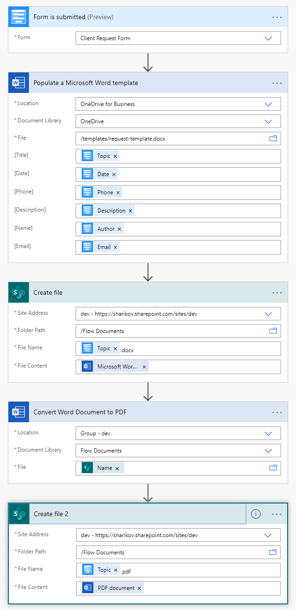

Generate PDF from Plumsail Form with MS Power Automate or Zapier
==================================================================

.. contents:: Contents:
 :local:
 :depth: 1

Create Word template
--------------------------------------------------
To generate PDF document, the easiest option is to create a Word template file first. For this, you will need desktop version of Microsoft Word.

First, you need to activate the Developer tab in the ribbon. Click **File** -> **Options**, select **Customize Ribbon** in dialog and activate the Developer tab in the right column:

|customize ribbon|

Go to the Developer tab. With it, you can select any part of your text, for example, the *Title* and select them as Plain Text content control:

|plain text content|

These sections can then be populated via a flow or a zap. Upload templates to a cloud storage (such as OneDrive) in order to use in your processes.

.. note::   Alternatively, use |Plumsail Documents| to create PDF files from template - no need to create flows or zaps.

            .. toctree::
                  :maxdepth: 1
                  
                  Generate PDF documents from a DOCX template on Plumsail Forms submission <https://plumsail.com/docs/documents/v1.x/user-guide/processes/examples/create-word-and-pdf-documents-from-plumsail-forms.html>
                  Auto-populate fillable PDF on Plumsail Forms submission <https://plumsail.com/docs/documents/v1.x/user-guide/processes/examples/auto-populate-pdf-from-plumsail-forms.html>

MS Power Automate
--------------------------------------------------
Generate PDF file when someone submits Plumsail Form with |MS Power Automate| and |Word Online (Business)| connector.

|flow process img|

You can also use |Plumsail Documents| to create PDF files from template.

Recommended templates: 

|flowTemplateImg|

.. |flowTemplateImg|  raw:: html 

   <a href="https://emea.flow.microsoft.com/en-us/galleries/public/templates/35bdf13afbad4ff29d3df49e7f288729/create-word-and-pdf-documents-from-plumsail-forms/" target="_blank" class="img-link public-integration">Create Word and PDF documents from Plumsail Forms</a>

.. |MS Power Automate|  raw:: html

   <a href="https://flow.microsoft.com/" target="_blank">MS Power Automate</a>

.. |Plumsail Documents| raw:: html

   <a href="https://plumsail.com/documents/" target="_blank">Plumsail Documents</a>

.. |Examples|  raw:: html

   <h3><a>Examples</a></h3>

.. |Word Online (Business)|  raw:: html

   <a href="https://emea.flow.microsoft.com/en-us/connectors/shared_wordonlinebusiness/word-online-business/" target="_blank">Word Online (Business)</a>

Zapier
--------------------------------------------------
Generate PDF file when someone submits Plumsail Form with |Zapier|.

Recommended templates: 

|zapTemplateImg|

|zapTemplateImg2|

|zapTemplateImg3|

|zapTemplateImg4|

|zapTemplateImg5|

|zapTemplateImg6|

.. |Zapier|  raw:: html

   <a href="https://zapier.com/" target="_blank">Zapier</a>

.. |zapTemplateImg|  raw:: html

   <a href="https://zapier.com/app/editor/template/133665" target="_blank" class="img-link public-integration">Generate documents from templates in Plumsail Documents</a>

.. |zapTemplateImg2|  raw:: html

   <a href="https://zapier.com/app/editor/template/199072" target="_blank" class="img-link public-integration">Create PDF with Google Docs and Cloud Print</a>

.. |zapTemplateImg3|  raw:: html

   <a href="https://zapier.com/app/editor/template/198876" target="_blank" class="img-link public-integration">Create Word and PDF files with Formstack Docs</a>

.. |zapTemplateImg4|  raw:: html

   <a href="https://zapier.com/app/editor/template/198853" target="_blank" class="img-link public-integration">Generate PDF Monkey PDFs</a>

.. |zapTemplateImg5|  raw:: html

   <a href="https://zapier.com/app/editor/template/199139" target="_blank" class="img-link public-integration">Create document in Docupilot</a>

.. |zapTemplateImg6|  raw:: html

   <a href="https://zapier.com/app/editor/template/199567" target="_blank" class="img-link public-integration">Create document in PandaDoc</a>