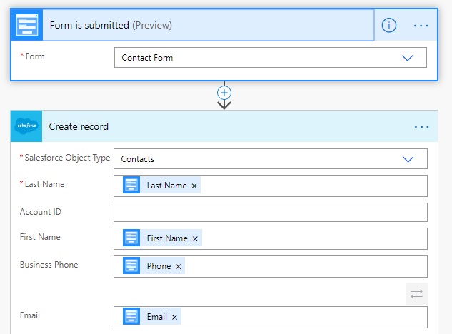

.. title:: Add records to Salesforce from Plumsail Forms with MS Power Automate or Zapier

.. meta::
   :description: Templates for public web forms integration with Salesforce in MS Power Automate or Zapier

Add records to Salesforce with MS Power Automate or Zapier
==========================================================================

.. contents:: Contents:
 :local:
 :depth: 1

MS Power Automate
--------------------------------------------------
Add records, such as leads and contacts, to Salesforce when someone submits Plumsail Form with |MS Power Automate| and |Salesforce Flow| connector.

|flow process img|

.. |MS Power Automate|  raw:: html

   <a href="https://flow.microsoft.com/" target="_blank">MS Power Automate</a>

.. |Salesforce Flow|  raw:: html

   <a href="https://emea.flow.microsoft.com/en-us/connectors/shared_salesforce/salesforce/" target="_blank">Salesforce</a>

Zapier
--------------------------------------------------
Add records, such as leads and contacts, to Salesforce when someone submits Plumsail Form with |Zapier| and |Salesforce| connector.

Recommended templates: 

|zapTemplateImg|

.. |Zapier|  raw:: html

   <a href="https://zapier.com/" target="_blank">Zapier</a>

.. |Salesforce|  raw:: html

   <a href="https://zapier.com/apps/salesforce/integrations" target="_blank">Salesforce</a>

.. |zapTemplateImg|  raw:: html

   

