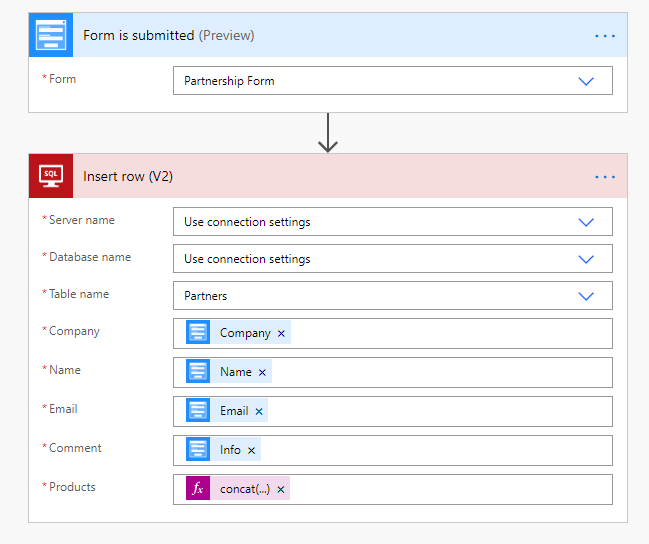

.. meta::
   :description: Examples and templates for public web forms integration

Insert row to SQL server from Plumsail Forms with Power Automate or Zapier
==========================================================================

.. contents:: Contents:
 :local:
 :depth: 1
 
MS Power Automate
--------------------------------------------------
Add SQL server row when someone submits Plumsail Form with |MS Power Automate| and |SQL Server| connector.

|flow process img|

.. |MS Power Automate|  raw:: html

   <a href="https://flow.microsoft.com/" target="_blank">MS Power Automate</a>

|Examples|

.. toctree::
      :maxdepth: 1
      
      Insert new SQL Server records from public web forms <../how-to/sql>

.. |SQL Server|  raw:: html

   <a href="https://flow.microsoft.com/en-us/connectors/shared_sql/sql-server/" target="_blank">SQL Server</a>

Zapier
--------------------------------------------------
Add SQL server row when someone submits Plumsail Form with |Zapier| and |SQL Server2| connector.

Recommended template: 

|zapTemplateImg|

.. |Zapier|  raw:: html

   <a href="https://zapier.com/" target="_blank">Zapier</a>

.. |zapTemplateImg|  raw:: html

   <a href="https://zapier.com/app/editor/template/123004" target="_blank" class="img-link public-integration">Add SQL Server rows for new Plumsail Forms submissions</a>

.. |SQL Server2|  raw:: html

   <a href="https://zapier.com/apps/sql-server/integrations" target="_blank">SQL Server</a>

.. |Examples|  raw:: html

   <h3><a>Examples</a></h3>