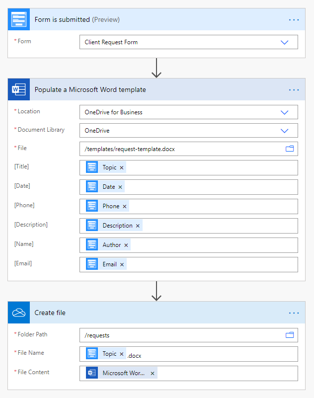

.. title:: Generate Word document from Plumsail Form

.. meta::
   :description: Examples and templates for public web forms integration with Microsoft Power Automate, Zapier or Plumsail DOcuments

Generate Word document from Plumsail Form with MS Power Automate, Zapier, or Plumsail Documents
====================================================================================================

.. contents::
 :local:
 :depth: 2

MS Power Automate
--------------------------------------------------

Create Word template
*******************************************************************
To generate PDF document, the easiest option is to create a Word template file first. For this, you will need desktop version of Microsoft Word.

First, you need to activate the Developer tab in the ribbon. Click **File** -> **Options**, select **Customize Ribbon** in dialog and activate the Developer tab in the right column:

|customize ribbon|

.. |customize ribbon| image:: ../images/integration/word/integration-word-customize-ribbon.png
   :alt: Customize Ribbon

Go to the Developer tab. With it, you can select any part of your text, for example, the *Title* and select them as Plain Text content control:

|plain text content|

.. |plain text content| image:: ../images/integration/word/integration-word-plain-text-content-control.png
   :alt: Plain Text content control

These sections can then be populated via a flow. Upload templates to a cloud storage (such as OneDrive) in order to use in your processes.

Launch flow
*******************************************************************
Generate a Word document from template when someone submits Plumsail Form with |MS Power Automate| and |Word Online (Business)| connector.

|flow process img|

.. |MS Power Automate|  raw:: html

   <a href="https://flow.microsoft.com/" target="_blank">MS Power Automate</a>

.. |Word Online (Business)|  raw:: html

   <a href="https://emea.flow.microsoft.com/en-us/connectors/shared_wordonlinebusiness/word-online-business/" target="_blank">Word Online (Business)</a>

Other options
*******************************************************************

You can also use |Plumsail Documents| with Power Automate to create DOCX files from template.

Recommended templates: 

|flowTemplateImg|

.. |flowTemplateImg|  raw:: html 

   <a href="https://emea.flow.microsoft.com/en-us/galleries/public/templates/35bdf13afbad4ff29d3df49e7f288729/create-word-and-pdf-documents-from-plumsail-forms/" target="_blank" class="img-link public-integration">Create Word and PDF documents from Plumsail Forms</a>

.. |Plumsail Documents| raw:: html

   <a href="https://plumsail.com/documents/" target="_blank">Plumsail Documents</a>

Zapier
--------------------------------------------------
Generate DOCX file when someone submits Plumsail Form with |Zapier|.

Recommended templates: 

|zapTemplateImg|

.. |Zapier|  raw:: html

   <a href="https://zapier.com/" target="_blank">Zapier</a>

.. |zapTemplateImg|  raw:: html

   

Plumsail Documents
--------------------------------------------------
Alternatively, use |Plumsail Documents| to create PDF files from template - no need to create flows or zaps.

.. toctree::
      :maxdepth: 1
      
      Create DOCX document from template <https://plumsail.com/docs/documents/v1.x/user-guide/processes/examples/create-docx-from-template-processes.html>